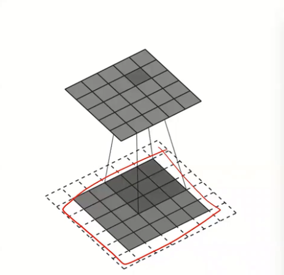

# Deep Learning with TensorFlow: Build Neural Networks

> **Course Reference**: [Deep Learning with TensorFlow: Build Neural Networks](https://www.coursera.org/learn/deep-learning-tensorflow-build-neural-networks) by EDUCBA on Coursera
>
> **Disclaimer**: These are personal notes and customized code implementations based on the course materials. The code examples have been adapted, extended, and documented for learning purposes. This repository is not affiliated with or endorsed by EDUCBA or Coursera.

---

- Deep learning
    - Subset of ML
    - Analysis of data using structures inspired by human brain (Artificial Neural Networks)

# Perceptron (Single Neuron)
$$
y = f\left(\sum_{i=1}^{n}w_ix_i + b\right)
$$

- Where:
    - $x_i$ = input features
    - $w_i$ = weights
    - $b$ = bias term
    - $f$ = activation function
    - $y$ = output

- Dot Product:
    - The operation $\sum_{i=1}^{n}w_ix_i$ is the dot product between weight vector $\mathbf{w}$ and input vector $\mathbf{x}$
    - Can be written as: $\mathbf{w} \cdot \mathbf{x} = w_1x_1 + w_2x_2 + ... + w_nx_n$
    - Why it happens:
        - Combines all input features into a single value
        - Each weight determines how much each feature contributes to the final decision
        - Measures similarity between input and weight vectors
    - Where it happens:
        - First step in the perceptron, before adding bias
        - Core operation in every neuron in neural networks

- Bias Term:
    - Definition:
        - A learnable parameter added to the weighted sum
        - Acts as an offset or threshold adjustment
        - Independent of input features (always active)
    - Mathematical representation: $b$ (scalar value)
    - Usage and purpose:
        - Shifts the activation function left or right
        - Allows the model to fit data that doesn't pass through the origin
        - Provides flexibility: neuron can activate even when all inputs are zero
        - Controls the threshold for neuron activation
    - Example:
        - Without bias: decision boundary must pass through origin (0,0)
        - With bias: decision boundary can be anywhere in the space

- Activation Function:
    - Purpose:
        - Introduces non-linearity to the model
        - Without it, multiple layers would collapse into a single linear transformation
        - Determines if a neuron should "fire" or activate
    - Common types:
        - Step function: outputs 0 or 1 (binary classification)
        - Sigmoid: outputs values between 0 and 1 (probabilities)
        - ReLU: outputs max(0, x) (most common in deep learning)
        - Tanh: outputs values between -1 and 1
    - **Why ReLU is Preferred in Deep Networks** (vs Sigmoid/Tanh):
        - **Solves vanishing gradient problem**:
            - Sigmoid and Tanh have saturating regions where gradients approach zero
            - In deep networks, gradients multiply through layers, causing vanishing gradients
            - ReLU has constant gradient (1) for positive inputs, preventing gradient decay
        - **Computational efficiency**:
            - ReLU: Simple max(0, x) operation (very fast)
            - Sigmoid/Tanh: Require expensive exponential calculations
        - **Sparsity**:
            - ReLU outputs zero for negative inputs, creating sparse activations
            - Sparse networks are more efficient and can learn better representations
        - **Linear behavior for positive inputs**:
            - ReLU is linear when x > 0, making optimization easier
            - Sigmoid/Tanh are always non-linear, making optimization more complex
        - **Limitations of ReLU**:
            - **Dying ReLU problem**: Neurons can "die" if they always output zero (gradient = 0)
            - Solutions: Leaky ReLU, Parametric ReLU (PReLU), ELU
        - **When to use Sigmoid/Tanh**:
            - Output layers for binary/multi-class classification (sigmoid/softmax)
            - When bounded outputs are required
            - Shallow networks where vanishing gradients are less problematic

- Binary Classification (Step Function):
    - $y = 1$ if $\sum_{i=1}^{n}w_ix_i + b \geq 0$
        - Happens when: $\sum_{i=1}^{n}w_ix_i \geq -b$
        - The weighted sum of inputs is large enough to cross the threshold
    - $y = 0$ if $\sum_{i=1}^{n}w_ix_i + b < 0$
        - Happens when: $\sum_{i=1}^{n}w_ix_i < -b$
        - The weighted sum of inputs is too small to cross the threshold

# Simple Neural Network

It has three parts:
- Input layer
    - Receives raw data/features
    - No computation, just passes data forward
    - Size = number of features in dataset
 - Hidden layer
    - Performs computations and transformations
    - Extracts patterns and learns representations
    - Can have multiple hidden layers (deep learning)
    - Each neuron in the hidden layer could be seen as a perceptron
 - Output layer
    - Produces final predictions
    - Size depends on task (1 for binary, n for multi-class)
    - Uses appropriate activation for the problem

- Diagram:

```
   Input Layer       Hidden Layer      Output Layer
   
      x₁  ──────────→  h₁  ────────┐
           ╲        ╱  ║  ╲        │
            ╲      ╱   ║   ╲       │
      x₂  ───╲────────→ h₂  ───────┼────→  y₁
              ╲  ╱      ║    ╲     │
               ╳        ║     ╲    │
              ╱  ╲      ║      ╲   │
      x₃  ───────╲────→ h₃  ────────┘
                  ╲   ╱ ║
                   ╲ ╱  ║
      xₙ  ──────────→  hₘ
      
    (Features)    (Perceptrons)   (Prediction)
```

- **How to Decide Number of Layers and Neurons**:
    - **General Principles**:
        - **Start simple, then increase complexity**: Begin with a small network and gradually add layers/neurons if needed
        - **Problem complexity matters**: Simple problems need fewer layers, complex problems need more
        - **Data size**: More data can support larger networks (prevents overfitting)
        - **Computational resources**: Larger networks require more memory and computation time
    - **Number of Layers (Depth)**:
        - **Shallow networks (1-2 hidden layers)**:
            - Good for: Simple problems, small datasets, linear/near-linear relationships
            - Example: Basic classification, simple regression
            - Rule of thumb: Start with 1-2 hidden layers
        - **Deep networks (3+ hidden layers)**:
            - Good for: Complex patterns, large datasets, non-linear relationships, image/text processing
            - Example: Image recognition, natural language processing, complex feature extraction
            - Rule of thumb: Use 3-5 layers for most problems, 10+ for very complex tasks (CNNs, RNNs)
        - **When to add more layers**:
            - Model is underfitting (high training error, high validation error)
            - Problem requires hierarchical feature learning (simple → complex patterns)
            - You have sufficient data to prevent overfitting
        - **When to reduce layers**:
            - Model is overfitting (low training error, high validation error)
            - Simple problem that doesn't need deep architecture
            - Limited computational resources
    - **Number of Neurons per Layer (Width)**:
        - **Input layer**: Fixed by your data
            - Number of features in your dataset
            - Example: 784 for flattened 28×28 images, 10 for 10 features
        - **Hidden layers**: Variable, depends on problem complexity
            - **Common ranges**:
                - Small networks: 10-50 neurons per layer
                - Medium networks: 50-200 neurons per layer
                - Large networks: 200-1000+ neurons per layer
            - **Rule of thumb**: Start with 2-3× the number of input features
                - Example: 784 inputs → start with 128-256 neurons in first hidden layer
            - **Progressive reduction**: Often decrease neurons in deeper layers
                - Example: 784 → 256 → 128 → 64 → 10 (output)
                - Reason: Extract more abstract features with fewer neurons
            - **Progressive expansion**: Sometimes increase, then decrease (hourglass shape)
                - Example: 784 → 128 → 256 → 128 → 10
                - Reason: First compress, then expand feature space
        - **Output layer**: Fixed by your task
            - **Binary classification**: 1 neuron (sigmoid)
            - **Multi-class classification**: N neurons (softmax), where N = number of classes
            - **Regression**: 1 neuron (no activation, linear)
    - **Practical Guidelines**:
        - **Starting point for most problems**:
            - 2-3 hidden layers
            - First hidden layer: 2-3× input size
            - Subsequent layers: Gradually reduce (e.g., 128 → 64 → 32)
        - **Example architectures**:
            - **Simple problem** (small dataset, few features):
                - Input → 32 → 16 → Output (2 hidden layers)
            - **Medium problem** (MNIST digit classification):
                - Input(784) → 128 → 64 → 32 → Output(10) (3 hidden layers)
            - **Complex problem** (image classification):
                - Input(784) → 512 → 256 → 128 → 64 → Output(10) (4-5 hidden layers)
        - **Avoid these mistakes**:
            - **Too many neurons**: Leads to overfitting, slow training, high memory usage
            - **Too few neurons**: Leads to underfitting, cannot learn complex patterns
            - **Too many layers**: Vanishing gradients, overfitting, difficult to train
            - **Too few layers**: Cannot learn hierarchical features
    - **Iterative Approach (Recommended)**:
        1. **Start with baseline**: Simple architecture (1-2 layers, moderate neurons)
        2. **Train and evaluate**: Check training/validation loss and accuracy
        3. **If underfitting**: Add more layers or neurons
        4. **If overfitting**: Reduce layers/neurons, add dropout, or get more data
        5. **Experiment**: Try different architectures and compare performance
        6. **Use validation set**: Monitor validation metrics to find optimal architecture
    - **Heuristics from Practice**:
        - **Power of 2**: Use neuron counts like 32, 64, 128, 256, 512 (computationally efficient)
        - **Input-to-output ratio**: Don't make hidden layers smaller than output layer (unless very deep)
        - **Parameter count**: Aim for 10-100× more training samples than parameters
            - Example: 60,000 samples → aim for 600-6,000 parameters
        - **Memory constraints**: Each neuron adds parameters (weights + bias)
            - Layer with N inputs and M neurons = N×M + M parameters
    - **Special Cases**:
        - **CNNs**: Use convolutional layers (different from dense layers), then flatten to dense layers
        - **Autoencoders**: Hourglass shape (encode → bottleneck → decode)
        - **Transfer learning**: Use pre-trained architectures (ResNet, VGG, etc.)

### Backpropagation

- Definition:
    - Algorithm to calculate gradients of the loss function with respect to network weights
    - Propagates error backwards from output to input layer
    - Uses chain rule of calculus to compute derivatives efficiently

- Purpose:
    - Updates weights to minimize prediction error
    - Enables learning in multi-layer networks
    - Makes deep learning computationally feasible

- Loss Function:
    - Measures error between prediction $\hat{y}$ and true value $y$
    - Common types:
        - Mean Squared Error (MSE): $L = \frac{1}{n}\sum_{i=1}^{n}(y_i - \hat{y}_i)^2$
        - Cross-Entropy: $L = -\sum_{i=1}^{n}y_i\log(\hat{y}_i)$

- Chain Rule:
    - Core mathematical principle of backpropagation
    - For function composition: $\frac{\partial L}{\partial w} = \frac{\partial L}{\partial y} \cdot \frac{\partial y}{\partial z} \cdot \frac{\partial z}{\partial w}$
    - Breaks complex derivative into manageable parts
    - **Derivative of Loss over Weights** ($\frac{\partial L}{\partial w}$):
        - Measures how much the loss changes when a weight changes
        - Tells us direction and magnitude to adjust weights
        - Large gradient = weight has big impact on loss
        - Small gradient = weight has little impact on loss
    - **Neural Network Components**:
        - $z$ = linear combination before activation: $z = wx + b$
            - Weighted sum of inputs plus bias
            - Raw output from matrix multiplication
        - $y$ (or $\hat{y}$) = output after activation: $y = f(z)$
            - Final prediction after applying activation function
            - Example: $y = \sigma(z)$ for sigmoid, or $y = \text{ReLU}(z)$
        - $L$ = loss function comparing prediction to true value
        - Chain rule breakdown:
            - $\frac{\partial L}{\partial y}$: how loss changes with output
            - $\frac{\partial y}{\partial z}$: how activation function changes with linear combination
            - $\frac{\partial z}{\partial w}$: how linear combination changes with weights (equals input $x$)

- Gradient Descent:
    - Weight update rule: $w_{new} = w_{old} - \alpha \frac{\partial L}{\partial w}$
    - Where $\alpha$ is the learning rate
    - Moves weights in direction that reduces loss

- Learning Rate ($\alpha$):
    - Controls step size for weight updates
    - Critical hyperparameter that affects training speed and convergence
    - **Too small** ($\alpha$ very small, e.g., 0.0001):
        - Takes much longer to converge
        - Moves very slowly toward minimum
        - May get stuck in suboptimal regions
        - Requires many more iterations
    - **Too large** ($\alpha$ very large, e.g., 1.0 or higher):
        - Can overshoot the minimum
        - May oscillate or bounce around optimal point
        - Can get stuck jumping from one side to the other
        - May diverge (loss increases instead of decreases)
        - Can cause training instability
    - **Optimal**: Balance between speed and stability
        - Typical range: 0.001 to 0.1
        - Often found through experimentation or learning rate scheduling

- Weight Initialization:
    - **Most Critical Factor**: Preventing vanishing and exploding gradients
        - Maintains appropriate variance in activations and gradients as they propagate through the network
        - Ensures gradients remain in a usable range for training
    - **Vanishing Gradients**:
        - Occurs when weights are too small
        - Gradients shrink exponentially through layers
        - Makes deep networks untrainable
    - **Exploding Gradients** (Gradients Explode):
        - Occurs when weights are too large
        - Gradients explode: gradients grow exponentially as they propagate backward through layers
        - **What happens during training**:
            - **Numerical overflow**: Gradient values become NaN (Not a Number) or Infinity
            - **Unstable weight updates**: Weights jump to extreme values, making the model useless
            - **Loss becomes NaN**: Training loss becomes undefined, stopping the training process
            - **Oscillating behavior**: Model parameters bounce between extreme values
            - **Training failure**: Model cannot learn meaningful patterns
        - **Visual indicators**:
            - Loss curve shows sudden spikes or becomes NaN
            - Weights grow to very large values
            - Predictions become meaningless or NaN
        - **Solutions**:
            - Proper weight initialization (He, Xavier)
            - Gradient clipping: limit gradient values to a maximum threshold
            - Lower learning rate
            - Batch normalization
            - Architecture changes (skip connections, residual blocks)
    - **Common Initialization Strategies**:
        - **Xavier/Glorot Initialization**: Maintains variance for activations
            - Suited for sigmoid and tanh activation functions
            - Variance: $\text{Var}(W) = \frac{1}{n_{in}}$ or $\frac{2}{n_{in} + n_{out}}$
        - **He Initialization**: Maintains variance for ReLU networks
            - Accounts for ReLU's zeroing of negative values
            - Variance: $\text{Var}(W) = \frac{2}{n_{in}}$
            - Most common for deep networks with ReLU
        - **LeCun Initialization**: Similar principle, designed for specific architectures
    - **Other Important Factors** (secondary):
        - **Activation function**: ReLU benefits from He; sigmoid/tanh from Xavier
        - **Network depth**: Deeper networks are more sensitive to initialization
        - **Layer width**: Affects variance calculations in initialization formulas

- Process:
    1. Forward pass: compute predictions
    2. Calculate loss: measure error
    3. Backward pass: compute gradients using chain rule
    4. Update weights: apply gradient descent
    5. Repeat until convergence

- **Detailed Step-by-Step Training Process** (Example: MNIST Digit Classification):
    - **Initialization**:
        - All weights $W = \{w_1, w_2, w_3, ...\}$ and biases $b$ are initialized (e.g., using He/Xavier initialization)
        - Example: For a 784 → 30 → 20 → 10 network, we have:
            - $W_1$: weights from input (784) to hidden layer 1 (30 neurons) → shape: (784, 30)
            - $W_2$: weights from hidden layer 1 (30) to hidden layer 2 (20) → shape: (30, 20)
            - $W_3$: weights from hidden layer 2 (20) to output (10) → shape: (20, 10)
            - Plus biases for each layer: $b_1, b_2, b_3$
    - **Training Loop (Epoch by Epoch)**:
        - **For each epoch** (e.g., 50 epochs):
            - **For each batch** (e.g., batch_size=128, so ~469 batches for 60,000 samples):
                - **Step 1: Forward Pass for Each Sample in Batch**
                    - **Sample 1 (First digit image)**:
                        - **Input**: $x_1 = [x_1, x_2, ..., x_{784}]$ (flattened 28×28 image, normalized [0,1])
                        - **Layer 1 (Hidden Layer 1)**:
                            - $z_1^{(1)} = W_1 \cdot x_1 + b_1$ (matrix multiplication: 784 → 30)
                            - $h_1^{(1)} = \text{ReLU}(z_1^{(1)})$ (activation: 30 outputs)
                        - **Layer 2 (Hidden Layer 2)**:
                            - $z_1^{(2)} = W_2 \cdot h_1^{(1)} + b_2$ (matrix multiplication: 30 → 20)
                            - $h_1^{(2)} = \text{ReLU}(z_1^{(2)})$ (activation: 20 outputs)
                        - **Layer 3 (Output Layer)**:
                            - $z_1^{(3)} = W_3 \cdot h_1^{(2)} + b_3$ (matrix multiplication: 20 → 10)
                            - $\hat{y}_1 = \text{softmax}(z_1^{(3)})$ (activation: 10 probabilities, sum to 1)
                        - **Prediction**: $\hat{y}_1 = [p_0, p_1, ..., p_9]$ (probabilities for digits 0-9)
                        - **True label**: $y_1 = [0, 0, 0, 1, 0, 0, 0, 0, 0, 0]$ (one-hot, digit is 3)
                - **Step 2: Calculate Loss for Sample 1**
                    - Loss: $L_1 = \text{Categorical Crossentropy}(y_1, \hat{y}_1)$
                    - Measures how far prediction is from true label
                - **Step 3: Backward Pass (Backpropagation) for Sample 1**
                    - Compute gradients: $\frac{\partial L_1}{\partial W_3}, \frac{\partial L_1}{\partial W_2}, \frac{\partial L_1}{\partial W_1}$
                    - Compute bias gradients: $\frac{\partial L_1}{\partial b_3}, \frac{\partial L_1}{\partial b_2}, \frac{\partial L_1}{\partial b_1}$
                    - Gradients flow backward: output → layer 2 → layer 1 → input
                    - **Store gradients** (don't update weights yet!)
                - **Repeat Steps 1-3 for Sample 2, Sample 3, ..., Sample 128** (all samples in batch)
                    - Each sample produces its own gradients
                    - All gradients are accumulated (summed/averaged)
                - **Step 4: Update Weights (After Processing Entire Batch)**
                    - **Average gradients** across all 128 samples in the batch:
                        - $\frac{\partial L}{\partial W_3} = \frac{1}{128} \sum_{i=1}^{128} \frac{\partial L_i}{\partial W_3}$
                        - Same for $W_2, W_1, b_3, b_2, b_1$
                    - **Update all weights** using gradient descent:
                        - $W_3^{new} = W_3^{old} - \alpha \cdot \frac{\partial L}{\partial W_3}$
                        - $W_2^{new} = W_2^{old} - \alpha \cdot \frac{\partial L}{\partial W_2}$
                        - $W_1^{new} = W_1^{old} - \alpha \cdot \frac{\partial L}{\partial W_1}$
                        - Same for biases: $b_3, b_2, b_1$
                        - Where $\alpha$ is the learning rate (e.g., 0.001)
                    - **All weights are updated simultaneously** after processing the entire batch
                    - **Move to next batch** (samples 129-256, then 257-384, etc.)
            - **After all batches processed** (one epoch complete):
                - All 60,000 training samples have been seen
                - Weights have been updated ~469 times (once per batch)
                - Model has learned from the entire dataset once
        - **Repeat for next epoch** (epoch 2, 3, ..., 50)
    - **Key Points**:
        - **Weights are NOT updated after each sample** - they're updated after each batch
        - **Batch processing**: Multiple samples processed, gradients averaged, then weights updated
        - **All weights updated together**: $W_1, W_2, W_3, b_1, b_2, b_3$ all updated simultaneously
        - **Forward pass**: Input → Hidden 1 → Hidden 2 → Output (for each sample)
        - **Backward pass**: Output → Hidden 2 → Hidden 1 → Input (gradients flow backward)
        - **Weight update**: Happens after processing entire batch, not after each sample
        - **Epoch**: One complete pass through all training data
        - **Batch**: Subset of samples processed together before weight update

- **Inference and Prediction** (After Training):
    - **Inference vs Prediction**:
        - **Inference**: The process of running the trained model on new data (forward pass only)
        - **Prediction**: The output/result produced by inference (the actual prediction value)
        - Inference is the process, prediction is the outcome
    - **What is Inference?**: Using the trained model to process new, unseen data through forward pass
    - **Key Difference from Training**: No weight updates during inference - weights are frozen (fixed)
    - **Step-by-Step Inference Process** (Example: Processing a new digit image):
        - **Step 1: Prepare Input**
            - New digit image: $x_{new} = [x_1, x_2, ..., x_{784}]$ (flattened 28×28 image, normalized [0,1])
            - Same preprocessing as training: normalize pixel values, flatten image
        - **Step 2: Forward Pass (Same as Training, but No Backward Pass)**
            - **Layer 1 (Hidden Layer 1)**:
                - $z_{new}^{(1)} = W_1 \cdot x_{new} + b_1$ (using trained weights $W_1$ and $b_1$)
                - $h_{new}^{(1)} = \text{ReLU}(z_{new}^{(1)})$ (activation: 30 outputs)
            - **Layer 2 (Hidden Layer 2)**:
                - $z_{new}^{(2)} = W_2 \cdot h_{new}^{(1)} + b_2$ (using trained weights $W_2$ and $b_2$)
                - $h_{new}^{(2)} = \text{ReLU}(z_{new}^{(2)})$ (activation: 20 outputs)
            - **Layer 3 (Output Layer)**:
                - $z_{new}^{(3)} = W_3 \cdot h_{new}^{(2)} + b_3$ (using trained weights $W_3$ and $b_3$)
                - $\hat{y}_{new} = \text{softmax}(z_{new}^{(3)})$ (activation: 10 probabilities, sum to 1)
        - **Step 3: Obtain Prediction (Result of Inference)**
            - Inference produces: $\hat{y}_{new} = [p_0, p_1, p_2, ..., p_9]$ (probabilities for digits 0-9)
            - **Prediction**: $\arg\max(\hat{y}_{new})$ (digit with highest probability)
            - Example: If inference produces $\hat{y}_{new} = [0.01, 0.02, 0.05, 0.85, 0.03, 0.01, 0.01, 0.01, 0.005, 0.005]$
                - Highest probability: $p_3 = 0.85$ (85%)
                - **Final prediction**: Digit is 3
        - **Summary**: Inference = forward pass process, Prediction = final output result
        - **No backward pass, no weight updates** - just forward computation using learned weights

- **Why Do Trained Weights Work for All Digits? The "Trick" Behind Neural Networks**:
    - **The Key Insight**: Neural networks don't memorize individual images - they learn **patterns and features** that are common across all digits
    - **What the Weights Actually Learned**:
        - **Layer 1 weights ($W_1$)**: Learned to detect **low-level features** (edges, curves, lines, corners)
            - Each of the 30 neurons in layer 1 has learned to recognize a specific pattern
            - Example: Neuron 1 might activate for vertical edges, Neuron 2 for horizontal edges, Neuron 3 for diagonal lines, etc.
            - These features are **universal** - they appear in all digits (0-9)
        - **Layer 2 weights ($W_2$)**: Learned to combine low-level features into **mid-level features**
            - Combines edges and lines into shapes (curves, loops, intersections)
            - Example: Neuron 1 might detect "top curve", Neuron 2 detects "vertical line", etc.
            - These combinations are also **universal patterns**
        - **Layer 3 weights ($W_3$)**: Learned to recognize **high-level digit patterns**
            - Combines mid-level features into complete digit representations
            - Each of the 10 output neurons corresponds to one digit (0-9)
            - Example: Output neuron 3 (for digit "3") has learned which combination of features indicates a "3"
    - **Why It Works for All Digits**:
        - **Generalization**: The network learned **abstract patterns** that apply to any digit image
        - **Feature Hierarchy**: 
            - Low-level: Edges and lines (present in all digits)
            - Mid-level: Shapes and curves (common patterns across digits)
            - High-level: Complete digit structures (unique combinations for each digit)
        - **Pattern Recognition**: The network learned that:
            - A "3" has specific features: top curve, middle horizontal line, bottom curve
            - A "7" has different features: top horizontal line, diagonal line
            - These patterns are **consistent** across different handwriting styles
        - **Not Memorization**: The network didn't memorize 60,000 training images
            - Instead, it learned the **underlying structure** of what makes each digit unique
            - New images with similar patterns will activate the same learned features
    - **The Mathematical "Trick"**:
        - **Weight sharing**: The same weights process all inputs
        - **Feature extraction**: Each layer extracts increasingly complex features
        - **Composition**: Simple features combine into complex patterns
        - **Activation patterns**: Different input images produce different activation patterns, but similar images produce similar patterns
    - **Example: Why a New "3" is Recognized**:
        - New "3" image → Activates edge detectors (Layer 1) → Activates curve/shape detectors (Layer 2) → Activates "3" detector (Layer 3)
        - Even if this "3" looks slightly different from training "3"s, it shares the same **fundamental features**
        - The learned weights recognize these features and produce high probability for digit "3"
    - **What Makes It Work**:
        - **Training on diverse examples**: Seeing many variations of each digit during training
        - **Learning invariances**: The network learns to ignore irrelevant variations (position, size, style)
        - **Feature reuse**: The same low-level features (edges, curves) are useful for all digits
        - **Statistical learning**: The network learns the statistical patterns that distinguish digits

- **Summary: The "Magic" of Neural Networks**:
    - **Not magic, but pattern recognition**: Networks learn hierarchical feature representations
    - **Generalization**: Learned patterns apply to new, unseen data
    - **Feature learning**: Automatically discovers useful features (edges → shapes → digits)
    - **Weight interpretation**: Each weight contributes to recognizing specific patterns
    - **Why it works**: The same mathematical operations (matrix multiplication + activation) that learned patterns during training can recognize similar patterns in new data

Notes:
- [Visualize Neural Network: https://playground.tensorflow.org](https://playground.tensorflow.org/#activation=tanh&batchSize=10&dataset=circle&regDataset=reg-plane&learningRate=0.03&regularizationRate=0&noise=0&networkShape=4,2&seed=0.88120&showTestData=false&discretize=false&percTrainData=50&x=true&y=true&xTimesY=false&xSquared=false&ySquared=false&cosX=false&sinX=false&cosY=false&sinY=false&collectStats=false&problem=classification&initZero=false&hideText=false)
- [Visualize functions](https://www.geogebra.org/calculator)

#### Tensorflow
- Open source library for end to end ML
- Developed by Google to conduct ML research
- Offers great speed and supports computation on GPU
- High-level Keras API to ease DL model building
- ML production anywhere (can train & deploy models in cloud)
- Language independent
- Uses high-level APIs like Keras 

### Example 1

- [Code Example 1](./ex1.py)

**Description**:
- Loads and explores the MNIST handwritten digit dataset
- Prints TensorFlow version
- Loads training and test sets: `(x_train, y_train), (x_test, y_test)`
- Displays dataset shapes:
    - Training images: (60000, 28, 28) - 60K grayscale 28×28 images
    - Training labels: (60000,) - corresponding digit labels (0-9)
    - Test images: (10000, 28, 28) - 10K test images
    - Test labels: (10000,) - test labels
- Visualizes the first training image using matplotlib
- Shows the label of the first image


### Example 2

- [Code Example 2](./ex2.py)

**Description**:
- **Data Preprocessing**:
    - Normalizes pixel values: divides by 255.0 to scale from [0, 255] to [0, 1]
        - Improves training stability and convergence
        - Prevents large input values from dominating gradients
    - Reshapes images: flattens 28×28 matrices to 784-element vectors
        - From (60000, 28, 28) → (60000, 784)
        - Required for dense/fully-connected layers
    - Converts labels to categorical (one-hot encoding):
        - From integer labels [0, 1, 2, ...] → vectors [[1,0,0,...], [0,1,0,...], ...]
        - Example: label 3 → [0, 0, 0, 1, 0, 0, 0, 0, 0, 0]
        - Required for multi-class classification with softmax output
        - One-hot: It represents categorical labels in a format suitable for softmax output

- **First Model (Underfitting Example)**:
    - Architecture: Sequential model with 1 neuron (sigmoid) → 10 neurons (softmax)
    - Performance: Poor (~22% accuracy, barely better than random)
    - Issues: Insufficient capacity, architecture mismatch, severe underfitting
    - Demonstrates importance of model capacity

- **Second Model (Improved)**:
    - Architecture: Sequential model with multiple hidden layers
        - 3 Dense layers with ReLU activation (10 neurons each)
        - Dropout layers (0.2 rate) for regularization
        - Output layer: 10 neurons with softmax
    - Performance: Good (92.85% validation accuracy)
    - Key improvements: More neurons, multiple layers, dropout regularization
    - Validation accuracy higher than training due to dropout effect

- **Training and Evaluation**:
    - Compiles with SGD optimizer, categorical crossentropy loss, accuracy metric
    - Trains for multiple epochs with batch size 128
    - Tracks training/validation loss and accuracy
    - Plots training curves to visualize learning progress
    - Evaluates model on test set
    - Generates predictions and visualizes model architecture

- **Key Concepts Demonstrated**:
    - Data normalization and preprocessing for neural networks
    - Model capacity and underfitting
    - Dropout regularization and its effects
    - Training metrics interpretation (loss, accuracy, val_loss, val_accuracy)
    - Why validation can outperform training with dropout
    - Model evaluation, prediction, and visualization

### Example 3

- [Code Example 3](./ex3.py)

**Description**:
- Demonstrates three different neural network architectures for different problem types
- Uses same MNIST preprocessing (normalization, reshaping, categorical encoding)

- **Regression Model**:
    - **Purpose**: Predict continuous values (e.g., normalized pixel intensity sum)
    - **Architecture**:
        - Input: 784 features (flattened image)
        - Hidden layers: 30 → 20 neurons with ReLU activation
        - Output: 1 neuron with **no activation** (linear output)
    - **Loss function**: MSE (Mean Squared Error)
    - **Metrics**: MAE (Mean Absolute Error)
    - **Performance interpretation**:
        - Lower MAE is better (closer to 0)
        - MAE of 0.000131 means predictions are off by ~0.013% on average
        - Excellent performance for normalized targets [0, 1]

- **Binary Classification Model**:
    - **Purpose**: Predict binary outcomes (even/odd digits)
    - **Architecture**:
        - Input: 784 features
        - Hidden layers: 30 → 20 neurons with ReLU activation
        - Output: 1 neuron with **sigmoid activation** (probability output)
    - **Loss function**: Binary crossentropy
    - **Metrics**: Accuracy
    - **Performance**: ~98.54% accuracy (excellent for binary classification)

- **Multi-Class Classification Model**:
    - **Purpose**: Predict one of multiple classes (digit 0-9)
    - **Architecture**:
        - Input: 784 features
        - Hidden layers: 30 → 20 neurons with ReLU activation
        - Dropout layer (0.2) for regularization
        - Output: 10 neurons with **softmax activation** (probability distribution)
    - **Loss function**: Categorical crossentropy
    - **Metrics**: Accuracy
    - **Performance**: ~96.45% accuracy (very good for 10-class classification)

- **Key Differences Between Model Types**:

| Aspect | Regression | Binary Classification | Multi-Class Classification |
|--------|-----------|---------------------|---------------------------|
| **Output** | Continuous value | Probability (0-1) | Probability distribution |
| **Output neurons** | 1 | 1 | N (number of classes) |
| **Output activation** | None (linear) | Sigmoid | Softmax |
| **Loss function** | MSE or MAE | Binary crossentropy | Categorical crossentropy |
| **Metrics** | MAE, MSE | Accuracy | Accuracy |
| **Example tasks** | House prices, temperature | Spam detection, yes/no | Digit recognition, image classification |

- **Training Hyperparameters**:
    - Optimizer: Adam (adaptive learning rate)
    - Batch size: 128 (memory-efficient)
    - Epochs: 50 (controlled training)
    - All models use same preprocessing pipeline

- **Key Concepts Demonstrated**:
    - Different neural network architectures for different problem types
    - Appropriate activation functions for each task
    - Loss function selection based on problem type
    - Metric interpretation (MAE for regression, accuracy for classification)
    - Model comparison across different architectures
    - Performance visualization with side-by-side plots


# Deep learning with tensorflow

## Image processing using CNN

### Introduction to Deep Learning

- $DL \in ML \in AI $
    - AI: Capable of analysis and decision making
    - ML: Analysis with statistical models
    - DL: Analysis with neural networks
- Feed forward neural network
    - It has input, multiple hidden, and output layers
    - Problem with image classification
        - Images are processed in a flattened way
        - Images that contain the same figure in a different position will be treated as different.
        - Loss of neighborhood information
        - More parameters to optimize
        - It is not translation invariance
    - Solution: Convolution Neural Network


### Intro to CNN
Convolution is a mathematical operation of two functions ($f$ and $g$) that produces a third function expressing how the shape of one is modified by the other one.

- There exist a kernel (small matrix)
- Will operate from left-right/top-bottom the real image (dot product)
- Generate a third image


- **Local Receptive Fields**: Why CNNs use them
    - **Definition**: Each neuron in a convolutional layer is connected to only a small local region (receptive field) of the input, not the entire input
    - **Key Benefits**:
        - **Detects local patterns**: Each kernel focuses on small regions (edges, textures, corners) rather than the entire image
        - **Preserves spatial relationships**: Maintains the 2D structure and neighborhood information of pixels
        - **Parameter efficiency**: Significantly fewer parameters than fully connected layers (weight sharing)
        - **Translation invariance**: The same pattern can be detected anywhere in the image using the same kernel
        - **Hierarchical feature learning**: Early layers detect simple features (edges), deeper layers combine them into complex patterns (shapes, objects)
    - **Comparison with fully connected layers**:
        - Fully connected: Each neuron sees entire input → loses spatial structure, many parameters
        - Convolutional: Each neuron sees local region → preserves spatial structure, fewer parameters
    - **Weight sharing**: The same kernel (weights) is applied across all positions, making the network more efficient and translation-invariant

- **Key Differences: Convolutional vs Fully Connected Layers**

| Aspect | Fully Connected (Dense) Layers | Convolutional Layers |
|--------|-------------------------------|---------------------|
| **Receptive Field** | Each neuron sees entire input | Each neuron sees local region (receptive field) |
| **Spatial Structure** | Flattens input, loses 2D structure | Preserves 2D spatial relationships |
| **Weight Sharing** | No weight sharing (each connection has unique weight) | Weight sharing (same kernel applied everywhere) |
| **Parameters** | Many parameters ($n_{in} \times n_{out}$) | Few parameters (kernel size × number of filters) |
| **Translation Invariance** | Not translation-invariant | Translation-invariant (same pattern detected anywhere) |
| **Use Case** | Final classification, small inputs | Image processing, spatial data |
| **Input Shape** | 1D vector (flattened) | 2D/3D tensors (height × width × channels) |
| **Feature Detection** | Global patterns | Local patterns (edges, textures) |

- **Most Critical Difference**: 
    - **Fully Connected**: Each neuron connects to every input → loses spatial information, requires many parameters
    - **Convolutional**: Each neuron connects to local region → preserves spatial structure, uses weight sharing for efficiency

- We need to add a padding layout to ensure the image will not change the size


### Operations in CNN

- **Stride**: The number of pixels the kernel moves at each step during convolution
    - Controls how much the kernel shifts across the input image
    - Determines the size of the output feature map
    - $stride=1$: Kernel moves one pixel at a time (most common, produces larger output)
    - $stride=2$: Kernel moves two pixels at a time (reduces output size by half, common for downsampling)
    - Larger stride values produce smaller output feature maps


- We need to make use of **Pooling layers** to reduce the number of dimensions using a pool region (nxm)
    - Max pool: Maximum value
    - Average pool: Average value


#### Structure of CNN

- We can have multiple kernels (filters)
- Set the kernel size
- Set the activation function
- Set whether we will use padding or not
- Then we generate a flatten layer to be sent to the DNN

### Use case: classify the images of cats & dogs

### Implementation
- Application to classify photos of dogs and cats
- **Code**: [cats-and-dogs.py](./cnnCatsAndDogs/cats-and-dogs.py) - Complete CNN implementation from scratch
- Use of
    - `tf.keras.layers.Conv2D`
    - `tf.keras.layers.MaxPool2D`
    - `tf.keras.layers.Flatten`

#### Step-by-Step CNN Implementation Process

**1. Data Preparation and Splitting**

- **Purpose**: Organize raw data into train/validation/test sets for proper model evaluation
- **Process**:
    - **Initial data structure**: Images organized by class in directories (e.g., `cats/`, `dogs/`)
    - **Split strategy**: 70% training, 15% validation, 15% test
        - **Training set (70%)**: Used to train the model and learn weights
        - **Validation set (15%)**: Used during training to monitor performance and prevent overfitting
        - **Test set (15%)**: Used only at the end to evaluate final model performance (unseen during training)
    - **Why this split**:
        - 70% training: Sufficient data for learning patterns
        - 15% validation: Enough to monitor generalization without wasting training data
        - 15% test: Provides unbiased final evaluation
    - **Shuffling**: Randomly shuffle images before splitting to ensure balanced distribution
    - **Directory structure created**:
        ```
        data_dir/
        ├── train/
        │   ├── cats/
        │   └── dogs/
        ├── val/
        │   ├── cats/
        │   └── dogs/
        └── test/
            ├── cats/
            └── dogs/
        ```

**2. Image Preprocessing and Data Augmentation**

- **ImageDataGenerator**: Creates batches of augmented image data on-the-fly during training
- **Key Variables and Parameters**:

    - **`rescale=1./255`**:
        - **What it does**: Normalizes pixel values from [0, 255] to [0, 1]
        - **Why**: Neural networks train better with normalized inputs
            - Prevents large pixel values from dominating gradients
            - Improves numerical stability
            - Speeds up convergence
        - **Recommended**: Always use `1./255` for RGB images (standard practice)

    - **`target_size=(224, 224)`**:
        - **What it does**: Resizes all images to 224×224 pixels
        - **Why**: CNNs require fixed input dimensions
            - All images must have same size for batch processing
            - 224×224 is standard size for many pre-trained models (VGG, ResNet)
        - **Recommended values**:
            - **224×224**: Standard, good balance of detail and computation
            - **128×128**: Faster training, less detail (good for simple problems)
            - **256×256**: More detail, slower training (good for complex problems)
            - **32×32 or 64×64**: Very fast, but may lose important details
        - **Trade-off**: Larger = more detail but slower training and more memory

    - **`class_mode="binary"`**:
        - **What it does**: Labels images as 0 (first class) or 1 (second class)
        - **Why**: Binary classification (cats vs dogs) requires binary labels
        - **Alternative**: `class_mode="categorical"` for multi-class (one-hot encoding)

    - **Data Augmentation Parameters** (for training only):
        - **`rotation_range=0.3`**:
            - **What it does**: Randomly rotates images up to 30% of 360° (108°)
            - **Why**: Makes model robust to rotation variations
            - **Recommended**: 0.2-0.3 (20-30%) for natural images
            - **Too high**: May create unrealistic images (upside-down animals)
        - **`zoom_range=0.2`**:
            - **What it does**: Randomly zooms in/out by 20%
            - **Why**: Handles different scales and distances
            - **Recommended**: 0.1-0.3 (10-30%)
            - **Too high**: May crop out important features
        - **`horizontal_flip=True`**:
            - **What it does**: Randomly flips images left-right
            - **Why**: Doubles training data, handles mirror images
            - **Recommended**: Always use for natural images (animals, objects)
            - **Don't use for**: Text, faces (unless symmetric), directional objects
        - **`vertical_flip=True`**:
            - **What it does**: Randomly flips images up-down
            - **Why**: Adds variation, but use carefully
            - **Recommended**: Use for symmetric objects, but NOT for animals (cats/dogs upside-down is unrealistic)
            - **Better alternative**: Remove vertical_flip for animal classification

    - **Why augmentation only for training**:
        - Training: Need variety to learn robust features
        - Validation/Test: Need original images to evaluate true performance

**3. CNN Architecture: How It Works Step-by-Step**

The CNN processes images through multiple stages, each extracting increasingly complex features:

- **Stage 1: Convolutional Layers (Feature Extraction)**

    - **Conv2D Layer 1**: `Conv2D(filters=16, kernel_size=(3, 3), activation="relu", input_shape=(224, 224, 3))`
        - **Input**: Image of shape (224, 224, 3) - height × width × RGB channels
        - **Filters (16)**: Number of feature detectors (kernels)
            - **What it does**: Each filter learns to detect a different pattern (edges, textures, colors)
            - **Why 16**: Starting small, will increase in deeper layers
            - **Recommended progression**: 16 → 32 → 64 → 128 (doubles each layer)
            - **Too few**: May miss important features
            - **Too many**: Overfitting, slow training, memory issues
        - **Kernel size (3, 3)**: Size of the convolution filter
            - **What it does**: 3×3 window that slides across the image
            - **Why 3×3**: Standard size, good balance of detail and computation
            - **Recommended**: (3, 3) or (5, 5) for most cases
            - **Smaller (1×1)**: Point-wise operations, not spatial features
            - **Larger (7×7, 9×9)**: More context but slower, more parameters
        - **Activation ("relu")**: ReLU activation function
            - **What it does**: Sets negative values to 0, keeps positive values
            - **Why**: Introduces non-linearity, prevents vanishing gradients
            - **Output shape**: (222, 222, 16) - slightly smaller due to no padding
                - Formula: `output_size = (input_size - kernel_size + 1) = (224 - 3 + 1) = 222`
        - **No padding**: Images shrink slightly with each convolution
            - **Padding options**: `padding="same"` (keeps size) or `padding="valid"` (default, no padding)
            - **Trade-off**: No padding = fewer parameters, but lose edge information

    - **Conv2D Layer 2**: `Conv2D(filters=16, kernel_size=(3, 3), activation="relu")`
        - **Input**: (222, 222, 16) from previous layer
        - **Output**: (220, 220, 16) - detects more complex patterns using 16 filters
        - **Why same filters**: Combines features from first layer before pooling

    - **MaxPool2D Layer 1**: `MaxPool2D(pool_size=(2, 2))`
        - **What it does**: Takes maximum value from each 2×2 region
        - **Input**: (220, 220, 16)
        - **Output**: (110, 110, 16) - reduces spatial dimensions by half
        - **Why pooling**:
            - **Reduces computation**: Smaller feature maps = faster training
            - **Reduces overfitting**: Less detailed information to memorize
            - **Translation invariance**: Small shifts don't affect output
            - **Increases receptive field**: Each neuron sees larger area of original image
        - **Pool size (2, 2)**: Standard size, reduces dimensions by 2×
        - **Stride**: Automatically set to pool_size (2) - moves 2 pixels at a time
        - **Recommended**: Always use (2, 2) after convolutional layers

    - **Conv2D Layer 3**: `Conv2D(filters=32, kernel_size=(3, 3), activation="relu")`
        - **Input**: (110, 110, 16)
        - **Output**: (108, 108, 32)
        - **Why more filters (32)**: Deeper layers need more filters to detect complex patterns
        - **Pattern**: 16 → 32 → 64 (doubles each block)

    - **MaxPool2D Layer 2**: `MaxPool2D(pool_size=(2, 2))`
        - **Input**: (108, 108, 32)
        - **Output**: (54, 54, 32)

    - **Conv2D Layer 4**: `Conv2D(filters=64, kernel_size=(3, 3), activation="relu")`
        - **Input**: (54, 54, 32)
        - **Output**: (52, 52, 64)
        - **Why even more filters (64)**: Detects high-level features (faces, body parts)

    - **MaxPool2D Layer 3**: `MaxPool2D(pool_size=(2, 2))`
        - **Input**: (52, 52, 64)
        - **Output**: (26, 26, 64)

- **Stage 2: Regularization**

    - **Dropout Layer**: `Dropout(0.4)`
        - **What it does**: Randomly sets 40% of neurons to 0 during training
        - **Why**: Prevents overfitting by forcing network to not rely on specific neurons
        - **Rate (0.4)**: 40% of connections dropped
            - **Recommended**: 0.2-0.5 (20-50%)
            - **Too low (0.1)**: Minimal regularization effect
            - **Too high (0.7+)**: May underfit, network too sparse
        - **When to use**: After convolutional layers and dense layers
        - **Note**: Dropout is disabled during inference (all neurons active)

- **Stage 3: Flattening and Dense Layers (Classification)**

    - **Flatten Layer**: `Flatten()`
        - **Input**: (26, 26, 64) - 3D tensor
        - **Output**: (43,264) - 1D vector (26 × 26 × 64 = 43,264)
        - **What it does**: Converts 2D feature maps into 1D vector for dense layers
        - **Why**: Dense layers require 1D input

    - **Dense Layer 1**: `Dense(units=64, activation="relu")`
        - **Input**: 43,264 features
        - **Output**: 64 values
        - **Units (64)**: Number of neurons in dense layer
            - **Recommended**: Start with 64-128, reduce if overfitting
            - **Too many**: Overfitting, slow training
            - **Too few**: Underfitting, cannot learn complex patterns
        - **Why ReLU**: Standard activation for hidden layers

    - **Dropout Layer 2**: `Dropout(0.4)`
        - **Why again**: Additional regularization before final classification

    - **Dense Layer 2 (Output)**: `Dense(units=1, activation="sigmoid")`
        - **Input**: 64 features
        - **Output**: 1 value (probability between 0 and 1)
        - **Why 1 unit**: Binary classification (cat or dog)
        - **Why sigmoid**: Outputs probability (0 = cat, 1 = dog)
        - **Alternative for multi-class**: `Dense(units=N, activation="softmax")` where N = number of classes

**4. Model Compilation**

- **Optimizer**: `optimizer="adam"`
    - **What it does**: Adaptive learning rate optimization algorithm
    - **Why Adam**: 
        - Automatically adjusts learning rate for each parameter
        - Combines benefits of momentum and adaptive learning rates
        - Works well with default settings (learning_rate=0.001)
    - **Recommended**: Adam for most cases (default choice)
    - **Alternatives**:
        - **SGD**: Simple, but requires manual learning rate tuning
        - **RMSprop**: Good for RNNs, similar to Adam
    - **Learning rate**: Default 0.001, can be adjusted if needed

- **Loss function**: `loss="binary_crossentropy"`
    - **What it does**: Measures error between predicted probability and true label
    - **Why**: Standard for binary classification with sigmoid output
    - **Formula**: $L = -(y \log(\hat{y}) + (1-y) \log(1-\hat{y}))$
    - **Alternative for multi-class**: `"categorical_crossentropy"` with softmax

- **Metrics**: `metrics=["accuracy"]`
    - **What it does**: Tracks percentage of correct predictions
    - **Why**: Easy to interpret (higher = better)
    - **Other metrics**: Precision, recall, F1-score (for imbalanced data)

**5. Training Process and Callbacks**

- **Callbacks**: Functions called during training to monitor and control training

    - **EarlyStopping**: `EarlyStopping(monitor="val_accuracy", min_delta=0.01, patience=5, verbose=1)`
        - **What it does**: Stops training if validation accuracy stops improving
        - **Parameters**:
            - **`monitor="val_accuracy"`**: Metric to watch (validation accuracy)
                - **Why val_accuracy**: Measures generalization, not just training performance
            - **`min_delta=0.01`**: Minimum improvement (1%) to count as improvement
                - **Recommended**: 0.01-0.001 (1%-0.1%)
                - **Too small**: May stop too early on noise
                - **Too large**: May continue training unnecessarily
            - **`patience=5`**: Wait 5 epochs without improvement before stopping
                - **Recommended**: 3-10 epochs
                - **Too low**: May stop too early
                - **Too high**: Wastes time on overfitting
            - **`verbose=1`**: Print messages when stopping
        - **Why use**: Prevents overfitting, saves time, finds optimal stopping point

    - **ModelCheckpoint**: `ModelCheckpoint(filepath="model.h5", monitor="val_accuracy", save_best_only=True, verbose=1)`
        - **What it does**: Saves model weights after each epoch if performance improves
        - **Parameters**:
            - **`filepath="model.h5"`**: Where to save the model
            - **`monitor="val_accuracy"`**: Save when this metric improves
            - **`save_best_only=True`**: Only save if better than previous best
                - **Why**: Saves disk space, keeps only best model
            - **`verbose=1`**: Print when saving
        - **Why use**: Preserves best model, prevents loss of good weights if training degrades

- **Training Parameters**:

    - **`epochs=30`**: Maximum number of training iterations
        - **Recommended**: 20-50 for most problems
        - **Too few**: May underfit
        - **Too many**: May overfit (but EarlyStopping will prevent this)
        - **Note**: Training may stop earlier due to EarlyStopping

    - **`steps_per_epoch=32`**: Number of batches per epoch
        - **What it does**: How many batches to process before considering epoch complete
        - **Calculation**: `steps_per_epoch = total_training_samples / batch_size`
        - **Default batch_size**: 32 (if not specified)
        - **Why specify**: If dataset is large, you may want fewer steps per epoch
        - **Recommended**: Let it auto-calculate or set based on dataset size
        - **Example**: 1000 training images, batch_size=32 → steps_per_epoch ≈ 31-32

    - **`validation_steps=16`**: Number of validation batches per epoch
        - **Similar to steps_per_epoch but for validation set**
        - **Recommended**: Set based on validation set size

    - **`verbose=1`**: Print training progress
        - **0**: Silent
        - **1**: Progress bar with metrics
        - **2**: One line per epoch

**6. Model Evaluation**

- **`evaluate()` or `evaluate_generator()`**: Evaluates model on test set
    - **What it does**: Runs forward pass on test images, calculates loss and metrics
    - **Why test set**: Final unbiased evaluation (never seen during training)
    - **Output**: Test loss and test accuracy
    - **Note**: `evaluate_generator()` is deprecated in newer TensorFlow versions; use `evaluate()` with generators directly

**7. Key Variables Summary and Recommended Values**

| Variable | Recommended Value | Why | Adjust If |
|----------|------------------|-----|-----------|
| **Data Split** | 70% train, 15% val, 15% test | Balanced learning and evaluation | Small dataset: 80/10/10, Large: 60/20/20 |
| **target_size** | (224, 224) | Standard size, good detail/computation balance | Simple: (128,128), Complex: (256,256) |
| **rescale** | 1./255 | Normalizes pixels to [0,1] | Always use for RGB images |
| **rotation_range** | 0.2-0.3 | Realistic rotation variations | Too high creates unrealistic images |
| **zoom_range** | 0.1-0.3 | Handles scale variations | Adjust based on image content |
| **horizontal_flip** | True | Doubles data, natural variation | Don't use for text/directional objects |
| **vertical_flip** | False (for animals) | Animals upside-down unrealistic | Use for symmetric objects |
| **filters (progression)** | 16 → 32 → 64 | Doubles each layer, standard pattern | Start smaller if overfitting, larger if underfitting |
| **kernel_size** | (3, 3) | Standard, good detail/computation | (5,5) for more context, (1,1) for point-wise |
| **pool_size** | (2, 2) | Standard, halves dimensions | Always use (2,2) |
| **dropout_rate** | 0.2-0.5 | Prevents overfitting | Increase if overfitting, decrease if underfitting |
| **dense_units** | 64-128 | Good capacity without overfitting | Adjust based on problem complexity |
| **optimizer** | "adam" | Adaptive, works well default | Use SGD if need fine control |
| **learning_rate** | 0.001 (Adam default) | Good starting point | Decrease if unstable, increase if slow |
| **batch_size** | 32 (default) | Good balance | Smaller if memory issues, larger if stable |
| **epochs** | 20-50 | Sufficient for most problems | EarlyStopping will stop if needed |
| **patience** | 5 | Wait for improvement | Increase if training is noisy |
| **min_delta** | 0.01 | 1% improvement threshold | Adjust based on metric scale |

**8. How CNN Processes an Image: Complete Flow**

1. **Input**: Image (224, 224, 3) - RGB image
2. **Conv2D Layer 1**: Applies 16 filters → Detects edges, colors, textures → Output: (222, 222, 16)
3. **Conv2D Layer 2**: Applies 16 filters → Combines simple features → Output: (220, 220, 16)
4. **MaxPool2D**: Reduces size → Output: (110, 110, 16)
5. **Conv2D Layer 3**: Applies 32 filters → Detects patterns, shapes → Output: (108, 108, 32)
6. **MaxPool2D**: Reduces size → Output: (54, 54, 32)
7. **Conv2D Layer 4**: Applies 64 filters → Detects complex features (faces, body parts) → Output: (52, 52, 64)
8. **MaxPool2D**: Reduces size → Output: (26, 26, 64)
9. **Dropout**: Regularization → Output: (26, 26, 64)
10. **Flatten**: Converts to 1D → Output: (43,264)
11. **Dense Layer**: Learns combinations → Output: (64)
12. **Dropout**: Regularization → Output: (64)
13. **Output Layer**: Final classification → Output: (1) - probability [0, 1]

**9. Common Issues and Solutions**

- **Overfitting** (high training accuracy, low validation accuracy):
    - Increase dropout rate (0.4 → 0.5)
    - Reduce model size (fewer filters/neurons)
    - Add more data augmentation
    - Get more training data
    - Add more dropout layers

- **Underfitting** (low training and validation accuracy):
    - Increase model size (more filters/neurons)
    - Reduce dropout rate (0.4 → 0.2)
    - Train for more epochs
    - Reduce regularization

- **Slow training**:
    - Reduce image size (224 → 128)
    - Reduce batch size
    - Reduce number of filters
    - Use GPU if available

- **Memory errors**:
    - Reduce batch size
    - Reduce image size
    - Reduce number of filters
    - Use smaller model architecture

**10. Making Predictions**

- **Code**: [predict.py](./cnnCatsAndDogs/predict.py) - Script for making predictions on new images
- **Process**:
    - Load trained model from saved file
    - Preprocess image (resize to 224×224, normalize to [0,1])
    - Add batch dimension
    - Run forward pass to get prediction probability
    - Apply threshold (0.5 for binary classification)
- **Key points**:
    - Preprocessing must match training preprocessing exactly
    - Model expects batch dimension even for single images
    - Output is probability [0,1] from sigmoid activation

### Transfer Learning with VGG16

- **Code**: [train_vgg16_transfer_learning.py](./cnnCatsAndDogs/train_vgg16_transfer_learning.py) - Complete transfer learning implementation using VGG16

#### What is Transfer Learning and Why Do We Need It?

- **Definition**: Transfer learning uses a model trained on one task (e.g., ImageNet classification with 1000 categories) and adapts it to a new, related task (e.g., cats vs dogs binary classification)

- **Why We Need It**:
    - **Leverages pre-trained knowledge**: Pre-trained models have learned general image features (edges, textures, shapes, objects) from millions of images
    - **Requires less data**: Can achieve good performance with much smaller datasets (hundreds vs millions of images)
    - **Faster training**: Pre-trained weights provide good starting point, need fewer epochs to converge
    - **Better performance**: Pre-trained models often outperform models trained from scratch, especially with limited data
    - **Computational efficiency**: Avoids training deep networks from scratch (saves weeks/months of training time)
    - **Proven architectures**: Uses architectures (VGG16, ResNet, etc.) that have been extensively tested and optimized

- **The Core Idea**:
    - **Early layers** learn general features (edges, textures) that are useful for any image task
    - **Later layers** learn task-specific features (specific objects, classes)
    - We keep the general features and replace/retrain only the task-specific parts

- **When NOT to Use Transfer Learning**:
    - Very different image domains (medical X-rays vs natural photos)
    - Extremely large datasets (millions of images) - may train from scratch
    - Very specific, unique image types not similar to ImageNet
    - Need for very lightweight models (transfer learning models are often larger)

#### How Transfer Learning Works: Conceptual Overview

**1. Pre-trained Model (VGG16)**:
    - Trained on ImageNet dataset (1.4 million images, 1000 classes)
    - Learned to recognize general image features:
        - **Early layers**: Edges, corners, textures, colors
        - **Middle layers**: Patterns, shapes, parts of objects
        - **Late layers**: Complete objects, complex scenes
    - Final layer: 1000-class classification (ImageNet categories)

**2. Adaptation Process**:
    - **Remove top layer**: Discard the final 1000-class classification layer
    - **Freeze early layers**: Keep early feature extraction layers frozen (weights don't change)
    - **Fine-tune later layers**: Optionally unfreeze and retrain some later layers
    - **Add custom head**: Add new classification layers for your specific task (e.g., binary: cat vs dog)

**3. Training Strategy**:
    - **Feature extraction**: Use frozen base model as feature extractor, only train new classification head
    - **Fine-tuning**: Unfreeze some layers and train with very low learning rate to adapt to new task

#### VGG16 Architecture Overview

- **VGG16**: Visual Geometry Group 16-layer network
    - **Input**: (224, 224, 3) RGB images
    - **Architecture**: 13 convolutional layers + 3 fully connected layers
    - **Key characteristics**:
        - Uses only 3×3 convolutions (small filters)
        - Deep architecture (16 layers)
        - ~138 million parameters
        - Pre-trained on ImageNet
    - **Layer structure**:
        - **Block 1-2**: Low-level features (edges, textures) - 64, 128 filters
        - **Block 3-4**: Mid-level features (patterns, shapes) - 256 filters
        - **Block 5**: High-level features (objects, complex patterns) - 512 filters
        - **FC layers**: Classification (1000 classes)

- **Why VGG16 for Transfer Learning**:
    - Well-established architecture
    - Good balance of depth and performance
    - Pre-trained weights readily available
    - Works well for many image classification tasks
    - Alternative models: ResNet50, Inception, EfficientNet (newer, often better)

#### Step-by-Step Transfer Learning Implementation

**1. Load Pre-trained VGG16 Base Model**

```python
vgg_base = VGG16(
    input_shape=(224, 224, 3), 
    include_top=False,  # Don't include final classification layer
    weights="imagenet"  # Use pre-trained ImageNet weights
)
```

- **`input_shape=(224, 224, 3)`**:
    - **What it does**: Specifies input image dimensions (height, width, channels)
    - **Why (224, 224)**: VGG16 was trained on 224×224 images, must match
    - **Why 3 channels**: RGB images
    - **Important**: Must match your data preprocessing `target_size`

- **`include_top=False`**:
    - **What it does**: Excludes the final classification layers (1000-class output)
    - **Why**: We want to add our own classification head for our task
    - **Output**: Feature maps (e.g., 7×7×512) instead of class probabilities
    - **Alternative**: `include_top=True` would give 1000 ImageNet classes (not useful for our task)

- **`weights="imagenet"`**:
    - **What it does**: Loads pre-trained weights from ImageNet
    - **Why**: These weights contain learned features we want to reuse
    - **Alternative**: `weights=None` (random initialization, defeats purpose of transfer learning)

**2. Freeze and Unfreeze Layers**

```python
# Freeze early layers (feature extraction)
for layer in vgg_base.layers[:15]:
    layer.trainable = False

# Unfreeze later layers (fine-tuning)
for layer in vgg_base.layers[15:]:
    layer.trainable = True
```

- **Freezing layers** (`trainable=False`):
    - **What it does**: Prevents weights from being updated during training
    - **Why freeze early layers**: They learn general features (edges, textures) that work for any image task
    - **Which layers to freeze**: Typically first 10-15 layers (feature extraction layers)
    - **Benefits**:
        - Faster training (fewer parameters to update)
        - Prevents overfitting (fewer trainable parameters)
        - Preserves general features learned from ImageNet

- **Unfreezing layers** (`trainable=True`):
    - **What it does**: Allows weights to be updated during training
    - **Why unfreeze later layers**: They learn task-specific features that may need adaptation
    - **Which layers to unfreeze**: Last few convolutional layers and/or all layers
    - **Strategy options**:
        - **Feature extraction only**: Freeze all base layers, only train new head
        - **Partial fine-tuning**: Unfreeze last 1-2 blocks (layers 15+)
        - **Full fine-tuning**: Unfreeze all layers (requires more data and lower learning rate)

- **Recommended approach**:
    - **Small dataset (< 1000 images)**: Freeze all base layers, only train head
    - **Medium dataset (1000-10000 images)**: Unfreeze last 1-2 blocks
    - **Large dataset (> 10000 images)**: Can unfreeze all layers with low learning rate

**3. Add Custom Classification Head**

```python
# Get VGG16 output (feature maps)
vgg_output = vgg_base.output

# Global pooling (reduces spatial dimensions)
x = GlobalMaxPooling2D()(vgg_output)
# Alternative: x = Flatten()(vgg_output)

# Dense layers for classification
x = Dense(512, activation="relu")(x)
x = Dropout(0.3)(x)
x = Dense(1, activation="sigmoid")(x)  # Binary classification
```

- **GlobalMaxPooling2D vs Flatten**:
    - **GlobalMaxPooling2D**: Takes maximum value across spatial dimensions
        - **Input**: (7, 7, 512) feature maps
        - **Output**: (512,) - one value per filter
        - **Why preferred**: More parameter-efficient, reduces overfitting
        - **Parameters**: 0 (no weights, just pooling operation)
    - **Flatten**: Converts 2D feature maps to 1D vector
        - **Input**: (7, 7, 512) feature maps
        - **Output**: (25,088,) - flattened vector (7 × 7 × 512)
        - **Why alternative**: More parameters, may overfit with small datasets
        - **Parameters**: Many (in subsequent dense layers)
    - **Recommended**: Use GlobalMaxPooling2D for transfer learning (standard practice)

- **Dense layers**:
    - **First Dense layer**: `Dense(512, activation="relu")`
        - **Units (512)**: Number of neurons
            - **Recommended**: 256-1024 for transfer learning
            - **Too many**: Overfitting, especially with small datasets
            - **Too few**: May not capture enough complexity
        - **Why ReLU**: Standard activation for hidden layers
    - **Dropout**: `Dropout(0.3)`
        - **Rate (0.3)**: 30% of neurons randomly set to 0
        - **Why**: Prevents overfitting in dense layers
        - **Recommended**: 0.3-0.5 for transfer learning
    - **Output Dense layer**: `Dense(1, activation="sigmoid")`
        - **Units (1)**: Binary classification (cat or dog)
        - **Why sigmoid**: Outputs probability [0, 1]
        - **For multi-class**: `Dense(N, activation="softmax")` where N = number of classes

**4. Create Transfer Learning Model**

```python
transfer_model = Model(inputs=vgg_base.input, outputs=x)
```

- **What it does**: Combines VGG16 base (input) with custom classification head (output)
- **Input**: VGG16 input (224, 224, 3)
- **Output**: Custom classification head (probability for binary classification)

**5. Compile with Appropriate Optimizer**

```python
transfer_model.compile(
    optimizer=tf.keras.optimizers.SGD(learning_rate=0.0001, momentum=0.9), 
    loss="binary_crossentropy", 
    metrics=["accuracy"]
)
```

- **Optimizer choice**: SGD with low learning rate
    - **Why SGD instead of Adam**:
        - Pre-trained weights are already good, need fine adjustments
        - SGD with momentum provides more stable fine-tuning
        - Lower learning rate prevents destroying pre-trained features
    - **Learning rate (0.0001)**:
        - **What it does**: Controls step size for weight updates
        - **Why so low**: Pre-trained weights are already good, need small adjustments
        - **Recommended values**:
            - **Feature extraction only** (all frozen): 0.001-0.01 (can be higher)
            - **Fine-tuning** (some unfrozen): 0.0001-0.001 (must be low)
            - **Full fine-tuning** (all unfrozen): 0.00001-0.0001 (very low)
        - **Too high**: May destroy pre-trained features, poor performance
        - **Too low**: Very slow convergence
    - **Momentum (0.9)**:
        - **What it does**: Adds inertia to gradient updates
        - **Why**: Helps SGD converge faster and more smoothly
        - **Recommended**: 0.9 (standard value)

- **Loss function**: `"binary_crossentropy"` (same as CNN from scratch)
- **Metrics**: `["accuracy"]` (same as CNN from scratch)

**6. Training Process**

```python
history = transfer_model.fit(
    train_data, 
    epochs=10, 
    validation_data=val_data, 
    callbacks=callbacks, 
    steps_per_epoch=128, 
    validation_steps=16, 
    verbose=1
)
```

- **Epochs (10)**:
    - **Why fewer than CNN from scratch**: Pre-trained weights provide good starting point
    - **Recommended**: 5-20 epochs for transfer learning
    - **With EarlyStopping**: Can set higher (e.g., 30), will stop early if needed
    - **Note**: Transfer learning typically converges much faster than training from scratch

- **Steps per epoch**: Same concept as CNN implementation
- **Callbacks**: Same as CNN (EarlyStopping, ModelCheckpoint)

**7. Making Predictions**

```python
# Load and preprocess image
pil = load_img(test_image_path, target_size=(224, 224))
image = img_to_array(pil)
image = image / 255.0  # Normalize

# Expand dimensions for batch
image = np.expand_dims(image, axis=0)

# Make prediction
pred = best_model.predict(image, verbose=0)
pred_class = int(pred[0][0] > 0.5)  # Binary threshold
```

- **Preprocessing**: Must match training preprocessing (resize to 224×224, normalize to [0,1])
- **Batch dimension**: Add batch dimension (model expects batch, even if size 1)
- **Threshold**: 0.5 for binary classification (probability > 0.5 = class 1)

#### Key Parameters Summary and Recommended Values

| Parameter | Recommended Value | Why | Adjust If |
|-----------|------------------|-----|-----------|
| **input_shape** | (224, 224, 3) | VGG16 standard input size | Must match VGG16 (224×224) |
| **include_top** | False | Need custom classification head | True only if using ImageNet classes |
| **weights** | "imagenet" | Use pre-trained features | None defeats purpose of transfer learning |
| **Layers to freeze** | First 10-15 layers | Preserve general features | More if small dataset, fewer if large dataset |
| **GlobalMaxPooling2D** | Preferred | More efficient than Flatten | Use Flatten if need more capacity |
| **Dense units** | 256-512 | Good capacity without overfitting | Increase if underfitting, decrease if overfitting |
| **Dropout rate** | 0.3-0.5 | Prevents overfitting | Increase if overfitting |
| **Optimizer** | SGD with momentum | Better for fine-tuning | Adam can work but SGD preferred |
| **Learning rate** | 0.0001 (fine-tuning) | Small adjustments to pre-trained weights | Higher if only training head, lower if full fine-tuning |
| **Momentum** | 0.9 | Standard for SGD | Keep at 0.9 |
| **Epochs** | 5-20 | Converges faster than from scratch | More if fine-tuning many layers |

#### When to Use Transfer Learning

**Use Transfer Learning When**:
- ✅ **Limited data**: Have hundreds to thousands of images (not millions)
- ✅ **Similar domain**: Your images are similar to ImageNet (natural photos, objects, animals)
- ✅ **Need good performance quickly**: Want results faster than training from scratch
- ✅ **Limited computational resources**: Can't afford to train deep networks from scratch
- ✅ **Proven architecture needed**: Want to use battle-tested architectures
- ✅ **Starting point for fine-tuning**: Will customize pre-trained model for your task

**Don't Use Transfer Learning When**:
- ❌ **Very different domain**: Medical images, satellite imagery, etc. (unless using domain-specific pre-trained models)
- ❌ **Very large dataset**: Millions of images (may train from scratch)
- ❌ **Extremely specific task**: Task has nothing in common with ImageNet
- ❌ **Need very small model**: Transfer learning models are often larger
- ❌ **Real-time constraints**: May need lighter custom architectures

#### Comparison: Transfer Learning vs Training from Scratch

| Aspect | Transfer Learning | Training from Scratch |
|--------|------------------|----------------------|
| **Data requirement** | Hundreds to thousands | Thousands to millions |
| **Training time** | Hours to days | Days to weeks/months |
| **Performance** | Often better, especially with limited data | May be better with very large datasets |
| **Computational cost** | Lower (fewer epochs, fewer trainable params) | Higher (more epochs, all params trainable) |
| **Starting point** | Pre-trained weights (good features) | Random weights (learn from scratch) |
| **Flexibility** | Limited to pre-trained architecture | Full control over architecture |
| **Best for** | Limited data, similar domains | Large datasets, unique domains |

#### Transfer Learning Best Practices

**1. Data Preprocessing**:
    - **Match pre-training**: Use same preprocessing as pre-trained model (224×224 for VGG16)
    - **Normalization**: Always normalize to [0, 1] or use ImageNet normalization
    - **Augmentation**: Use data augmentation (same as CNN from scratch)

**2. Freezing Strategy**:
    - **Start conservative**: Freeze all base layers, only train head
    - **If underfitting**: Gradually unfreeze more layers
    - **If overfitting**: Freeze more layers or reduce learning rate

**3. Learning Rate**:
    - **Feature extraction**: Can use higher LR (0.001-0.01) since only training head
    - **Fine-tuning**: Must use very low LR (0.0001-0.001) to preserve pre-trained features
    - **Learning rate scheduling**: Consider reducing LR during training

**4. Regularization**:
    - **Dropout**: Use in custom head (0.3-0.5)
    - **Data augmentation**: Important, especially with small datasets
    - **Early stopping**: Monitor validation metrics to prevent overfitting

**5. Evaluation**:
    - **Compare with baseline**: Always compare with model trained from scratch
    - **Test set**: Use separate test set for final evaluation
    - **Monitor both**: Training and validation metrics

**6. Model Selection**:
    - **VGG16**: Good starting point, well-established
    - **ResNet50**: Often better performance, more modern
    - **EfficientNet**: State-of-the-art, efficient
    - **Choose based on**: Task complexity, dataset size, computational resources

#### Common Issues and Solutions

- **Overfitting** (high training accuracy, low validation accuracy):
    - Freeze more base layers
    - Increase dropout rate (0.3 → 0.5)
    - Reduce dense layer size (512 → 256)
    - Add more data augmentation
    - Use GlobalMaxPooling2D instead of Flatten

- **Underfitting** (low training and validation accuracy):
    - Unfreeze more base layers for fine-tuning
    - Increase dense layer size (256 → 512)
    - Reduce dropout rate (0.5 → 0.3)
    - Train for more epochs
    - Check if learning rate is too low

- **Poor performance** (worse than expected):
    - Verify input preprocessing matches VGG16 requirements
    - Check if images are similar to ImageNet domain
    - Try different pre-trained model (ResNet50, EfficientNet)
    - Consider full fine-tuning instead of feature extraction only

- **Slow training**:
    - Freeze more layers (fewer trainable parameters)
    - Reduce batch size if memory constrained
    - Use GPU acceleration
    - Consider feature extraction only (faster than fine-tuning)

- **Memory errors**:
    - Reduce batch size
    - Use GlobalMaxPooling2D instead of Flatten
    - Freeze more layers (fewer trainable parameters)
    - Reduce image size (if acceptable for your task)
