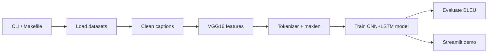

# Developer & course notes

Technical documentation for the image-captioning codebase. For **how to run** the app (CLI, Makefile, datasets table), see the [main README](../README.md).

## Contents

| Doc | What it covers |
|-----|----------------|
| [Setup](setup.md) | Python env, dependencies, Kaggle credentials, Apple Silicon / Metal |
| [Datasets](datasets.md) | Downloading, parsing, merging, custom data |
| [Extract features](extract-features.md) | VGG16 CNN, caching, `features_<dataset>.dump` |
| [Training](training.md) | Pipeline, tokenizer, teacher forcing, model fit, **architecture diagram** |
| [Evaluation](evaluation.md) | BLEU scores, greedy caption generation |
| [Streamlit](streamlit.md) | Upload UI, model switching, inference path |
| [AI concepts](ai-concepts.md) | Ultimate project goal, CNN, LSTM, encoder–decoder, trade-offs |
| [Module reference](module-reference.md) | File-by-file map of `app/` |

## End-to-end flow

1. **Datasets**: Kaggle or local paths → `train_description`, `test_description`, image folders.
2. **Features**: VGG16 turns each image into a fixed vector; cached per dataset.
3. **Text**: Keras `Tokenizer`, padding, `<start>` / `<end>` tokens.
4. **Model**: Two inputs (image vector + caption prefix) → next-word softmax.
5. **Deploy**: `app.py` runs VGG16 + caption model on uploaded images.

## Artifacts (under `app/`)

| File | Role |
|------|------|
| `vgg16_model.h5` | Shared VGG16 feature extractor |
| `features_<dataset>.dump` | Per-dataset image feature cache |
| `model_<prefix>.keras` | Trained caption model |
| `tokenize_<prefix>.dump` | Fitted tokenizer |
| `maxlen_<prefix>.dump` | Max caption length |
| `models_registry.json` | Index of trained runs |
| `training_stats_<prefix>.json` | Timing summary after train/evaluate |

`prefix` is sorted dataset ids joined with `_` (e.g. `flickr8k_flickr30k`).
