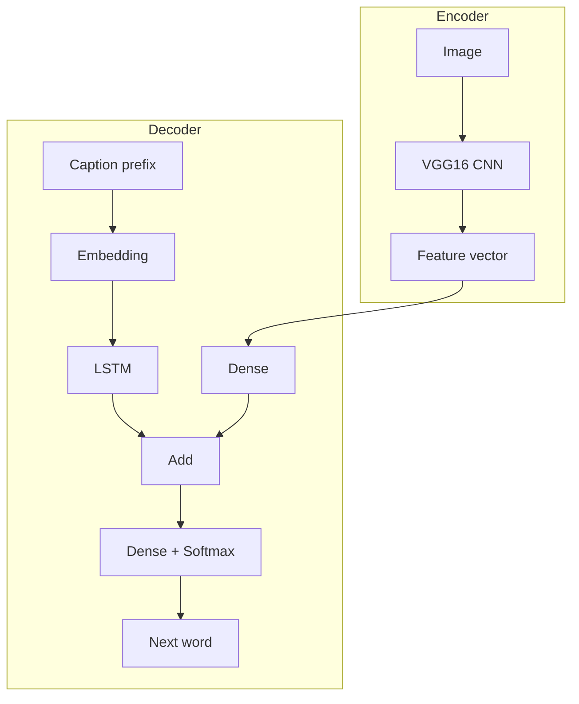
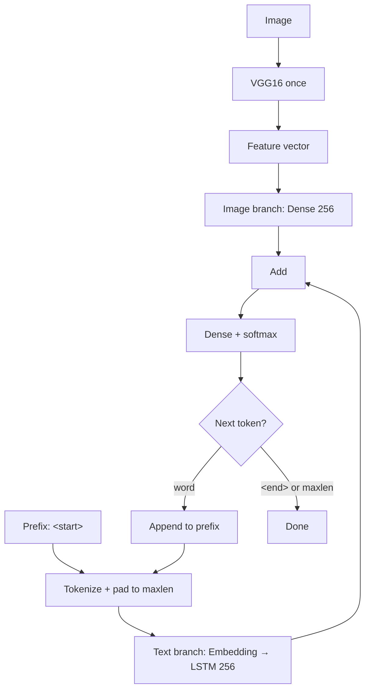

# AI concepts

Theory behind the course implementation: multimodal learning, CNN + LSTM, and trade-offs.

## Ultimate project goal
The **ultimate goal** of this project is to build and ship a complete **image captioning** system: given a **new** photo, produce a short natural-language caption and let a human try it through an interactive app, not only score it on a fixed test split.

That goal unfolds in three layers the repo implements end to end:

| Layer | What “done” looks like |
|-------|------------------------|
| **Learn multimodal AI** | Encoder–decoder captioning with a CNN vision encoder (VGG16) and an LSTM language decoder, fused at each word step |
| **Train and measure** | Fit on paired (image, caption) data (Flickr8k/30k or custom), cache CNN features, evaluate with BLEU on a held-out test set |
| **Deploy for humans** | Serve trained artifacts via Streamlit (upload → caption); the Coursera course extends this to **cloud deployment** on AWS EC2 so others can use a public URL |

CLI `train` and `evaluate` prove the pipeline **numerically**; Streamlit proves it **experientially** on arbitrary uploads: paraphrases, nonsense, and missed objects that BLEU may not reflect. Closing that human-facing loop is what turns a training script into a finished captioning product.

This repository stays on the classic **CNN + LSTM** stack from [*Image Captioning with TensorFlow and Streamlit*](https://www.coursera.org/learn/image-captioning-tensorflow-streamlit) so you learn fundamentals before attention-based and transformer captioners.

## Image captioning

**Task:** Given an image, produce a short natural-language description.

- **Multimodal**: combines vision (pixels → features) and language (word sequences).
- **Supervised**: needs many (image, caption) pairs aligned by image id.
- **Sequential output**: captions are generated word by word (or token by token).

### When this approach fits

| Good fit | Poor fit |
|----------|----------|
| Short descriptive sentences | Long documents or stories |
| Paired image–caption data | Images without text labels |
| Transfer learning from ImageNet CNN | Need fine-grained spatial reasoning only |
| Education, prototypes, accessibility tools | SOTA competition without large compute |

## Encoder–decoder pattern

This project uses a classic **encoder–decoder** for captioning:

- **Encoder (image)**: CNN compresses the image into one vector (“what is in the scene”).
- **Decoder (language)**: LSTM reads the partial caption and, fused with the image vector, predicts the next word.

Same pattern appears in video captioning, speech recognition, and multimodal QA.

### Why CNN + RNN/LSTM together?
Image captioning needs **two different kinds of computation** that no single network type handles well alone:

| Problem | Input / output shape | Best fit |
|---------|----------------------|----------|
| **See the image** | Fixed-size grid of pixels → one summary of scene content | **CNN**: convolutions exploit spatial structure (edges, parts, objects) and compress the image into a vector |
| **Speak the caption** | Variable-length word sequence, generated one token at a time | **RNN / LSTM**: recurrent state carries “what was said so far” and predicts the next word |

**Why not CNN only?** A CNN maps an image to a fixed vector. It has no built-in mechanism to emit a *sequence* of words or to condition each new word on previous ones. You would still need a sequential decoder on top.

**Why not RNN/LSTM only?** Feeding raw pixels step-by-step into an RNN treats the image as a 1D stream and ignores 2D neighborhood structure. Training vision from scratch that way needs far more data and compute than transfer learning with a pretrained CNN.

**Why pair them?** The CNN is the **encoder**: “what is in the picture?” The RNN/LSTM is the **decoder**: “given that meaning and the words so far, what word comes next?” Each step fuses the image vector with the LSTM hidden state (in this repo, via `Add` + `Dense` + softmax). Training uses teacher forcing on caption prefixes; inference runs the LSTM greedily, feeding each predicted word back as input.

**RNN vs LSTM:** Plain RNNs struggle with **vanishing gradients** on longer prefixes; earlier words fade from memory. **LSTM** adds gating so the decoder can retain context across a full caption (e.g. subject–verb agreement several tokens apart). That is why this course uses LSTM rather than a vanilla RNN, even though both are sequential decoders.

Neither branch replaces the other: **CNN = vision encoder, LSTM = language decoder**: the standard encoder–decoder design for multimodal captioning before attention and Transformers.

## CNN (vision encoder)

**Convolutional Neural Networks** learn hierarchical visual features: edges → textures → parts → objects.

### Why a CNN?
Image captioning is **multimodal**: the model must understand visual content before the LSTM can choose words. A CNN is the **vision encoder** in the encoder–decoder pattern for four related reasons:

1. **Images are spatial**: Neighboring pixels form edges, textures, and objects. Convolutions and pooling detect local patterns at multiple scales; a dense network on raw pixels would need far more data and compute for the same job.
2. **Fixed vector for fusion**: The caption branch expects a single vector per image alongside padded token sequences. The CNN compresses a 224×224×3 image (≈150k values) into a compact summary the LSTM branch can merge with (`Add` at 256 dimensions).
3. **Transfer learning**: Flickr8k has only thousands of images; training vision from scratch is impractical. **VGG16** pretrained on ImageNet already encodes common objects and scenes; this project reuses those weights and trains only the language head.
4. **Efficient pipeline**: Features are extracted once and cached (`features_*.dump`). The caption model in `model_builder.py` never backpropagates through VGG16, so training epochs stay fast and use less GPU memory.

The Keras caption model takes **precomputed CNN features** as `inputs1`, not raw pixels. VGG16 still belongs to the full system: every training and inference step depends on CNN-encoded image vectors.

### Role in this repo

- **VGG16** pretrained on ImageNet.
- Classification head removed; last hidden layer → **fixed feature vector**.
- Weights frozen in practice (feature extractor only); caption model trains on top.

### Advantages

- Strong visual representations without training CNN from scratch.
- Smaller training problem (vectors vs millions of pixels).
- Faster epochs, less GPU memory.

### Disadvantages

- **Bag-of-activations**: single vector loses explicit spatial layout (where objects are).
- Domain shift if images differ greatly from ImageNet.
- VGG16 is older/heavier than EfficientNet, ViT, or CLIP backbones.

### Preprocessing

224×224 resize and `preprocess_input` match VGG16 training; required for valid features.

## LSTM (language decoder)

**Long Short-Term Memory** networks model **sequences** with gating that mitigates vanishing gradients in plain RNNs.

### Why RNN/LSTM for the decoder?
Captions are **ordered language**: word *n* depends on words `1…n−1` and on what the image shows. A feed-forward network on a fixed-length input cannot generate an arbitrary-length sentence one token at a time.

- **Sequential output**: The model predicts the next word, then appends it and repeats (`generate_caption`). Recurrence implements that loop in a single trained graph.
- **Variable length**: Different images need short or long descriptions; the LSTM runs until `<end>` or `maxlen`.
- **Context from the prefix**: Hidden state summarizes the partial caption so later words stay grammatically and semantically consistent with earlier ones.
- **Works with the CNN vector**: The image branch supplies a fixed conditioning signal at every step; the LSTM branch supplies the temporal context. See [Why CNN + RNN/LSTM together?](#why-cnn--rnnlstm-together).

This repo uses **LSTM** specifically (not a vanilla RNN) for more stable learning on caption-length sequences.

### Role in this repo

- Input: token ids of caption **prefix** (words generated so far).
- `Embedding` maps ids to dense vectors; `mask_zero=True` ignores padding.
- LSTM output (256 units) summarizes “what has been said.”

### Advantages

- Natural fit for variable-length text.
- Teacher forcing during training is stable and fast.
- Interpretable course baseline from the Coursera material.

### Disadvantages

- **Sequential inference**: greedy word-by-word generation is slow and can drift.
- **Exposure bias**: training sees ground-truth prefixes; inference sees model's own errors.
- Superseded by **Transformers** (self-attention) on most benchmarks.

## Caption tokenization

Neural networks operate on **numbers**, not raw strings. A caption like `"<start> a dog runs <end>"` must become a list of integer token ids (e.g. `[1, 42, 17, 2]`) before training or inference.

### Why tokenization is required

| Without tokenization | What breaks |
|----------------------|-------------|
| No fitted vocabulary | `Embedding` layer has no `vocab_size`; model cannot be built |
| Strings fed to the LSTM branch | TensorFlow expects integer tensors: type/shape errors |
| `texts_to_sequences` on unfitted tokenizer | Empty `[]` sequences → `create_sequences` yields **zero training samples** |
| Mismatched tokenizer at inference | Unknown words map to nothing; generation decodes wrong ids |

The caption model is **next-word classification**: softmax over `vocab_size` classes. Each target in `create_sequences` is a one-hot vector indexed by token id (`to_categorical`). That only works after words are mapped to integers.

### Pipeline in this repo

Tokenization is **not optional**: the training pipeline always runs a dedicated `tokenizer` phase before `caption_training`:

1. **Load**: datasets parse captions and wrap them (`wrap_caption` → `"<start> … <end>"`).
2. **Clean**: `clean_descriptions` lowercases and strips non-alphabetic tokens (still strings).
3. **Fit**: `fit_tokenizer` builds Keras `Tokenizer.word_index` from all train captions.
4. **Convert**: `create_sequences` calls `tokenizer.texts_to_sequences` for each caption, then pads prefixes and one-hot encodes the next token.

At inference, `generate_caption` uses the **same** saved tokenizer (`tokenize_<prefix>.dump`) to encode the growing prefix before each `model.predict`.

### Code locations

| File | Role |
|------|------|
| `captioning/pipeline.py` | `load_or_create_tokenizer` in the `tokenizer` phase |
| `captioning/text_processing.py` | `fit_tokenizer`, `load_or_create_tokenizer`, `create_sequences` |
| `captioning/model_builder.py` | `data_generator` → `create_sequences`; `Embedding(vocab_size, …)` |
| `captioning/inference.py` | `generate_caption`: `texts_to_sequences` on each decoding step |

### Vocabulary size and index 0

- `vocab_size = len(tokenizer.word_index) + 1`: the extra slot reserves index **0** for padding (see [Sequence padding](#sequence-padding)).
- Optional `--num-words` caps how many frequent words Keras keeps; rarer words are dropped at sequence conversion time.

### Tokenization vs cleaning vs wrapping

These steps are related but distinct:

| Step | Example | Still strings? |
|------|---------|----------------|
| **Wrap** | `"a dog"` → `"<start> a dog <end>"` | Yes |
| **Clean** | `"A Dog!"` → `"a dog"` | Yes |
| **Tokenize** | `"a dog"` → `[3, 17]` | No (integers for the network) |

Skipping **cleaning** leaves punctuation in the vocabulary; skipping **tokenization** stops training entirely.

## Sequence padding

Captions are **variable length**: one might be five words, another twenty. Batched LSTM training needs **fixed-shape** inputs: every sample in a batch must be `(maxlen,)`.

**Padding** extends shorter token sequences with **zeros** (token index `0`) until they reach `maxlen`, the longest caption in the train split (from `compute_maxlen`, or `--max-caption-length`). Index `0` is reserved for padding, which is why `vocab_size = len(tokenizer.word_index) + 1`.

### When padding is applied

| Phase | What gets padded |
|-------|------------------|
| **Training** | Each teacher-forcing prefix `seq[:i]` (different length at every step) |
| **Inference** | The growing caption prefix before each `model.predict` |

### Post-padding and `mask_zero`

This repo uses **post-padding** (zeros on the right) via `pad_caption_sequence` and Keras `pad_sequences`. Real tokens stay left-aligned; padding fills the rest.

Post-padding is required for `Embedding(mask_zero=True)` with cuDNN LSTM on GPU/Metal: the mask tells the embedding and LSTM to **ignore** index-0 positions so padding does not affect learning or generation.

### Code locations

| File | Role |
|------|------|
| `captioning/text_processing.py` | `pad_caption_sequence`, `create_sequences` |
| `captioning/inference.py` | `generate_caption` pads before each prediction |
| `captioning/model_builder.py` | `Embedding(..., mask_zero=True)` on `inputs2` |

## Fusion: why Add at 256 dimensions?

Image branch: `Dense(256)`. LSTM branch: `256` units. **Element-wise add** requires matching shapes: both branches project to the same size before merge.

Alternatives in other systems: concatenation, attention over image regions, cross-attention (Transformer).

## Teacher forcing vs greedy decoding

| Training | Inference |
|----------|-----------|
| True previous words fed to LSTM | Model's own predictions fed back |
| `create_sequences` builds all prefixes | `generate_caption` loops argmax |

Mismatch (exposure bias) is a known limitation of this training scheme.

## Greedy caption generation at inference

A common first guess at how captions are produced:

1. Get the feature vector of the image.
2. Send it to the LSTM and get a word.
3. Send the feature vector + the previous word to the LSTM again.
4. Repeat until a fixed caption length.

That is close in spirit (one word per step, image context reused), but the implementation in this repo differs in three important ways:

| Step in the mental model | What actually happens in this project |
|--------------------------|---------------------------------------|
| Get feature vector | **Yes.** VGG16 encodes the image once; the same vector is reused at every decoding step. |
| Send to LSTM → get a word | **Partially.** The image vector and the tokenized caption prefix go through **two separate branches** (image `Dense` vs text `Embedding` → LSTM), then are **added** and passed through `Dense` + softmax. The LSTM only sees the **text** branch. |
| Feature vector + previous word | **Close, but not quite.** Each step feeds the **same** image vector plus the **entire growing prefix** (e.g. `"<start> a dog"`, not just `"dog"`). The prefix is tokenized and padded to `maxlen` before `model.predict`. |
| Until a specific length | **No fixed output length.** Decoding stops when the model predicts `<end>`, or when the loop hits `max_length` (a safety cap from training data), whichever comes first. |

### Accurate inference loop (`generate_caption`)

1. **Encode image once:** VGG16 → feature vector (cached offline during training; computed on upload in Streamlit).
2. **Start prefix:** `"<start>"`.
3. **Each word step:**
   - Tokenize the full prefix so far → pad to `maxlen`.
   - `model.predict([photo, sequence])` — both inputs every time.
   - Argmax over softmax → next word id.
   - Append word to prefix; stop on `<end>` or after `max_length` iterations.
4. **Display:** Streamlit strips `<start>` / `<end>` for readable output.

See [`captioning/inference.py`](../app/captioning/inference.py) and [Evaluation: greedy decoding](evaluation.md#generate_captionmodel-tokenizer-photo-max_length).

## Data generators

A **data generator** is a Python iterator that yields training samples **one batch at a time** instead of building the full dataset in memory before `model.fit`.

### Why use a generator with large datasets?
Caption training with teacher forcing **multiplies** data: one image with five captions and a 20-token sentence becomes hundreds of `(image vector, padded prefix, one-hot next word)` tuples. Precomputing every tuple for Flickr30k-scale data can consume gigabytes of RAM before the first epoch starts.

| Preload entire dataset | Data generator |
|------------------------|----------------|
| All sequences materialized before training | Sequences built per image when Keras requests them |
| RAM grows with images × captions × caption length | RAM stays bounded; only the current yield is live |
| Hard to scale to millions of samples or raw pixels | Standard pattern for large vision and NLP pipelines |

**Advantages:**

1. **Memory efficiency**: You never hold the full expanded training set in RAM. Only the samples for the current step exist at once.
2. **Scalability**: Dataset size is limited mainly by disk (and caches like `features_*.dump`), not available memory.
3. **Controlled epochs**: An infinite loop (`while True`) plus `steps_per_epoch` lets Keras run fixed-length epochs without storing a global shuffled index of every sample.
4. **`tf.data` integration**: `tf.data.Dataset.from_generator` wires the Python generator into `model.fit` with an explicit `output_signature`, which modern TensorFlow requires for typed, safe batching.

In this repo, `data_generator` walks `train_description`, calls `create_sequences` for **one image at a time**, and yields that image's teacher-forcing tuples. CNN features are already cached as compact vectors (not raw pixels), but **sequence expansion** is still done lazily. See [Training: Data generator](training.md#data-generator) for the implementation.

## Two-input Keras model

Layer-by-layer diagram (matches `define_model`): [Training: Architecture](training.md#architecture-define_model).

| Input | Shape | Meaning |
|-------|-------|---------|
| `inputs1` | `(batch, image_feature_dim)` | Image content |
| `inputs2` | `(batch, maxlen)` | Partial caption token ids |

Output: softmax over vocabulary: **next word** classification.

Cannot use one input: image is a fixed vector, caption is a padded sequence; different structures need separate branches.

## Hyperparameters (course defaults)

| Param | Default | Role |
|-------|---------|------|
| `embedding_dim` | 256 | Word vector size |
| `lstm_units` | 256 | LSTM hidden size |
| `dense_units` | 256 | Image/text fusion width |
| `dropout` | 0.5 | Regularization |
| `learning_rate` | 0.001 | Adam step size |

Larger values → more capacity, more overfit risk on small Flickr sets.

## Evaluation: BLEU

**BLEU** measures n-gram overlap with reference captions.

- Useful for comparing training runs.
- Multiple references per image (Flickr8k has five) improve fairness.

### Limitation: lexical overlap ≠ meaning
BLEU scores **surface word overlap**, not whether a caption is **semantically correct**.

| Generated caption | Reference | Human judgment | BLEU tendency |
|-------------------|-----------|----------------|---------------|
| `a man riding a horse` | `a person on a horse` | Both valid | Low: few shared n-grams |
| `a dog in the park` | `a dog in the park` | Same meaning | High: exact match |
| `a puppy in the park` | `a dog in the park` | Same scene | Low: “puppy” ≠ “dog” to BLEU |

**Why this matters:** A model can produce a fluent, accurate description and still score poorly if it paraphrases the reference wording. Conversely, a caption that repeats reference n-grams can score well without fully describing the image.

BLEU is still useful for **comparing runs** on the same dataset, but it is **blind to synonyms and paraphrase**; one reason papers also report CIDEr, SPICE, or human ratings. See [Evaluation](evaluation.md) for how this repo computes corpus BLEU.

## Modern alternatives (context)

| Approach | Idea |
|----------|------|
| **Attention (Show, Attend and Tell)** | Weight image regions per generated word |
| **Transformer / ViT + GPT** | Attention on patches and tokens |
| **CLIP / BLIP / LLaVA** | Large pretraining on image–text pairs |

This repository intentionally stays close to the **CNN + LSTM** course design for learning fundamentals.

## Summary

| Component | Purpose |
|-----------|---------|
| CNN (VGG16) | Encode image → vector |
| LSTM | Encode caption prefix → vector |
| Add + Dense | Fuse modalities |
| Softmax | Predict next word |
| BLEU | Measure overlap with references |
| Streamlit | Demo deployment |

Understanding these pieces prepares you to read attention-based and transformer captioning papers with clearer intuition.
