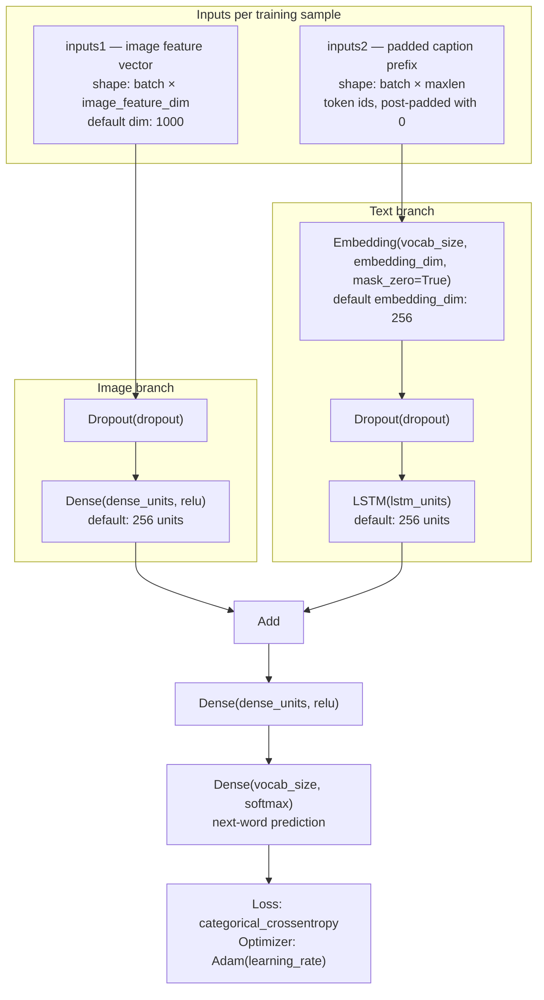

# Training

Full training pipeline: tokenizer, sequences, model definition, and fit loop.

## CLI

```bash
python main.py train --datasets flickr8k --epochs 30
python main.py train --datasets flickr8k,flickr30k --force-retrain -y
make train DATASETS=flickr8k EPOCHS=30
```

## Orchestration (`captioning/pipeline.py`)

`run_pipeline(config)` executes timed phases:

| Phase | What happens |
|-------|----------------|
| `artifact_checks` | `prepare_training_artifacts`: confirm deletions if retraining |
| `load_datasets` | `load_selected_datasets` |
| `features` | `load_or_extract_features` |
| `prepare_splits` | `train_features` / `test_features` |
| `tokenizer` | `load_or_create_tokenizer` |
| `maxlen` | `load_or_create_maxlen` |
| `caption_training` | `load_or_train_model` (fit) |
| `evaluation` | Optional BLEU if `config.evaluate` |
| `sample_caption` | Greedy caption on one test image |

Writes `training_stats_<prefix>.json` via `captioning/timing.py`.

## Artifacts (`captioning/artifacts.py`)

`prepare_training_artifacts` only removes files for the **current prefix** and optionally per-dataset feature dumps: never another model's `model_*.keras`.

`datasets_needing_feature_extract` returns dataset ids missing `features_<id>.dump`.

## Text processing (`captioning/text_processing.py`)

### Tokenizer

- `fit_tokenizer`: Keras `Tokenizer` on all train captions; optional `num_words` cap.
- `load_or_create_tokenizer`: load pickle or refit if missing / too small / `force_retrain`.
- Saved as `tokenize_<prefix>.dump`.

### Max length

- `compute_maxlen`: longest caption (in words) in train split.
- Override with `--max-caption-length`.
- Saved as `maxlen_<prefix>.dump`.

### Teacher forcing: `create_sequences`

For each caption and each position `i = 1 … len(seq)-1`:

- **Input image**: same feature vector for every sub-sequence from that image.
- **Input sequence**: prefix `seq[:i]`, right-padded to `maxlen` (`pad_caption_sequence`, post-padding for GPU/Metal LSTM). See [Sequence padding](ai-concepts.md#sequence-padding) for why this is needed.
- **Target**: next token, one-hot (`to_categorical`).

This is **teacher forcing**: the model always sees the true previous words during training, not its own predictions.

## Model (`captioning/model_builder.py`)

### Architecture: `define_model`

Two inputs (encoder–decoder style). The image branch consumes **VGG16 CNN features** (not raw pixels); see [Why a CNN?](ai-concepts.md#why-a-cnn). The text branch is an **LSTM decoder** for word-by-word generation; see [Why CNN + RNN/LSTM together?](ai-concepts.md#why-cnn--rnnlstm-together).

VGG16 runs **outside** this Keras model (feature extraction phase). `define_model` only trains on cached vectors as `inputs1`.



Implementation in [`captioning/model_builder.py`](../app/captioning/model_builder.py) (`define_model`):

| Branch | Layers | Input shape |
|--------|--------|-------------|
| Image | Dropout → Dense(256, relu) | `(image_feature_dim,)` e.g. 1000 |
| Text | Embedding → Dropout → LSTM(256) | `(maxlen,)` token ids |

Branches merged with `Add()`, then Dense(256) → softmax over `vocab_size`.

Compiled with `categorical_crossentropy` and Adam (`learning_rate` from config).

### Data generator

`data_generator`: infinite loop over `train_description`; yields `((photo, seq), one_hot_word)` per image step.

Wrapped in `tf.data.Dataset.from_generator` with explicit `output_signature` (required by modern TensorFlow).

Why generators matter for large datasets (memory, lazy sequence expansion, epoch control): [Data generators](ai-concepts.md#why-use-a-generator-with-large-datasets).

### Training loop: `train_model`

- `steps_per_epoch` = `len(train_description)` unless overridden.
- One epoch per outer loop iteration; `model.save` after each epoch.
- ETA printed via `TrainingTimer.record_epoch`.

### Load or train: `load_or_train_model`

- Loads existing `model_<prefix>.keras` if vocab size matches.
- Otherwise builds fresh model and trains.

## Hyperparameters

See main README **Training parameters** table. Key levers:

- `embedding_dim`, `lstm_units`, `dense_units`: capacity (default 256).
- `dropout`: regularization (default 0.5).
- `epochs`, `learning_rate`, `steps_per_epoch`.

## Registry

After training, `register_model_run(prefix, dataset_ids)` updates `models_registry.json` for Streamlit discovery.
