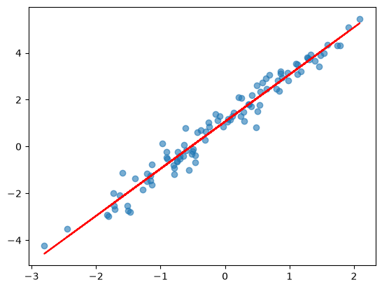
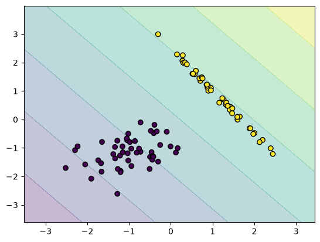
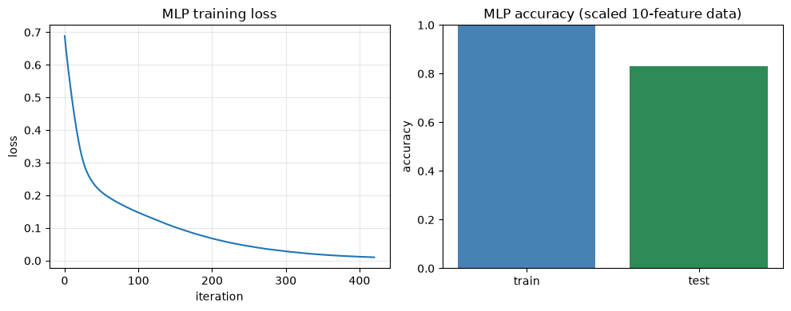
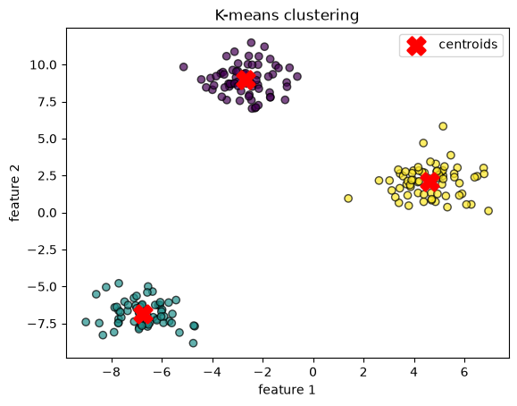
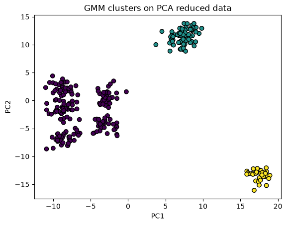

# Module 2: AI for Cybersecurity Professionals

### Objectives

- Understand fundamental AI and ML concepts
- Relate AI techniques to cybersecurity use cases
- Identify where AI adds value in protecting digital assets

### Key concepts


| Term                   | Definition / notes                                               |
| ---------------------- | ---------------------------------------------------------------- |
| Supervised learning    | Trains on **labeled** data; test on unseen examples              |
| Unsupervised learning  | No labels: clustering & dimensionality reduction                |
| Reinforcement learning | Trial-and-error via **reward matrix**; hands-on later            |
| Linear regression      | Supervised; predicts continuous values (best-fit line)           |
| Neural network (MLP)   | Supervised; layered classifier; often needs scaled features      |
| PCA                    | Reduces feature dimensions while keeping variance                |
| GMM clustering         | Groups data into clusters on reduced features                    |
| K-Means                | Clustering; assigns points to k nearest **centroids**            |
| ML analytic process    | Data engineer to data scientist to optimize to deploy test          |
| `random_state`         | Fixed seed for random ops to **reproducible** results across runs |


# Notes

## Supervised learning

Learns from **labeled** examples. Cyber use case: 

- **spam detection**: 
  - train on spam + legitimate emails
  - then test on unseen mail to measure performance.

**Goal**: learn parameters $\theta$ so predictions $\hat{y} = f(\mathbf{x}; \theta)$ match labels $y$.

**Pattern:** import to instantiate model to `fit()` train to `predict()` / visualize.

## Linear regression

Predicts a line that best fits continuous data.

**Model**: weighted sum of features plus bias:


$\hat{y} = w_1 x_1 + w_2 x_2 + \cdots + w_n x_n + b = \mathbf{w}^\top \mathbf{x} + b$


**Training**: minimize **mean squared error** (MSE) between predictions and true values:


$\text{MSE} = \frac{1}{n} \sum_{i=1}^{n} (y_i - \hat{y}_i)^2$


```python
import numpy as np
import matplotlib.pyplot as plt
from sklearn.linear_model import LinearRegression

# --- Build fake data with a known linear pattern (for learning/demo) ---
# X: 100 rows, 1 feature each: random inputs from a standard normal distribution
X = np.random.randn(100, 1)

# y = 2*x + 1 + small noise
#   - 2 * X.squeeze()  to slope of 2 (multiply each x by 2)
#   - + 1              to intercept of 1
#   - + noise * 0.1    to slight scatter so points aren't perfectly on a line
# squeeze() flattens (100, 1) to (100,) so we can do element-wise math
y = 2 * X.squeeze() + 1 + np.random.randn(100) * 0.1

# --- Train: find the line (slope + intercept) that best fits X to y ---
model = LinearRegression()
model.fit(X, y)  # learns weights from data; should recover ~slope 2, ~intercept 1
# model.coef_[0] ≈ 2.0 (slope), model.intercept_ ≈ 1.0: check after fit

# --- Visualize: blue dots = training data, red line = model prediction ---
plt.scatter(X, y, alpha=0.6)              # alpha = transparency (see overlapping points)
plt.plot(X, model.predict(X), color="red")  # predict y for each X; draws best-fit line
plt.show()
```



**When commonly used**

- Predicting **continuous** values (scores, counts, timing metrics)
- Quick **baseline** before trying harder models
- When you need **interpretable** coefficients (which feature drives the output)
- Cyber: trend analysis, resource forecasting, simple numeric risk scores

**Common disadvantages**

| Limitation | Better alternative |
| ---------- | ------------------ |
| Predicts continuous values, bad at **classification** (ham/spam labels) | **Logistic regression**, **decision tree**, **SVM** |
| Assumes a **linear** relationship | **Polynomial regression**, **MLP**, **decision tree** for curved patterns |
| Sensitive to **outliers** | **Random forest**, **robust regression** |
| Cannot capture feature **interactions** alone | **Decision tree**, **MLP**, **random forest** |

### Linear regression vs perceptron (same equation shape, different job)

Both models start with the same weighted sum:

$z = \mathbf{w}^\top \mathbf{x} + b$

What happens **after** $z$ is computed is what differs.

| | **Linear regression** | **Perceptron** |
| - | --------------------- | -------------- |
| **Task** | **Regression**: predict a number | **Classification**: predict a class |
| **Output** | Continuous $\hat{y} = z$ (any real value) | Discrete $\hat{y} \in \{0, 1\}$ via threshold |
| **Target $y$** | Continuous (price, score, count) | Category (ham/spam, legit/attack) |
| **Training goal** | Minimize **MSE**: $\frac{1}{n}\sum(y_i - \hat{y}_i)^2$ | Minimize **classification errors** |
| **Decision rule** | No class; output is the number itself | Class if $z \geq \theta$, else other class |
| **Output range** | Unbounded ($-\infty$ to $+\infty$) | Only 0 or 1 |
| **Typical question** | "How much?" | "Which category?" |
| **Course script** | [`LinearRegression.py`](../code/mod2/LinearRegression.py) | [`PerceptronSpamFilter.py`](../code/mod2/PerceptronSpamFilter.py) (Module 3) |

**Perceptron output** (Module 3):

$z = \mathbf{w}^\top \mathbf{x} + b \qquad \hat{y} = \begin{cases} 1 & \text{if } z \geq \theta \\ 0 & \text{otherwise} \end{cases}$

**Perceptron learning** (updates only on mistakes):

$w_j \leftarrow w_j + \eta (y - \hat{y}) x_j$

**Study takeaway:** both draw a **straight line** in feature space, but linear regression fits **how high** points sit on that line; the perceptron picks **which side** of the line a point belongs to. Using linear regression for ham/spam labels forces a continuous score into categories and usually hurts accuracy (see [Module 3 linear regression spam lab](module-03-email-threat-detection.md#linear-regression-spam-filter-same-sms-dataset)).

**Logistic regression** (next section) is the middle ground: same $z$, but $\sigma(z)$ gives a **class probability** instead of a raw number or hard 0/1 threshold.

## Logistic regression: Classification + decision boundary

Same workflow on a labeled 2D dataset; plot decision space over training points.

Still starts with the same linear score as linear regression and the perceptron:

$z = \mathbf{w}^\top \mathbf{x} + b$

**Logistic regression** passes $z$ through the **sigmoid** $\sigma$ to get a **class probability**:

$P(y=1 \mid \mathbf{x}) = \sigma(z) = \frac{1}{1 + e^{-z}} = \frac{1}{1 + e^{-(\mathbf{w}^\top \mathbf{x} + b)}}$

Predict class 1 if $P(y=1 \mid \mathbf{x}) \geq 0.5$ (or tune the cutoff for fewer false positives).

### Binary sigmoid vs multi-class softmax

**Sigmoid** is the **binary** case: one score $z$ → one probability for class 1; class 0 is $1 - P(y{=}1)$.

**Softmax** is the **multi-class** version: compute a score $z_k$ per category, then **normalize** so all class probabilities sum to **1**:

$P(y = k \mid \mathbf{x}) = \frac{e^{z_k}}{\sum_{j=1}^{N} e^{z_j}}$

| | **Sigmoid (binary)** | **Softmax ($N$ classes)** |
| - | -------------------- | ------------------------- |
| Scores | One $z$ | One $z_k$ per class |
| Output | $P(y{=}1)$ in $(0,1)$ | $N$ probabilities, each in $(0,1)$, **sum to 1** |
| Equation shape | $\frac{e^{z}}{1 + e^{z}}$ | $\frac{e^{z_k}}{\sum_j e^{z_j}}$ (same exponential ratio idea) |
| Typical use | Ham/spam, phishing vs legit | Malware family, attack type, multi-label routing |

When $N = 2$, softmax reduces to the same idea as sigmoid. MLP classifiers in later labs use **softmax** on the output layer when there are more than two classes.

### Why wrap $z$ in $e$? (purpose of the sigmoid)

| Problem with raw $z$ | What sigmoid fixes |
| -------------------- | ------------------ |
| $z$ can be any real number ($-\infty$ to $+\infty$) | Output is always between **0 and 1** → valid **probability** |
| Linear regression on 0/1 labels gives scores outside [0, 1] | Smooth S-shaped curve maps extreme $z$ toward 0 or 1 |
| Perceptron uses a **hard** step at $\theta$ (not differentiable) | Sigmoid is **smooth** → gradient-based training works well |

**Intuition:**

- Large positive $z$ → $e^{-z} \approx 0$ → $P \approx 1$ (confident class 1)
- Large negative $z$ → $e^{-z}$ huge → $P \approx 0$ (confident class 0)
- $z = 0$ → $P = 0.5$ (on the fence)

**Decision boundary unchanged:** $P = 0.5$ exactly when $z = 0$, so the separator is still the **same straight line** $\mathbf{w}^\top \mathbf{x} + b = 0$. The sigmoid only **softens** the output into a probability; it does not curve the boundary (unlike kernel SVM).

**Where this fits in the course:**

| Model | Uses $z = \mathbf{w}^\top \mathbf{x} + b$ | Final output |
| ----- | ----------------------------------------- | ------------ |
| Linear regression | $\hat{y} = z$ | Any real number |
| Logistic regression | $P = \sigma(z)$ | Probability in (0, 1) |
| Perceptron | $\hat{y} = 1$ if $z \geq \theta$ | Hard 0 or 1 |

Cyber use: phishing risk score ("87% likely phishing") rather than only yes/no.

```python
import matplotlib.pyplot as plt
from sklearn.datasets import make_classification
from sklearn.linear_model import LogisticRegression
from sklearn.inspection import DecisionBoundaryDisplay

# --- Build fake labeled data (2 features to easy to plot in 2D) ---
# X: feature matrix (n_samples × 2): two numeric inputs per point
# y: class labels (0 or 1): supervised learning needs these
# n_features=2        to 2 dimensions (x and y axis on plot)
# n_redundant=0       to no duplicate/useless features
# n_clusters_per_class=1 to one blob per class (cleaner separation)
X, y = make_classification(n_features=2, n_redundant=0, n_clusters_per_class=1)

# --- Train: logistic regression draws a linear decision boundary ---
# clf predicts class 0 vs 1 from the two features
clf = LogisticRegression().fit(X, y)

# --- Visualize: shaded regions = predicted class, dots = actual training points ---
DecisionBoundaryDisplay.from_estimator(clf, X, alpha=0.3)  # alpha = region transparency
plt.scatter(X[:, 0], X[:, 1], c=y, edgecolors="k")  # [:, 0]=feature1, [:, 1]=feature2; c=y colors by class
plt.show()
```



**When commonly used**

- **Binary or multi-class** classification with labeled data
- Need **class probabilities** (e.g. phishing risk score)
- **Interpretable** linear decision boundaries
- Cyber: phishing website detection, simple spam/ham with numeric features

**Common disadvantages**

| Limitation | Better alternative |
| ---------- | ------------------ |
| **Linear** decision boundary only | **SVM** (kernel), **MLP**, **decision tree** for non-linear data |
| Assumes features are **linearly independent** | **Decision tree**, **random forest**, **MLP** capture interactions |
| Weak on **high-dim text** (raw words) | **Naive Bayes**, **MLP** with embeddings |
| Struggles with **complex patterns** in large datasets | **Random forest**, **gradient boosting**, **MLP** |

## Neural network (supervised)

Runnable script: [`code/mod2/MLPSupervised.py`](../code/mod2/MLPSupervised.py).

Multi-layer classifier on labeled data, deeper than linear models.

### What inputs does the MLP need?

| Requirement | Why |
| ----------- | --- |
| **Numeric feature matrix `X`** | Shape `(n_samples, n_features)`; MLP multiplies weights by numbers, not raw text |
| **Class labels `y`** | Supervised learning: 0/1 (binary) or multi-class IDs |
| **`StandardScaler` on train** | Neural nets train better when features share similar range |
| **Enough samples** | More weights than logistic regression → needs more data to generalize |
| **`random_state=42`** | Reproducible data split, weight init, and shuffling |

**Why scale before MLP but not always for trees?** MLP uses gradient descent on weighted sums; features with large values dominate updates. Trees split on thresholds and are less scale-sensitive.

**Why 10 features here (vs 2 for logistic plot)?** Logistic regression demo uses 2D data for a decision-boundary plot. This MLP lab uses **higher-dimensional tabular data** closer to security feature vectors (keystroke timings, eigenface coefficients).

### One neuron → one MLP

**One neuron**: weighted sum passed through activation $g$ (ReLU by default in sklearn MLP):

$a = g\!\left(\sum_{j} w_j x_j + b\right) = g(\mathbf{w}^\top \mathbf{x} + b)$

**Hidden layer** (vector form):

$\mathbf{h} = g(\mathbf{W}_1 \mathbf{x} + \mathbf{b}_1)$

**Output layer** (binary classification, sklearn uses logistic loss):

$\hat{y} = \sigma(\mathbf{w}_2^\top \mathbf{h} + b_2)$

**MLP in this lab:** input(10) → hidden(64) → hidden(32) → output. Deeper layers combine lower-level feature patterns.

### Why MLP vs perceptron (what extra layers buy you)

A **perceptron** is a single layer: one weighted sum + threshold → **one straight decision boundary**. It can only separate classes when a single line (or hyperplane) works.

An **MLP** stacks layers: each hidden neuron applies a **non-linear** activation $g$ (ReLU), then the next layer mixes those outputs:

$\mathbf{h}^{(1)} = g(\mathbf{W}_1 \mathbf{x} + \mathbf{b}_1) \qquad \mathbf{h}^{(2)} = g(\mathbf{W}_2 \mathbf{h}^{(1)} + \mathbf{b}_2) \qquad \hat{y} = \sigma(\mathbf{w}_3^\top \mathbf{h}^{(2)} + b_3)$

| | **Perceptron** | **Logistic regression** | **MLP (hidden layers)** |
| - | -------------- | ----------------------- | ------------------------ |
| **Layers** | 1 (input → output) | 1 (linear score + sigmoid) | 2+ hidden layers in this lab |
| **Decision boundary** | **Linear** only | **Linear** (soft probability) | **Non-linear** (curved, piecewise) |
| **Feature interactions** | Only via raw inputs | Only via raw inputs | **Learned** in hidden units (e.g. "high hold time **and** low flight time") |
| **When it wins** | Simple, linearly separable spam keywords | Class probabilities, interpretable phishing scores | Keystroke rhythms, eigenface combos, complex tabular patterns |
| **Trade-off** | Fast, simple | Still fast, interpretable | More data, scaling, tuning; harder to explain |

**Why adding layers helps:**

1. **Non-linearity** — ReLU (or sigmoid) after each layer lets the network bend the boundary; a single perceptron cannot.
2. **Feature combinations** — Layer 1 might detect simple timing signals; layer 2 combines them into "this user's rhythm" (Module 4 keystroke lab: **MLP beats SVM/KNN**).
3. **Higher-dimensional inputs** — With 10+ features or 150 eigenface coefficients, linear models plateau; hidden layers learn useful mixes automatically.
4. **Same idea as stacking experts** — Each neuron asks a small question; deeper layers answer harder questions built from earlier answers.

**When a perceptron is enough:** few hand-picked features and classes are **linearly separable** (Module 3: 2 keyword counts, spam vs ham). **When to reach for MLP:** accuracy stalls on linear/logistic models, or features interact in non-obvious ways (biometrics, rich tabular data).

**Scaling** (fit on train only):

$x'_j = \frac{x_j - \mu_j}{\sigma_j}$

### Pipeline

| Phase | Steps |
| ----- | ----- |
| Data | `make_classification(500, 10)` → labeled tabular data |
| Split | 80% train / 20% test (`random_state=42`) |
| Scale | `StandardScaler.fit_transform` train → `transform` test |
| Train | `MLPClassifier(hidden_layer_sizes=(64, 32), max_iter=500)` |
| Evaluate | Accuracy + training loss curve |

```python
import matplotlib.pyplot as plt
from pathlib import Path
from sklearn.datasets import make_classification
from sklearn.metrics import accuracy_score
from sklearn.model_selection import train_test_split
from sklearn.neural_network import MLPClassifier
from sklearn.preprocessing import StandardScaler

# 500 samples × 10 features; random_state=42 → same data every run
X, y = make_classification(n_samples=500, n_features=10, random_state=42)

X_train, X_test, y_train, y_test = train_test_split(
    X, y, test_size=0.2, random_state=42
)

# fit on TRAIN only; transform test with train mean/std
scaler = StandardScaler()
X_train = scaler.fit_transform(X_train)
X_test = scaler.transform(X_test)

# 2 hidden layers: 64 neurons → 32 neurons → class output
clf = MLPClassifier(hidden_layer_sizes=(64, 32), max_iter=500, random_state=42)
clf.fit(X_train, y_train)

print(f"Accuracy: {accuracy_score(y_test, clf.predict(X_test)):.3f}")

# loss_curve_: how training loss drops across iterations
plt.plot(clf.loss_curve_)
plt.xlabel("iteration")
plt.ylabel("loss")
plt.title("MLP training loss")
out = Path(__file__).resolve().parent / "MLPSupervised.png"
plt.savefig(out, bbox_inches="tight")
plt.close()
```



#### vs logistic regression & perceptron (same module)

| | Perceptron | Logistic regression | MLP (this lab) |
| - | ---------- | ------------------- | -------------- |
| Layers | 1 | 1 | 3 (64 → 32 → out) |
| Features | 2 keywords (Module 3) | 2 (plottable demo) | 10 (tabular) |
| Boundary | **Linear** (hard 0/1) | **Linear** (probability) | **Non-linear** |
| Scaling | Optional | Optional | **Recommended** |
| Interpretability | Weights ≈ keyword importance | Coefficients | Low (black box) |
| Cyber use | Simple spam keywords | Phishing probabilities | Keystroke dynamics, eigenfaces |


**When commonly used**

- **Non-linear** patterns with many features
- Image/text biometrics after feature extraction (e.g. eigenfaces to MLP)
- Keystroke dynamics, complex tabular classification
- When **logistic regression** or **linear models** plateau on accuracy

**Common disadvantages**

| Limitation | Better alternative |
| ---------- | ------------------ |
| Needs **more data** and careful tuning | **Logistic regression**, **Naive Bayes** for small datasets |
| **Black box**, hard to explain alerts | **Decision tree**, **logistic regression** for interpretability |
| Requires **feature scaling** and more compute | **Decision tree**, **random forest** (less scaling needed) |
| Risk of **overfitting** with small training sets | **SVM**, **regularized logistic regression** |
| Slower iteration than simple models | **Logistic regression**, **KNN** for quick baselines |

## Unsupervised learning

No labels required.


| Type                         | What it does         | Cyber use                       |
| ---------------------------- | -------------------- | ------------------------------- |
| **Clustering**               | Groups similar data  | Malware / fraud detection       |
| **Dimensionality reduction** | Fewer features (PCA) | Simplify high-dim security data |


## Clustering (K-Means)

Groups unlabeled points by distance to cluster **centroids**: no `y` labels needed.

**Objective**: minimize total distance from each point to its assigned centroid $\mu_k$:

$\min \sum_{i=1}^{n} \left\| \mathbf{x}_i - \mu_{c_i} \right\|^2$

where $c_i$ = cluster assigned to point $i$. Algorithm alternates: assign points to recompute centroids to repeat.

```python
import matplotlib.pyplot as plt
from sklearn.datasets import make_blobs
from sklearn.cluster import KMeans

# --- Build fake unlabeled data (2 features to plottable in 2D) ---
# 200 samples, 2 features, 3 blob-shaped groups
# y_true exists only to compare later: KMeans never sees it
X, y_true = make_blobs(n_samples=200, n_features=2, centers=3, random_state=42)

# Shapes & meaning:
#   X         to (200, 2)  rows = 200 data points (samples)
#                         cols = 2 numeric features per point [feature_1, feature_2]
#   y_true    to (200,)    one true group ID per sample (0, 1, or 2): hidden from model
#   X[i]      to [x_i_feature1, x_i_feature2]: coordinates of sample i
#   X[:, 0]   to all 200 values of feature 1 (column 0)
#   X[:, 1]   to all 200 values of feature 2 (column 1)

# --- K-Means: partition data into k clusters ---
# n_clusters=3 to find 3 group centers (centroids)
# fit_predict: (1) places centroids, (2) assigns each point to nearest centroid
# labels    to (200,)  one predicted cluster ID per sample (0, 1, or 2)
# cluster_centers_ to (3, 2)  3 centroids, each [centroid_feature1, centroid_feature2]
kmeans = KMeans(n_clusters=3, random_state=42)
labels = kmeans.fit_predict(X)

# --- Visualize: dots = data points, X markers = learned centroids ---
# scatter x = feature 1, y = feature 2, color = predicted cluster (labels)
plt.scatter(X[:, 0], X[:, 1], c=labels, cmap="viridis", edgecolors="k", alpha=0.7)
plt.scatter(
    kmeans.cluster_centers_[:, 0],  # centroid x-coords (feature 1)
    kmeans.cluster_centers_[:, 1],  # centroid y-coords (feature 2)
    c="red", marker="X", s=200, linewidths=2, label="centroids",
)
plt.xlabel("feature 1"); plt.ylabel("feature 2")
plt.title("K-Means clustering")
plt.legend()
plt.show()
```



**Cyber angle:** cluster network traffic or malware samples by behavior, outliers or rare clusters may flag threats.

**When commonly used**

- Fast **clustering baseline** on unlabeled data
- **Large** datasets with roughly **round**, similar-sized groups
- Exploratory malware/fraud grouping, 2D visualization after feature reduction
- First pass before trying **GMM** or **DBSCAN**

**Common disadvantages**

| Limitation | Better alternative |
| ---------- | ------------------ |
| Must choose **k** (number of clusters) upfront | **DBSCAN**, **GMM** (model selection), hierarchical clustering |
| Assumes **spherical**, equal-size clusters | **GMM** for elliptical/overlapping groups; **DBSCAN** for irregular shapes |
| Sensitive to **outliers** and initialization | **DBSCAN**, **GMM** with robust preprocessing |
| **Hard** cluster assignment only (no probability) | **GMM** for soft membership scores |
| Poor on **high-dimensional** raw data | **PCA** first, then cluster; or **t-SNE** for visualization |

## PCA + Gaussian mixture clustering

Load data to reduce dimensions with PCA to cluster reduced data to visualize groups.

No labels passed to the model, clusters are discovered from structure in the data.

**PCA**: project data onto directions of **maximum variance**. Reduced coordinates:

$\mathbf{Z} = \mathbf{X} \mathbf{W}_k$

where $\mathbf{W}_k$ holds the top $k$ principal components (eigenvectors of the covariance matrix). Keeps most information in fewer dimensions for plotting or clustering.

**PCA: when commonly used**

- **High-dimensional** data (face images, many sensor features)
- Visualization in 2D/3D before clustering or classification
- **Eigenfaces** pipeline: reduce pixels before **MLP**
- Remove redundant/correlated features in security logs

**PCA: common disadvantages**

| Limitation | Better alternative |
| ---------- | ------------------ |
| Only **linear** combinations of features | **t-SNE**, **UMAP**, **autoencoders** for non-linear structure |
| Maximizes **variance**, not prediction quality | **LDA** (supervised), feature selection with labels |
| Components are **hard to interpret** | Keep original features + **decision tree** for explainability |
| Loses information when $k$ is too small | **GMM** or classifier on more components; tune $k$ carefully |

**PCA + K-Means instead of GMM?** Yes, PCA only reduces dimensions; **either** clusterer can run on `X_reduced`. Swap `GaussianMixture` for `KMeans(n_clusters=3)` and the pipeline stays the same.


|                   | **K-Means**                                          | **GMM**                                                    |
| ----------------- | ---------------------------------------------------- | ---------------------------------------------------------- |
| **Assignment**    | Hard: each point belongs to **one** cluster         | Soft: gives **probability** per cluster                   |
| **Cluster shape** | Assumes **round**, similar-sized blobs               | Handles **elliptical**, varied size/density                |
| **Speed**         | Faster, scales better                                | Slower, more parameters to fit                             |
| **When common**   | Quick baseline, big datasets, clean separated groups | Overlapping groups, uneven density, need confidence scores |
| **PCA + cluster** | Very common default (simple, fast)                   | Used when K-Means splits poorly after PCA                  |


**Why the course uses GMM here:** after PCA, groups are not always perfectly round, GMM models Gaussian-shaped clusters and can overlap more gracefully. For a first pass or large security logs, **K-Means is still a valid and common choice**.

```python
import matplotlib.pyplot as plt
from sklearn.datasets import make_blobs
from sklearn.decomposition import PCA
from sklearn.mixture import GaussianMixture
# from sklearn.cluster import KMeans  # alternative: see comparison above

# --- Build fake unlabeled data (many features: hard to plot directly) ---
# 300 samples, 8 features each; 3 natural groups in the data
# We generate y_true only to sanity-check clusters later: NOT fed to PCA/GMM
X, y_true = make_blobs(n_samples=300, n_features=8, centers=3, random_state=42)
# X.shape to (300, 8): 300 samples, 8 features each

# --- PCA: reduce 8 features to 2 (so we can plot on x/y axes) ---
# fit_transform learns principal directions from X, then projects onto them
# n_components=2 to keep the 2 directions that capture the most variance
pca = PCA(n_components=2)
X_reduced = pca.fit_transform(X)  # shape: (300, 2), PC1, PC2 per sample

# --- GMM clustering: group points into k clusters (unsupervised) ---
# n_components=3 to assume 3 groups (match the 3 blobs we generated)
# fit_predict assigns each row a cluster label (0, 1, or 2): no y needed
# labels.shape to (300,)
gmm = GaussianMixture(n_components=3, random_state=42)
labels = gmm.fit_predict(X_reduced)

# K-Means swap (same X_reduced, hard clusters, faster):
# labels = KMeans(n_clusters=3, random_state=42).fit_predict(X_reduced)

# --- Visualize: each color = one discovered cluster ---
plt.scatter(X_reduced[:, 0], X_reduced[:, 1], c=labels, cmap="viridis", edgecolors="k")
plt.xlabel("PC1"); plt.ylabel("PC2")
plt.title("GMM clusters on PCA-reduced data")
plt.show()
```



**Course lab variant:** replace `make_blobs` with `pd.read_csv("data.csv")` and `X = df.values`, same PCA to GMM to plot flow.

**GMM: when commonly used**

- Clusters are **elliptical**, **overlapping**, or uneven density
- Need **probability** of cluster membership per point
- After **PCA** when **K-Means** splits look wrong
- Fraud/malware subgroups that blend into each other

**GMM: common disadvantages**

| Limitation | Better alternative |
| ---------- | ------------------ |
| **Slower**, more parameters than **K-Means** | **K-Means** for large datasets and round blobs |
| Assumes **Gaussian**-shaped clusters | **DBSCAN** for arbitrary shapes; **K-Means** for simple blobs |
| Still need to pick number of components | **DBSCAN** (density-based, no fixed k) |
| Unsupervised, no class labels for detection | **Supervised** **logistic regression**, **random forest** when labels exist |

## Reinforcement learning (overview only)

No hands-on example in this chapter, covered in a later module.

- Agent learns by **trial and error** interacting with an environment
- **Reward matrix:** +points for correct actions, −points for wrong ones
- Goal: maximize **cumulative reward** over time:

$G_t = R_{t+1} + \gamma R_{t+2} + \gamma^2 R_{t+3} + \cdots = \sum_{k=0}^{\infty} \gamma^k R_{t+k+1}$

$\gamma \in [0,1]$ = discount factor (future rewards worth less than immediate ones)

- Cyber use case: detecting **polymorphic malware**

**When commonly used**

- **Sequential** decisions (block, allow, escalate) over time
- Environments with a clear **reward** signal (containment success, false alarm cost)
- Adaptive defense when attack strategy **changes** (polymorphic malware)
- Problems with no static labeled dataset, only interaction feedback

**Common disadvantages**

| Limitation | Better alternative |
| ---------- | ------------------ |
| Needs **many trials** to learn; sample-inefficient | **Supervised** **SVM**, **random forest** when labeled attacks exist |
| **Reward design** is hard and can backfire | Rule-based + **supervised** alerting for well-defined threats |
| Training is **unstable** and hard to debug | **Logistic regression**, **decision tree** for reproducible baselines |
| Overkill for **static** classification (spam, phishing URLs) | **Naive Bayes**, **logistic regression**, **decision tree** |

## ML analytic process (cyber analyst workflow)


| Role                   | Tasks                                                                                                 |
| ---------------------- | ----------------------------------------------------------------------------------------------------- |
| **Data engineer**      | Identify data; store in usable form (CSV to data warehouse / cluster)                                  |
| **Data scientist**     | Feature extraction / transforms to feed **supervised** models (unsupervised & DL often skip this step) |
| **Model optimization** | Pick algorithm to train/test to iterate on features & hyperparameters                                   |
| **Deployment test**    | Validate in a realistic environment before production                                                 |


**Dataset prep best practices:** clean data, handle missing values, split train/test, avoid leakage, document sources.


### ML types: quick compare


| Type              | Data                 | Labels        | Goal                                    | Cyber fit                                |
| ----------------- | -------------------- | ------------- | --------------------------------------- | ---------------------------------------- |
| **Supervised**    | Input + known output | Yes           | Predict labels on new data              | Spam/phishing, malware class labels      |
| **Unsupervised**  | Input only           | No            | Find structure (clusters, reduced dims) | Anomaly grouping, fraud patterns         |
| **Reinforcement** | Environment feedback | Reward signal | Maximize long-term reward               | Adaptive malware response (later module) |


**Most common in cyber today:** supervised, labeled threats (spam, IOCs, alerts) are abundant and map cleanly to classification tasks.

**Accuracy** (used throughout course labs):

$\text{Accuracy} = \frac{\text{correct predictions}}{\text{total predictions}} = \frac{TP + TN}{TP + TN + FP + FN}$

### Per-example dev process

Use the same four-step lens for every notebook:

```
Collect/store to Prepare features to Train & tune to Evaluate on unseen data
```


| Example               | Data                         | Features                                  | Model knobs                                     | What "good" looks like                       |
| --------------------- | ---------------------------- | ----------------------------------------- | ----------------------------------------------- | -------------------------------------------- |
| **Linear regression** | Synthetic or CSV             | Usually **raw** numeric X, y              | noise level, sample size                        | Line aligns with scatter; low residual error |
| **Neural network**    | `make_classification` or CSV | Often **transformed** (scaled/normalized) | `hidden_layer_sizes`, `max_iter`, learning rate | Higher test accuracy; stable convergence     |
| **PCA + clustering**  | Author CSV                   | **Transformed**: PCA reduces dims first  | `n_components`, `n_clusters` / GMM components   | Separable, interpretable clusters in 2D plot |


### Data prep: what to check

Before running classifiers, ask:


| Question          | Why it matters                                                |
| ----------------- | ------------------------------------------------------------- |
| Raw or scaled?    | NNs and distance-based methods need comparable feature ranges |
| Train/test split? | Measures generalization, not memorization                     |
| Leakage?          | Test data must never influence scaling or PCA fit             |
| Missing values?   | Breaks `fit()` or skews clusters                              |


**Scaling impact:** unscaled features let large-magnitude columns dominate, normalization often boosts NN accuracy and stabilizes training.

### Optimization ideas


| Example           | Try changing                           | Expected effect                     |
| ----------------- | -------------------------------------- | ----------------------------------- |
| Linear regression | More/less noise, more samples          | Tighter or looser line fit          |
| Neural network    | Layer sizes, `max_iter`, learning rate | Better accuracy; watch overfitting  |
| Clustering        | PCA components, cluster count          | Clearer or muddier group separation |


Document each change: parameter to metric/plot change to keep or revert.

### Self-reflection prompts

**ML types**

- Supervised needs labels to classification/detection; unsupervised finds hidden groups; RL needs an environment + rewards to sequential decisions.
- Cyber leans supervised because analysts already label incidents, emails, and alerts.

**Development process**

- Common friction: messy data, picking the right split, knowing when to stop tuning.
- Train/test holdout + realistic deployment test to catches overfitting and proves the model works outside the notebook.

**Features**

- Transformed features change what the model "sees", always know if scaling/PCA happened before interpreting weights or clusters.
- Wrong scaling (fit on full dataset) inflates scores and fails in production.

**Optimization in real cyber**

- Tune alert thresholds to balance false positives vs missed threats.
- Retrain on new attack patterns; validate on recent, unseen traffic before rollout.

## Summary

Supervised ML needs labels (spam vs ham, phishing vs legit); unsupervised ML (PCA, clustering) finds structure without labels; RL uses rewards (hands-on later). Building security ML: **get data → engineer features → train/optimize → test realistically**.

### Model cheat sheet (Module 2)

**Supervised**

| Model | Core equation | Output type | What makes it special / better | Cyber use cases |
| ----- | ------------- | ----------- | ------------------------------ | --------------- |
| **Linear regression** | $\hat{y} = \mathbf{w}^\top \mathbf{x} + b$; train with **MSE** | **Continuous** number | Simple, interpretable coefficients; fast baseline | Resource forecasting, numeric risk scores, trend analysis |
| **Perceptron** (see Module 3) | $z = \mathbf{w}^\top \mathbf{x} + b$; $\hat{y} = 1$ if $z \geq \theta$ | **Class** (hard 0/1) | Minimal NN; learns linear spam boundary from errors | Keyword-based spam filters, simple linearly separable alerts |
| **Logistic regression** | $P(y{=}1) = \sigma(\mathbf{w}^\top \mathbf{x} + b) = \frac{1}{1+e^{-z}}$ | **Probability** (0–1) | Same linear boundary as perceptron, but **soft** scores; tunable threshold | Phishing website detection, login risk probability, alert tuning |
| **MLP (neural net)** | $\mathbf{h} = g(\mathbf{W}\mathbf{x} + \mathbf{b})$; stacked layers + ReLU | **Class** (or probability via softmax) | **Non-linear** boundaries; learns feature **interactions** | Keystroke dynamics, eigenfaces → MLP, complex tabular classification |

**Unsupervised & RL**

| Model | Core equation | Output type | What makes it special / better | Cyber use cases |
| ----- | ------------- | ----------- | ------------------------------ | --------------- |
| **K-Means** | $\min \sum_i \|\mathbf{x}_i - \mu_{c_i}\|^2$ | **Cluster ID** (hard) | Fast; simple baseline on unlabeled data | Malware/fraud grouping, traffic behavior clusters, outlier hunting |
| **PCA** | $\mathbf{Z} = \mathbf{X}\mathbf{W}_k$ (top eigenvectors) | **Reduced features** (not a class label) | Cuts high dimensions; keeps most **variance** | Eigenfaces prep, log visualization, simplify sensor/log data |
| **GMM** | Gaussian mix per cluster; soft assignment | **Cluster ID** + **membership probability** | Elliptical/overlapping clusters vs K-Means blobs | Blended fraud groups, overlapping attack patterns after PCA |
| **Reinforcement learning** | $G_t = \sum_{k=0}^{\infty} \gamma^k R_{t+k+1}$ | **Action / policy** (not a static label) | Learns from **rewards** over time; adapts to changing attacks | Polymorphic malware response, sequential block/allow/escalate decisions |

**Quick pick**

| Need | Reach for |
| ---- | --------- |
| Continuous score (how much?) | **Linear regression** |
| Yes/no class, linear features | **Perceptron** |
| Risk **probability** + linear boundary | **Logistic regression** |
| Complex patterns, many features | **MLP** |
| No labels, find groups | **K-Means** or **GMM** (often after **PCA**) |
| Too many features to plot or train | **PCA** first |
| Sequential decisions, reward feedback | **RL** (later modules) |

**Same $z$ lineage:** linear regression uses $\hat{y} = z$; logistic uses $P = \sigma(z)$; perceptron thresholds $z$; MLP builds non-linear functions of $\mathbf{x}$ before the final score.