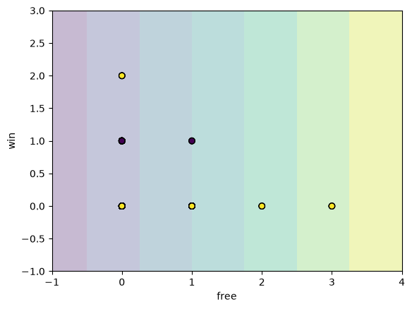
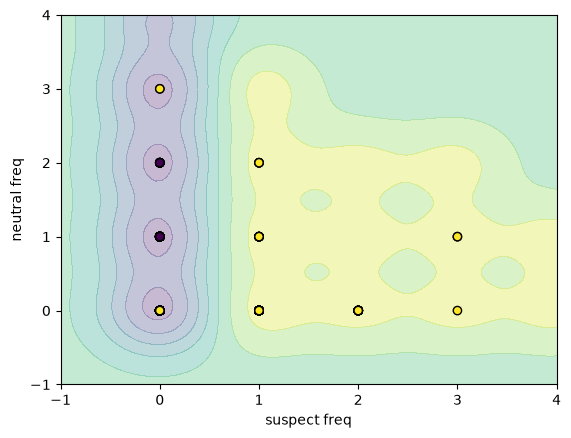
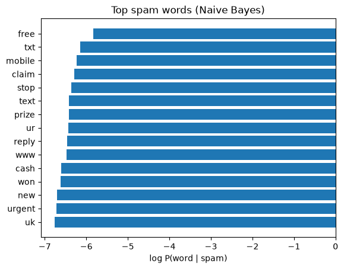
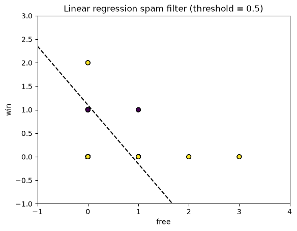
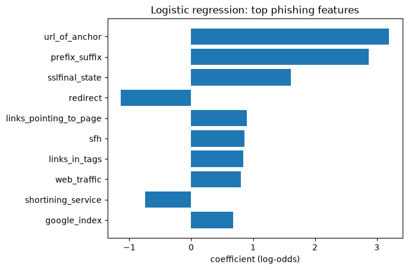
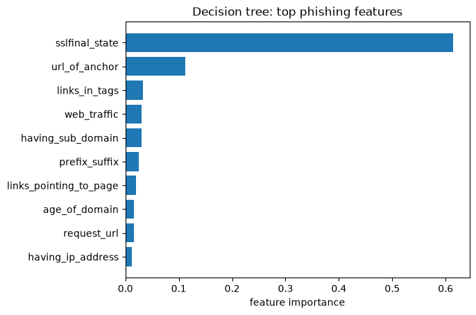

# Module 3: Email Threat Detection (Ham vs Spam)

### Objectives

- Understand why email is a major cyber attack surface
- Learn how spam filters evolved from rules to AI
- Understand the perceptron as a linear email classifier
- Understand SVM for non-linear spam classification
- Compare linear vs logistic regression for classification
- Apply logistic regression and decision trees to phishing detection
- Apply Naive Bayes + NLP for SMS spam filtering
- Apply classification techniques to email security

### Key concepts

| Term | Definition / notes |
| ---- | ------------------ |
| Ham | Legitimate email |
| Spam | Unsolicited / bulk email: first hands-on cyber ML problem |
| SpamAssassin | Early automated AI spam filter: worth researching |
| Keyword threshold | Single keyword rarely enough; **combinations** trigger spam score |
| Perceptron | Simplest NN: no hidden layer; **linear classifier** |
| Learning rate | How fast weights update during training |
| Linearly separable | Perceptron only works when classes can be split by a straight line |
| Activation threshold | Output fires only if weighted input exceeds threshold |
| SMS spam dataset | [Kaggle UCI SMS Spam Collection](https://www.kaggle.com/datasets/uciml/sms-spam-collection-dataset): `v1`=label, `v2`=message |
| Raw features | Keyword **frequency counts**: no scaling/normalization in this lab |
| Accuracy | Correct predictions ÷ total: simple metric for now; more later $\text{Accuracy} = \frac{TP + TN}{TP + TN + FP + FN}$ |
| SVM | Supervised classifier; **maximizes margin** to nearest points |
| Support vectors | Training points closest to the decision hyperplane |
| Suspect / neutral words | Spam-keyword set vs ham-keyword set: creates **non-linear** separation |
| Hyperplane | Decision boundary SVM optimizes: maximize distance to support vectors |
| Linear regression | Predicts **continuous** values: poor fit for spam **classification** |
| Logistic regression | Estimates **class probability**: better for ham/spam & phishing |
| One-hot encoding | Converts **categorical** columns → numeric 0/1 columns |
| Decision tree | Rule-based splits; strong accuracy; **sensitive** to training changes |
| Phishing dataset | [UCI Phishing Websites](https://archive.ics.uci.edu/dataset/327/phishing+websites): 11,055 sites, 30 features |
| Naive Bayes | Probabilistic classifier via **Bayes' theorem**; needs little training data |
| NLP (text vectorization) | Converts each **word** → numeric feature (counts or TF-IDF weights) |
| MultinomialNB | Naive Bayes variant for **word count / frequency** features |

# Notes

### Why email + AI

- Huge daily volume → large **attack surface**; ideal for **automated** AI protection
- You're a **cyber analyst** playing data scientist, focus on high-level algorithm behavior, not the math

### Spam filter evolution

| Generation | Approach | Weakness |
| ---------- | -------- | -------- |
| **1: Rules** | Static rules, keyword lists | One keyword ≠ spam; combos can cross threshold |
| **2: Statistics** | Keyword **frequency** + math transform + threshold | Spammers adapt wording |
| **3: Recalibration** | Change keywords / retune thresholds | Arms race: manual upkeep |
| **4: AI (today)** | Dynamic models (e.g. perceptron, NNs) | Needs labeled data & retraining |

Early filters ≈ drawing a **line** in feature space (keyword scores). Modern AI scales that idea to richer features.

**Rule-based spam score** (generations 1–2), sum keyword signals, flag if above threshold $\tau$:


$\text{score} = \sum_{i} w_i \cdot f_i \qquad \text{spam if } \text{score} \geq \tau$

$f_i$ = frequency of keyword $i$; $w_i$ = weight; $\tau$ = cutoff (tuned manually).

**Look up:** [SpamAssassin](https://spamassassin.apache.org/), one of the first widely used automated spam filters.

## Biological neuron ↔ perceptron

| Biological | Artificial (perceptron) |
| ---------- | ------------------------- |
| Dendrites receive stimuli | **Inputs** (features, e.g. keyword scores) |
| Cell body integrates signal | **Weighted sum** (transfer function) |
| Axon fires if strong enough | **Activation function** + **threshold** |
| Signal to other neurons | **Output**: spam or ham |

### Perceptron mechanics

**Forward pass**: weighted sum of features, compared to threshold $\theta$:

$$
z = \sum_{j=1}^{n} w_j x_j + b = \mathbf{w}^\top \mathbf{x} + b \qquad
\hat{y} = \begin{cases} 1 & \text{if } z \geq \theta \\ 0 & \text{otherwise} \end{cases}
$$

**Learning**: on misclassification, update weights by error (learning rate $\eta$):

$$
w_j \leftarrow w_j + \eta \, (y - \hat{y}) \, x_j
$$

1. Take inputs → multiply by **weights** → sum
2. Pass through **activation** (threshold): fire or not
3. Compare prediction to label → update weights by **error**
4. Repeat until weights classify training data well
5. Hope optimized weights generalize to **unseen** email

**Learning rate:** higher = faster weight changes (can overshoot); lower = slower, more stable.

**Limitation:** only separates **linearly separable** data, one straight decision boundary. Non-linear spam patterns need deeper networks (later modules).

```python
from sklearn.datasets import make_classification
from sklearn.model_selection import train_test_split
from sklearn.linear_model import Perceptron
from sklearn.metrics import accuracy_score

# stand-in for keyword-score features (spam vs ham labels)
X, y = make_classification(n_features=4, n_redundant=0, n_clusters_per_class=1)
X_train, X_test, y_train, y_test = train_test_split(X, y, test_size=0.2)

clf = Perceptron(eta0=0.1, max_iter=1000)  # eta0 = learning rate
clf.fit(X_train, y_train)

print(accuracy_score(y_test, clf.predict(X_test)))
```

**Parallel to early spam filters:** weights ≈ keyword importance; threshold ≈ spam score cutoff; both draw a linear boundary in feature space.

## Perceptron spam filter (SMS dataset)

First real AI spam filter on the public **UCI SMS Spam Collection** ([Kaggle](https://www.kaggle.com/datasets/uciml/sms-spam-collection-dataset)). Runnable script: [`code/mod2/PerceptronSpamFilter.py`](../code/mod2/PerceptronSpamFilter.py).

### Pipeline (ML analytic process)

| Phase | Role | Steps |
| ----- | ---- | ----- |
| **1: Data engineering** | Data engineer | Download CSV → `latin-1` encoding → rename columns → count **2 keyword** frequencies per SMS |
| **2: Model development** | Data scientist | Train/test split → **2 raw numeric features** → `Perceptron` → `fit()` / `predict()` |
| **3: Evaluation** | Data scientist | Decision plot + **accuracy** |

### What inputs does the perceptron need?

| Requirement | Why |
| ----------- | --- |
| **Numeric features only** | Perceptron multiplies each feature by a weight; raw text strings cannot be used directly |
| **2 keyword counts** (`kw1`, `kw2`) | Simple spam signals; each SMS becomes a point in 2D space (e.g. count of `"free"`, count of `"win"`) |
| **Raw counts, no scaling** | Both features are counts on a similar scale; course keeps it simple for a linear model |
| **Labels as 0/1** | `ham`→0, `spam`→1 so sklearn can train a binary classifier |
| **Linearly separable data** | Perceptron draws one straight line; these 2 keywords are chosen so spam/ham are roughly separable |

- **Why `encoding="latin-1"`?** The SMS file contains non-UTF-8 characters. Default UTF-8 raises `UnicodeDecodeError`.

- **Why rename `v1` / `v2`?** Kaggle CSV columns are `v1` (ham/spam) and `v2` (message text), not `label` / `message`.

#### Feature engineering detail

| Item | This lab |
| ---- | -------- |
| Source | `kagglehub` → `uciml/sms-spam-collection-dataset` |
| Features | **2 keyword frequencies** per message (`free`, `win`) |
| Transform | **None**: raw counts |
| Labels | `v1` → ham / spam → 0 / 1 |

```python
import pandas as pd
from pathlib import Path
from sklearn.model_selection import train_test_split
from sklearn.linear_model import Perceptron
from sklearn.metrics import accuracy_score
from sklearn.inspection import DecisionBoundaryDisplay
import matplotlib.pyplot as plt
import kagglehub

path = Path(kagglehub.dataset_download("uciml/sms-spam-collection-dataset"))

# latin-1: SMS file has bytes UTF-8 cannot decode
df = pd.read_csv(path / "spam.csv", encoding="latin-1")
# v1 = ham/spam label, v2 = message body in the raw Kaggle CSV
df = df.rename(columns={"v1": "label", "v2": "message"})

keywords = ["free", "win"]  # 2 spam-heavy words → 2 numeric features

def keyword_freq(text, word):
    return str(text).lower().count(word)  # str() handles missing values safely

# Each row → [count_free, count_win]: what the perceptron learns weights for
df["kw1"] = df["message"].apply(lambda t: keyword_freq(t, keywords[0]))
df["kw2"] = df["message"].apply(lambda t: keyword_freq(t, keywords[1]))

X = df[["kw1", "kw2"]].values          # shape (n_samples, 2): must be numeric
y = df["label"].map({"ham": 0, "spam": 1})  # sklearn needs numeric class labels

X_train, X_test, y_train, y_test = train_test_split(
    X, y, test_size=0.2, random_state=42
)

# Linear classifier: finds a line w1*kw1 + w2*kw2 + b that separates spam from ham
clf = Perceptron(eta0=0.1, max_iter=1000)
clf.fit(X_train, y_train)

print(accuracy_score(y_test, clf.predict(X_test)))

DecisionBoundaryDisplay.from_estimator(clf, X_test, alpha=0.3)
plt.scatter(X_test[:, 0], X_test[:, 1], c=y_test, edgecolors="k")
plt.xlabel(keywords[0])
plt.ylabel(keywords[1])
out = Path(__file__).resolve().parent / "PerceptronSpamFilter.png"
plt.savefig(out, bbox_inches="tight")
plt.close()
```



#### Results & tuning

- Accuracy is modest with only 2 keywords (linear boundary is limited)
- Richer metrics (precision, recall, F1) covered **later in the course**
- Tune `eta0`, `max_iter`, or keyword list to improve
- Perceptron needs **linearly separable** features; if the plot looks messy, try different keywords or switch to **SVM**

## Perceptron vs SVM

| | **Perceptron** | **SVM** |
| - | -------------- | ------- |
| Type | Supervised | Supervised |
| Goal | Minimize **classification errors** | Maximize **margin**: distance from hyperplane to nearest training points (**support vectors**) |
| Boundary | Linear only | Linear **or non-linear** (kernel) |
| **Inputs (this course)** | 2 spam keyword counts (`free`, `win`) | Suspect-word total + neutral-word total |
| **Transform** | Raw counts | Raw counts |
| **Why these features** | Simple linear spam score | Competing spam/ham signals → non-linear split |
| Best for | Linearly separable keyword scores | Harder, **non-linearly separable** feature spaces |

- **SVM hyperplane**: decision boundary $\mathbf{w}^\top \mathbf{x} + b = 0$. **Margin** = distance to nearest training points (support vectors):

  - $\text{margin} \propto \frac{2}{\|\mathbf{w}\|}$

- SVM **maximizes margin** (unlike perceptron, which only minimizes errors). Non-linear cases use a **kernel** to map features into a space where a hyperplane separates classes.

## SVM spam filter (same SMS dataset)

Same Kaggle dataset as the perceptron lab. Runnable script: [`code/mod2/SVMSpamFilter.py`](../code/mod2/SVMSpamFilter.py).

### Why harder than perceptron lab

| Perceptron lab | SVM lab |
| -------------- | ------- |
| 2 spam keywords only | **Suspect words** (spam) + **neutral words** (ham) |
| Roughly linearly separable | **Not** linearly separable: spam score vs ham score curves |
| Straight-line boundary works | Perceptron struggles; **RBF kernel** SVM fits curved boundary |

### What inputs does the SVM need?

| Requirement | Why |
| ----------- | --- |
| **Same numeric format** as perceptron | SVM also needs numbers, not raw text |
| **`suspect_freq`** | Total count of spam-like words (`free`, `win`, `prize`) across the message |
| **`neutral_freq`** | Total count of ham-like words (`meeting`, `thanks`, `ok`) |
| **Two competing signals** | Spam may have high suspect AND low neutral; ham the opposite. The relationship is **non-linear**, not a single straight split |
| **Raw counts, no scaling** | Course lab keeps counts as-is (same as perceptron) |
| **`kernel="rbf"`** | Maps 2D points into a higher space so a curved boundary can separate classes |

- **Why not use the perceptron's 2 keywords?** Adding neutral-word scoring changes the geometry of the data. A single line cannot separate spam from ham well anymore. SVM with an RBF kernel is used for this harder boundary.

- **Same data loading as perceptron:** `latin-1` encoding and `v1`/`v2` rename are required for the same reasons.

### Pipeline

| Phase | Role | Steps |
| ----- | ---- | ----- |
| **1: Data engineering** | Data engineer | Same CSV load → count **suspect** + **neutral** word-set frequencies |
| **2: Model development** | Data scientist | Train/test split → 2 raw features → `SVC(kernel="rbf")` → train/test |
| **3: Evaluation** | Data scientist | Decision plot + accuracy |

#### Feature engineering detail

| Item | SVM lab |
| ---- | ------- |
| Source | Same Kaggle SMS dataset via `kagglehub` |
| Features | `suspect_freq` + `neutral_freq` (word-set totals) |
| Transform | **None**: raw counts |
| Classifier | `SVC(kernel="rbf")` for non-linear boundary |

```python
import pandas as pd
from pathlib import Path
from sklearn.model_selection import train_test_split
from sklearn.svm import SVC
from sklearn.metrics import accuracy_score
from sklearn.inspection import DecisionBoundaryDisplay
import matplotlib.pyplot as plt
import kagglehub

path = Path(kagglehub.dataset_download("uciml/sms-spam-collection-dataset"))

df = pd.read_csv(path / "spam.csv", encoding="latin-1")
df = df.rename(columns={"v1": "label", "v2": "message"})

# Two word lists → two competing numeric signals (not a simple linear spam score)
suspect_words = ["free", "win", "prize"]    # tend to appear in spam
neutral_words = ["meeting", "thanks", "ok"]  # tend to appear in ham

def count_any(text, words):
    t = str(text).lower()
    return sum(t.count(w) for w in words)  # sum counts across a word set

df["suspect_freq"] = df["message"].apply(lambda t: count_any(t, suspect_words))
df["neutral_freq"] = df["message"].apply(lambda t: count_any(t, neutral_words))

# X = [spam-signal strength, ham-signal strength] per SMS
X = df[["suspect_freq", "neutral_freq"]].values
y = df["label"].map({"ham": 0, "spam": 1})

X_train, X_test, y_train, y_test = train_test_split(
    X, y, test_size=0.2, random_state=42
)

# RBF kernel: handles curved/non-linear decision boundary (perceptron cannot)
clf = SVC(kernel="rbf", C=1.0)
clf.fit(X_train, y_train)

print(accuracy_score(y_test, clf.predict(X_test)))

DecisionBoundaryDisplay.from_estimator(clf, X_test, alpha=0.3)
plt.scatter(X_test[:, 0], X_test[:, 1], c=y_test, edgecolors="k") # X_test[:, 0] is the suspect frequency, X_test[:, 1] is the neutral frequency
plt.xlabel("suspect freq")
plt.ylabel("neutral freq")
out = Path(__file__).resolve().parent / "SVMSpamFilter.png"
plt.savefig(out, bbox_inches="tight")
plt.close()
```



#### Results & tuning

- Accuracy is typically **better than perceptron** on this harder feature design
- Tune `C`, `gamma`, `kernel`, and word lists
- Other metrics (precision, recall) covered later

## Naive Bayes + NLP spam filter (same SMS dataset)

Same Kaggle dataset as the perceptron and SVM labs. Runnable script: [`code/mod2/NBNLPSpamFilter.py`](../code/mod2/NBNLPSpamFilter.py).

**Naive Bayes**: probabilistic classifier using **Bayes' theorem**. Assigns each message to the class (ham/spam) with the highest **posterior probability**, using prior knowledge of word patterns per class.

| Strength | Detail |
| -------- | ------ |
| Little training data | Works well even with smaller SMS corpora |
| Dynamic keywords | Learns suspect words from data: no manual keyword list |
| Fast | Simple math per word; scales to large vocabularies |

### What inputs does Naive Bayes + NLP need?

| Requirement | Why |
| ----------- | --- |
| **Raw text strings** (`message` column) | Unlike perceptron/SVM, the model ingests full SMS text, not hand-picked counts |
| **One string per sample** | `TfidfVectorizer` expects a 1D array/Series of documents |
| **Labels as 0/1** | Same `ham`→0, `spam`→1 mapping as other labs |
| **TF-IDF vectorization** | Converts each word into a numeric weight; down-weights common English words, highlights distinctive spam terms |
| **`stop_words="english"`** | Drops "the", "and", etc. that carry little spam/ham signal |
| **Non-negative features** | `MultinomialNB` expects count-like or TF-IDF weights (not negative values) |
| **Train on text, not pre-built features** | The pipeline learns vocabulary and word probabilities from training messages |

**Why TF-IDF instead of raw keyword counts?** Perceptron/SVM use 2–6 hand-picked words. Naive Bayes scores **every word** in the corpus. TF-IDF normalizes word frequency so a long SMS is not penalized and common words do not dominate.

**Why a Pipeline?** `TfidfVectorizer` must `fit` on training text only (learn vocabulary), then transform train and test. Bundling vectorizer + classifier prevents leaking test vocabulary into training.

**Same data loading as other SMS labs:** `latin-1` encoding and `v1`/`v2` rename are required for the same reasons.

#### Bayes' theorem (core idea)

$P(\text{class} \mid \text{words}) = \frac{P(\text{words} \mid \text{class}) \cdot P(\text{class})}{P(\text{words})}$

- **$P(\text{class})$**: prior: how common spam vs ham is in training data
- **$P(\text{words} \mid \text{class})$**: likelihood: how likely these words appear in spam/ham
- Pick the class with the **largest** $P(\text{class} \mid \text{words})$

#### Naive assumption

Treat each word as **independent** given the class (simplifies the math):

$P(w_1, w_2, \ldots, w_n \mid \text{class}) \approx \prod_{i=1}^{n} P(w_i \mid \text{class})$

"Naive" because words in a sentence clearly depend on each other, but it still works well for spam.

**TF-IDF weight** for word $t$ in document $d$ (normalization step in the pipeline):

$\text{tfidf}(t, d) = \text{tf}(t, d) \times \log\frac{N}{\text{df}(t)}$

$\text{tf}$ = term frequency in document; $\text{df}$ = documents containing $t$; $N$ = total documents. Down-weights common words, up-weights distinctive spam terms.

#### vs keyword-count labs (perceptron / SVM)

| | Perceptron / SVM | Naive Bayes + NLP |
| - | ---------------- | ----------------- |
| Features | 2 hand-picked keyword counts | **Every word** in the SMS → numeric vector |
| Keywords | Manual | **Learned** from training text |
| Transform | Raw counts | NLP vectorize + **normalize** (TF-IDF) |
| Input type | Numeric matrix `X` | Raw text `Series` → pipeline vectorizes |

### Pipeline

| Phase | Role | Steps |
| ----- | ---- | ----- |
| **1: Data engineering** | Data engineer | Same CSV load → keep full `message` text (no manual keyword counts) |
| **2: Model development** | Data scientist | Train/test split on text → `Pipeline(TfidfVectorizer → MultinomialNB)` → `fit()` / `predict()` |
| **3: Evaluation** | Data scientist | Accuracy + inspect top spam words learned by the model |

#### Feature engineering detail

| Item | This lab |
| ---- | -------- |
| Source | `kagglehub` → `uciml/sms-spam-collection-dataset` |
| Features | **Full message text** → thousands of TF-IDF word weights per SMS |
| Transform | `TfidfVectorizer(stop_words="english")` |
| Classifier | `MultinomialNB()` on vectorized text |
| Labels | `v1` → ham / spam → 0 / 1 |

```python
import pandas as pd
from pathlib import Path
from sklearn.model_selection import train_test_split
from sklearn.feature_extraction.text import TfidfVectorizer
from sklearn.naive_bayes import MultinomialNB
from sklearn.metrics import accuracy_score
from sklearn.pipeline import Pipeline
import matplotlib.pyplot as plt
import numpy as np
import kagglehub

path = Path(kagglehub.dataset_download("uciml/sms-spam-collection-dataset"))

# latin-1: SMS file has bytes UTF-8 cannot decode
df = pd.read_csv(path / "spam.csv", encoding="latin-1")
# v1 = ham/spam label, v2 = message body in the raw Kaggle CSV
df = df.rename(columns={"v1": "label", "v2": "message"})

# Naive Bayes takes raw text: the pipeline turns each SMS into a word-weight vector
X_text = df["message"]
y = df["label"].map({"ham": 0, "spam": 1})

X_train, X_test, y_train, y_test = train_test_split(
    X_text, y, test_size=0.2, random_state=42
)

# Step 1: TfidfVectorizer tokenizes text → TF-IDF matrix (n_samples × n_vocabulary)
# Step 2: MultinomialNB estimates P(word|spam) and P(word|ham) per vocabulary term
pipe = Pipeline([
    ("tfidf", TfidfVectorizer(stop_words="english")),
    ("nb", MultinomialNB()),
])

pipe.fit(X_train, y_train)
print(accuracy_score(y_test, pipe.predict(X_test)))

# Inspect learned spam signals: words with highest log P(word | spam)
nb = pipe.named_steps["nb"]
vocab = pipe.named_steps["tfidf"].get_feature_names_out()
scores = nb.feature_log_prob_[1]  # class 1 = spam
top_idx = np.argsort(scores)[-15:][::-1]

plt.barh(vocab[top_idx][::-1], scores[top_idx][::-1])
plt.xlabel("log P(word | spam)")
plt.title("Top spam words (Naive Bayes)")
out = Path(__file__).resolve().parent / "NBNLPSpamFilter.png"
plt.savefig(out, bbox_inches="tight")
plt.close()
```



#### Results

- Accuracy is **much higher** than keyword-count perceptron/SVM labs (full vocabulary vs 2 features)
- Model discovers spam words automatically (e.g. "free", "winner", "prize") without a manual list
- Top-word plot shows what the classifier learned: high `log P(word | spam)` = strong spam signal
- More SMS training data → likely better generalization
- Other metrics (precision, recall) covered later

---

# Advanced spam filtering & phishing detection

Regression and tree-based classifiers on the **same SMS dataset** (spam) and a **phishing website dataset** (phishing).

### Algorithm comparison (study sheet)

| Algorithm | Task fit | SMS spam result | Key limitation |
| --------- | -------- | --------------- | -------------- |
| **Linear regression** | Continuous output | **Poor** vs perceptron: expected | Assumes unrelated features; bad at discrete labels |
| **Logistic regression** | Class **probability** | Works **well** on phishing | Assumes features are linearly independent |
| **Decision tree** | Rule-based splits | **Best** on phishing | Very sensitive to small training-set changes |

## Linear regression spam filter (same SMS dataset)

Same Kaggle dataset and **same 2 keywords** as the perceptron lab. Runnable script: [`code/mod2/LinearRegressionAdvanced.py`](../code/mod2/LinearRegressionAdvanced.py).

Like the perceptron, features sum to a **straight line**: but linear regression predicts a **continuous** number, not a class.

$\hat{y} = w_1 f_1 + w_2 f_2 + b \qquad \text{then threshold: spam if } \hat{y} \geq 0.5$

Forcing a continuous output into ham/spam labels is why accuracy suffers vs classifiers built for discrete labels.

### What inputs does linear regression need? (and why it is a bad fit here)

| Requirement | Why |
| ----------- | --- |
| **Same numeric features as perceptron** | `kw1`, `kw2`: raw counts of `"free"` and `"win"` |
| **Raw counts, no scaling** | Same 2D feature space as the perceptron lab for a fair comparison |
| **Labels as 0/1** | sklearn fits on numeric targets, but linear regression treats them as **continuous** values (0.0–1.0), not discrete classes |
| **Post-hoc threshold** | `predict()` returns a real number; you must round or compare to 0.5 to get ham/spam |
| **Wrong model type** | Built for continuous targets (price, score); ham/spam are **categories**, not quantities on a scale |

**Why same keywords as perceptron?** Keeps features identical so the only change is the algorithm. Perceptron is designed for classification; linear regression is not.

**Same data loading as other SMS labs:** `latin-1` encoding and `v1`/`v2` rename are required for the same reasons.

### Pipeline

| Phase | Role | Steps |
| ----- | ---- | ----- |
| **1: Data engineering** | Data engineer | Same CSV load → count **2 keyword** frequencies per SMS |
| **2: Model development** | Data scientist | Train/test split → 2 raw features → `LinearRegression` → threshold at 0.5 |
| **3: Evaluation** | Data scientist | Accuracy + threshold boundary plot (dashed line at $\hat{y} = 0.5$) |

#### Feature engineering detail

| Item | This lab |
| ---- | -------- |
| Source | `kagglehub` → `uciml/sms-spam-collection-dataset` |
| Features | **2 keyword frequencies** per message (`free`, `win`) |
| Transform | **None**: raw counts (same as perceptron) |
| Labels | `v1` → ham / spam → 0 / 1 (used as continuous target: wrong) |
| Classifier? | **No**: regression model + manual threshold |

| Expectation | Why |
| ----------- | --- |
| Accuracy **worse than perceptron** | Linear regression suits continuous targets (price, score), not discrete ham/spam labels |
| Still worth running | Shows why picking the right algorithm matters |

**Drawbacks:** assumes features are unrelated; weak on classification problems.

```python
import pandas as pd
from pathlib import Path
from sklearn.model_selection import train_test_split
from sklearn.linear_model import LinearRegression
from sklearn.metrics import accuracy_score
import matplotlib.pyplot as plt
import numpy as np
import kagglehub

path = Path(kagglehub.dataset_download("uciml/sms-spam-collection-dataset"))

# latin-1: SMS file has bytes UTF-8 cannot decode
df = pd.read_csv(path / "spam.csv", encoding="latin-1")
# v1 = ham/spam label, v2 = message body in the raw Kaggle CSV
df = df.rename(columns={"v1": "label", "v2": "message"})

keywords = ["free", "win"]  # same 2 features as perceptron lab

def keyword_freq(text, word):
    return str(text).lower().count(word)

df["kw1"] = df["message"].apply(lambda t: keyword_freq(t, keywords[0]))
df["kw2"] = df["message"].apply(lambda t: keyword_freq(t, keywords[1]))

# X = [count_free, count_win]: numeric input (same shape as perceptron)
X = df[["kw1", "kw2"]].values
# y is 0/1, but LinearRegression treats it as a continuous score to regress toward
y = df["label"].map({"ham": 0, "spam": 1}).values

X_train, X_test, y_train, y_test = train_test_split(
    X, y, test_size=0.2, random_state=42
)

# Outputs a continuous value per SMS (can be < 0 or > 1): not a probability
model = LinearRegression()
model.fit(X_train, y_train)
y_pred = (model.predict(X_test) >= 0.5).astype(int)  # force ham/spam: not ideal

print(accuracy_score(y_test, y_pred))  # expect lower than perceptron

# Dashed line = where model score equals 0.5 (manual classification cutoff)
x_min, x_max = X_test[:, 0].min() - 1, X_test[:, 0].max() + 1
y_min, y_max = X_test[:, 1].min() - 1, X_test[:, 1].max() + 1
xx, yy = np.meshgrid(
    np.linspace(x_min, x_max, 200),
    np.linspace(y_min, y_max, 200),
)
Z = model.predict(np.c_[xx.ravel(), yy.ravel()]).reshape(xx.shape)

plt.contour(xx, yy, Z, levels=[0.5], colors="k", linestyles="--")
plt.scatter(X_test[:, 0], X_test[:, 1], c=y_test, edgecolors="k")
plt.xlabel(keywords[0])
plt.ylabel(keywords[1])
plt.title("Linear regression spam filter (threshold = 0.5)")
out = Path(__file__).resolve().parent / "LinearRegressionAdvanced.png"
plt.savefig(out, bbox_inches="tight")
plt.close()
```



#### Results

- Accuracy is **lower than perceptron** on the same features: wrong tool for discrete labels
- Predictions can fall outside [0, 1] because nothing constrains the output range
- Use **logistic regression** or **perceptron** for classification instead (covered next for phishing)

---

## Logistic regression: phishing website detection

Runnable script: [`code/mod2/LogisticRegressionPhishing.py`](../code/mod2/LogisticRegressionPhishing.py).

**Better strategy for classification:** estimates **probability** each sample belongs to a class (phishing vs legitimate).

$P(y=1 \mid \mathbf{x}) = \sigma(\mathbf{w}^\top \mathbf{x} + b) = \frac{1}{1 + e^{-(\mathbf{w}^\top \mathbf{x} + b)}}$

Predict **phishing** if $P(y=1 \mid \mathbf{x}) \geq 0.5$ (or tune threshold for fewer false positives).

### What inputs does logistic regression need?

| Requirement | Why |
| ----------- | --- |
| **30 numeric website features** | URL/SSL/domain signals (`having_ip_address`, `url_length`, `sslfinal_state`, …), not raw text |
| **Integer-coded values** | UCI encodes each attribute (e.g. -1, 0, 1); `ucimlrepo` returns them ready as a DataFrame |
| **One row per website** | Each sample is one site with 30 attribute columns |
| **Target `Result`** | **-1** = phishing, **1** = legitimate (sklearn accepts these directly) |
| **No manual feature counts** | Unlike SMS labs, features are **structured attributes**, not keyword frequencies |
| **`predict_proba()`** | Outputs class probabilities: the right output type for phishing risk scoring |

**Why `ucimlrepo`?** Fetches [UCI Phishing Websites #327](https://archive.ics.uci.edu/dataset/327/phishing+websites) in Python without downloading CSV/ARFF manually. `pip install ucimlrepo`.

**One-hot encoding in the course lab:** the notebook may start from raw categoricals and apply `pd.get_dummies()` to produce **30 numeric columns**. `fetch_ucirepo(id=327)` already ships those 30 integer features, so this script skips that step.

#### Dataset: UCI Phishing Websites

| Item | Detail |
| ---- | ------ |
| **Source** | [UCI ML Repository: Phishing Websites (id=327)](https://archive.ics.uci.edu/dataset/327/phishing+websites) |
| **Instances** | 11,055 website records |
| **Features** | 30 integer columns (URL/SSL/domain signals) |
| **Target** | `Result`: **-1** = phishing, **1** = legitimate |
| **Task** | Binary classification |
| **Origin** | PhishTank, MillerSmiles, Google search operators |

Example features: `having_ip_address`, `url_length`, `shortining_service`, `having_at_symbol`, `sslfinal_state`, `having_sub_domain`, …

### Pipeline

| Phase | Role | Steps |
| ----- | ---- | ----- |
| **1: Data engineering** | Data engineer | `fetch_ucirepo(id=327)` → `X` (30 features) + `y` (`Result`) |
| **2: Model development** | Data scientist | Train/test split → `LogisticRegression` → `fit()` / `predict()` / `predict_proba()` |
| **3: Evaluation** | Data scientist | Accuracy + top feature coefficients (which signals drive phishing) |

#### Feature engineering detail

| Item | This lab |
| ---- | -------- |
| Source | `ucimlrepo` → UCI id **327** |
| Features | **30 integer website attributes** per row |
| Transform | **None** in script (UCI already integer-coded; course notebook may one-hot from raw) |
| Labels | `Result`: -1 phishing / 1 legitimate |
| Classifier | `LogisticRegression(max_iter=1000)` |

**Limitation:** assumes features are **linearly independent**.

```python
import matplotlib.pyplot as plt
import numpy as np
from pathlib import Path
from sklearn.model_selection import train_test_split
from sklearn.linear_model import LogisticRegression
from sklearn.metrics import accuracy_score
from ucimlrepo import fetch_ucirepo

# UCI Phishing Websites: 11,055 sites, 30 URL/SSL/domain attributes
phishing = fetch_ucirepo(id=327)
X = phishing.data.features       # shape (11055, 30): integer-coded website signals
y = phishing.data.targets.squeeze()  # Result: -1 = phishing, 1 = legitimate

# X.shape → (n_samples, 30): every column must be numeric for sklearn
X_train, X_test, y_train, y_test = train_test_split(
    X, y, test_size=0.2, random_state=42
)

# Built for classification: predict_proba() returns P(phishing) and P(legitimate)
clf = LogisticRegression(max_iter=1000, random_state=42)
clf.fit(X_train, y_train)

print(accuracy_score(y_test, clf.predict(X_test)))

# Coefficients show which features push toward phishing vs legitimate
feature_names = np.array(phishing.data.features.columns)
coef = clf.coef_.ravel()
top_idx = np.argsort(np.abs(coef))[-10:][::-1]

plt.barh(feature_names[top_idx][::-1], coef[top_idx][::-1])
plt.xlabel("coefficient (log-odds)")
plt.title("Logistic regression: top phishing features")
out = Path(__file__).resolve().parent / "LogisticRegressionPhishing.png"
plt.savefig(out, bbox_inches="tight")
plt.close()
```



#### Results

- Accuracy is **strong** (~92%+): right model type for binary website classification
- `predict_proba()` gives phishing risk scores, not just ham/spam labels
- Coefficient plot shows which URL/SSL attributes matter most (e.g. IP in URL, SSL state)
- **One-hot encoding recap:** each category value can become its own column (1 = present, 0 = absent). UCI/`ucimlrepo` ships integer-coded features; the course lab applies one-hot encoding when starting from raw categoricals.

---

## Decision tree: phishing (same dataset)

Same UCI dataset as the logistic regression lab. Runnable script: [`code/mod2/DecisionTreePhishing.py`](../code/mod2/DecisionTreePhishing.py).

**Decision tree**: recursively splits on feature $x_j$ to minimize class impurity (e.g. **Gini**):

$\text{Gini}(S) = 1 - \sum_{k=1}^{C} p_k^2$

$p_k$ = fraction of class $k$ in node $S$. Each split creates if/then rules like "if `having_ip_address` = -1 → phishing".

### What inputs does the decision tree need?

| Requirement | Why |
| ----------- | --- |
| **Same 30 features as logistic regression** | `fetch_ucirepo(id=327)` → identical `X` and `y` for a fair model comparison |
| **Numeric integer columns** | Trees compare feature values at each split (e.g. `sslfinal_state <= 0`) |
| **One row per website** | Each sample is one site with 30 URL/SSL/domain attributes |
| **Target `Result`** | **-1** = phishing, **1** = legitimate |
| **No feature scaling** | Splits use thresholds on raw values; scaling is optional, not required |
| **No text / NLP** | Structured website attributes only, same as logistic regression |

**Why same data loading as logistic regression?** Only the model changes. Same `random_state=42` split lets you compare accuracy directly.

**Same `ucimlrepo` setup:** UCI ships 30 integer-coded features; the course notebook may one-hot encode from raw categoricals to reach the same columns.

| vs logistic regression | Decision tree |
| ---------------------- | ------------- |
| Accuracy | **Even better** |
| Training data needed | **Less**: simpler model |
| Interpretability | Easy to read as if/then rules |
| Downside | **Highly sensitive** to tiny changes in training data (unstable splits) |

### Pipeline

| Phase | Role | Steps |
| ----- | ---- | ----- |
| **1: Data engineering** | Data engineer | `fetch_ucirepo(id=327)` → `X` (30 features) + `y` (`Result`) |
| **2: Model development** | Data scientist | Same train/test split as logistic regression → `DecisionTreeClassifier` → `fit()` / `predict()` |
| **3: Evaluation** | Data scientist | Accuracy + feature importance plot (which attributes drive splits) |

#### Feature engineering detail

| Item | This lab |
| ---- | -------- |
| Source | `ucimlrepo` → UCI id **327** (same as logistic regression) |
| Features | **30 integer website attributes** per row |
| Transform | **None** in script |
| Labels | `Result`: -1 phishing / 1 legitimate |
| Classifier | `DecisionTreeClassifier(random_state=42)` |

```python
import matplotlib.pyplot as plt
import numpy as np
from pathlib import Path
from sklearn.model_selection import train_test_split
from sklearn.tree import DecisionTreeClassifier
from sklearn.metrics import accuracy_score
from ucimlrepo import fetch_ucirepo

# Same UCI load as LogisticRegressionPhishing.py
phishing = fetch_ucirepo(id=327)
X = phishing.data.features       # shape (11055, 30): integer-coded website signals
y = phishing.data.targets.squeeze()  # Result: -1 = phishing, 1 = legitimate

X_train, X_test, y_train, y_test = train_test_split(
    X, y, test_size=0.2, random_state=42
)

# Learns if/then splits on features (e.g. having_ip_address, sslfinal_state)
tree = DecisionTreeClassifier(random_state=42)
tree.fit(X_train, y_train)

print(accuracy_score(y_test, tree.predict(X_test)))  # typically beats logistic regression

# feature_importances_: how often each attribute is used for splitting
feature_names = np.array(phishing.data.features.columns)
importances = tree.feature_importances_
top_idx = np.argsort(importances)[-10:][::-1]

plt.barh(feature_names[top_idx][::-1], importances[top_idx][::-1])
plt.xlabel("feature importance")
plt.title("Decision tree: top phishing features")
out = Path(__file__).resolve().parent / "DecisionTreePhishing.png"
plt.savefig(out, bbox_inches="tight")
plt.close()
```



#### Results

- Accuracy is typically **higher than logistic regression** on the same split
- Feature importance shows which URL/SSL signals the tree relies on most
- Rules are readable (if/then), but the full tree can be large with 30 features
- **Unstable:** small training-set changes can flip early splits and hurt generalization

---

### SMS vs phishing labs: quick map

| Lab | Dataset | Features | Model | Notes |
| --- | ------- | -------- | ----- | ----- |
| Perceptron / SVM / Naive Bayes / Linear regression | Kaggle SMS (via `kagglehub`) | Keyword freqs (raw) or TF-IDF (NB) | Perceptron, SVM, `MultinomialNB`, `LinearRegression` | Spam/ham |
| Logistic regression | [UCI Phishing Websites](https://archive.ics.uci.edu/dataset/327/phishing+websites) (via `ucimlrepo`) | 30 integer website attributes | `LogisticRegression` | Good: class probabilities |
| Decision tree | Same UCI dataset (via `ucimlrepo`) | Same 30 integer attributes | `DecisionTreeClassifier` | Best accuracy; unstable |

### Data and features

**SMS spam labs** (perceptron, SVM, Naive Bayes, linear regression):

| Lab | Features | Separable? |
| --- | -------- | ---------- |
| [Perceptron](#perceptron-spam-filter-sms-dataset) | 2 keyword frequencies | **Linear** |
| [SVM](#svm-spam-filter-same-sms-dataset) | Suspect + neutral word-set frequencies | **Non-linear** |
| [Naive Bayes](#naive-bayes--nlp-spam-filter-same-sms-dataset) | TF-IDF word vectors (full message) | NLP: learned vocabulary |
| [Linear regression](#linear-regression-spam-filter-same-sms-dataset) | Same 2 keywords as perceptron | Linear: but wrong model type |

**Phishing labs** (logistic regression, decision tree) ([UCI dataset #327](https://archive.ics.uci.edu/dataset/327/phishing+websites):)

| Lab | Features | Transform |
| --- | -------- | --------- |
| [Logistic regression](#logistic-regression-phishing-website-detection) | 30 UCI website attributes | Integer-coded via `ucimlrepo` (one-hot in course notebook) |
| [Decision tree](#decision-tree-phishing-same-dataset) | Same 30 features | Same `ucimlrepo` load |

```
SMS:      raw text → keyword counts OR TF-IDF words → classifier
Phishing: UCI website features → one-hot encode (lab) → logistic / tree
```

### Model approach

| Step | SMS labs | Phishing labs |
| ---- | -------- | ------------- |
| Collect | SMS spam CSV | [UCI Phishing Websites](https://archive.ics.uci.edu/dataset/327/phishing+websites) |
| Engineer | Keyword freqs (raw) or TF-IDF (Naive Bayes) | One-hot encode → 30 features |
| Split | Train / test | Train / test |
| Train | Perceptron / SVM / MultinomialNB / LinearRegression | LogisticRegression / DecisionTree |
| Evaluate | Accuracy (+ decision plot for perceptron/SVM) | Accuracy |
| Iterate | Keywords, model config | Tree depth, encoding, split |

### Deployment considerations

<!-- Latency, false positives in production, retraining -->

- Spammers evolve → **retrain** and refresh features periodically
- False positives block legitimate mail, tune threshold for precision vs recall
- **Perceptron / SVM** = SMS keyword baselines; **linear regression** = wrong tool for labels
- **Logistic regression** = class probabilities for phishing; **decision tree** = best accuracy but unstable on small data changes


## Summary

Module 3 walks through **SMS spam** (keyword baselines → NLP) and **phishing websites** (UCI tabular features). Same ML pipeline everywhere: **collect → engineer features → train → evaluate → iterate**. Authentication threats continue in [Module 4](module-04-securing-user-authentication.md).

### Algorithm cheat sheet (Module 3)

**SMS spam labs** ([Kaggle SMS](https://www.kaggle.com/datasets/uciml/sms-spam-collection-dataset) via `kagglehub`)

| Algorithm | Core equation | Output type | What makes it special / better | Module 3 lab notes |
| --------- | ------------- | ----------- | ------------------------------ | ------------------ |
| **Perceptron** | $z = \mathbf{w}^\top \mathbf{x} + b$; $\hat{y} = 1$ if $z \geq \theta$ | **Class** (hard 0/1) | Simplest NN; one **linear** boundary; error-driven weight updates | 2 keyword counts (`free`, `win`); modest accuracy; good baseline plot |
| **SVM** | Hyperplane $\mathbf{w}^\top \mathbf{x} + b = 0$; **maximize margin** $\propto 2/\|\mathbf{w}\|$; **RBF kernel** for curves | **Class** (hard 0/1) | Focuses on **support vectors**; handles **non-linear** splits when perceptron fails | Suspect + neutral word totals; RBF kernel; curved decision boundary |
| **Naive Bayes + NLP** | $P(c \mid \mathbf{w}) \propto P(c) \prod_i P(w_i \mid c)$; **TF-IDF** weights words | **Class** (posterior argmax) | Uses **full message text**; learns vocabulary; fast with little data | `TfidfVectorizer` → `MultinomialNB`; **highest SMS accuracy** in module |
| **Linear regression** | $\hat{y} = \mathbf{w}^\top \mathbf{x} + b$; train with **MSE** | **Continuous** number (thresholded) | Same 2 keywords as perceptron but **wrong task**: predicts a real number, not a label | Deliberate **anti-pattern**; worse than perceptron on same features |

**Phishing labs** ([UCI Phishing Websites #327](https://archive.ics.uci.edu/dataset/327/phishing+websites) via `ucimlrepo`)

| Algorithm | Core equation | Output type | What makes it special / better | Module 3 lab notes |
| --------- | ------------- | ----------- | ------------------------------ | ------------------ |
| **Logistic regression** | $P(y{=}1 \mid \mathbf{x}) = \sigma(\mathbf{w}^\top \mathbf{x} + b) = \frac{1}{1+e^{-z}}$ | **Probability** (0–1) | Linear boundary + **soft scores**; `predict_proba()` for tunable risk thresholds | 30 URL/SSL/domain features; ~92%+ accuracy; coefficient plot |
| **Decision tree** | Split to minimize **Gini**: $1 - \sum_k p_k^2$; recursive if/then rules | **Class** (hard 0/1) | **Non-linear**, interpretable rules; captures feature interactions without manual engineering | Same 30 UCI features; **best accuracy** in module; **unstable** to small data changes |

**Quick pick (Module 3)**

| Scenario | Reach for |
| -------- | --------- |
| SMS, 2 hand-picked keywords, linearly separable | **Perceptron** |
| SMS, competing spam/ham signals, curved boundary | **SVM** (RBF kernel) |
| SMS, full text, no manual keyword list | **Naive Bayes + TF-IDF** |
| Show why **not** to use regression for labels | **Linear regression** (same SMS features) |
| Phishing risk **probability** + linear interpretability | **Logistic regression** |
| Phishing max accuracy + readable if/then rules | **Decision tree** (watch instability) |

**Feature → model map:** SMS raw text → keyword counts (perceptron/SVM/LR demo) **or** TF-IDF words (Naive Bayes). Phishing website rows → 30 integer attributes → logistic or tree.

**Deployment reminders:** retrain as spammers evolve; tune thresholds for false positives; perceptron/SVM = keyword baselines; logistic = probabilities; tree = accuracy vs stability trade-off.
