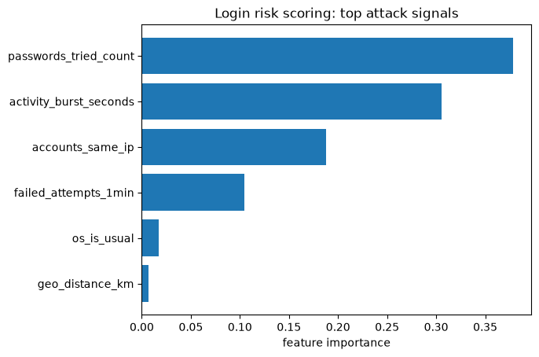
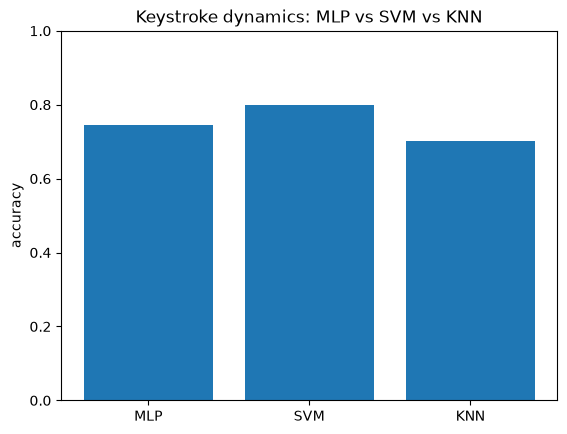
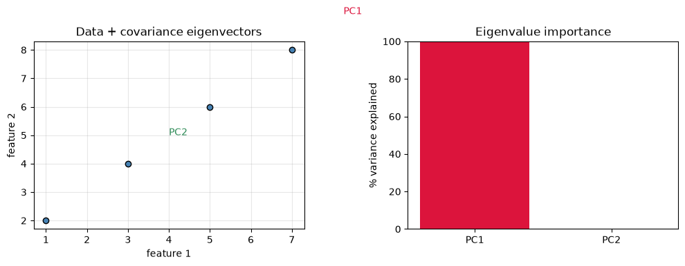
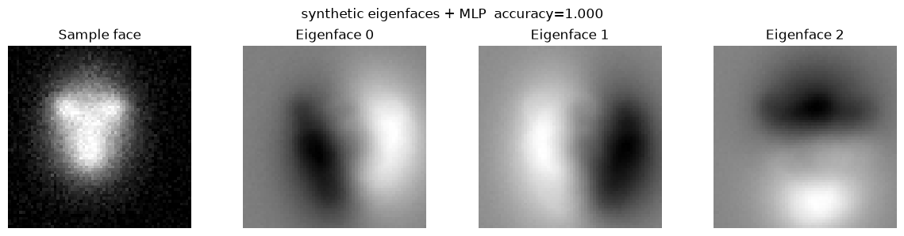

# Module 4: Securing User Authentication

### Objectives

- Understand drivers of authentication threats (IoT, weak passwords)
- Compare reactive vs predictive account protection
- Identify behavioral features for detecting unauthorized access
- Apply ML analytic process to authentication risk scoring
- Understand MFA and biometric options
- Apply ML to keystroke dynamics and eigenface facial recognition

### Key concepts

| Term | Definition / notes |
| ---- | ------------------ |
| IoT | Internet-connected devices (watches, sensors, smartphones): expands attack surface |
| MFA | Multi-factor authentication: password + something else (OTP, biometric) |
| OTP | One-time password via SMS or email |
| Reactive auth | Static rules (e.g. lock after N failures): same threshold for all users |
| Predictive auth | ML risk scoring from **per-user** behavior patterns |
| Account reputation | Baseline of normal activity; flag deviations |
| Behavioral biometrics | Gait, keystroke dynamics: how you move or type |
| Credential stuffing | Automated login attempts with stolen passwords |
| Keystroke dynamics | Hold time, flight time between keys: identifies typing rhythm |
| Eigenfaces | PCA principal components of face images: distinctive facial patterns |
| Eigenvector | Direction unchanged by a matrix transform: only scaled |
| Eigenvalue | Scalar $\lambda$: how much the eigenvector is stretched/compressed |
| Facial detection | Locate a face **in** an image (not the focus here) |
| Facial recognition | Match a face to a **known identity** in an archive |
| LFW dataset | Labeled Faces in the Wild: public face image dataset |
| Variance | Dispersion of data: average of squared deviations from the mean |
| Covariance | Degree of **linear correlation** between two variables |
| Covariance matrix | Matrix of covariances for every ordered pair of features in a dataset |

# Notes

## Understanding and securing user authentication threats

Pivot from spam/malware/network threats → **authentication**.

Applies the [ML analytic process](module-02-ai-for-cybersecurity-professionals.md#ml-analytic-process-cyber-analyst-workflow) to **user account protection**.

### Why authentication matters now

| Driver | Impact |
| ------ | ------ |
| **IoT explosion** | Fitbits, smart watches, sensors: small CPU/memory, wireless, always online |
| **Smartphones** | Textbook counts these as IoT-class devices too |
| **More touchpoints** | More human↔machine interaction → more chances for **unauthorized account access** |
| **Weak passwords** | Single-factor password-only accounts are a **recipe for disaster** |

### Authentication fundamentals

**Defense layers:**

```
Strong password → MFA (OTP / app / biometric) → behavioral monitoring → risk-based block/allow
```

| Factor | Examples |
| ------ | -------- |
| Something you **know** | Password, PIN |
| Something you **have** | Phone (OTP), hardware token |
| Something you **are** | Face, fingerprint, gait, keystrokes |

## Beyond passwords: MFA options

| Method | How it works |
| ------ | ------------ |
| **Password only** | Weakest: one stolen credential = full access |
| **OTP via SMS** | One-time code texted to phone on file |
| **OTP via email** | One-time code sent to registered email |
| **Other factors** | App authenticators, hardware tokens, **biometrics** |

Cyber analysts overseeing user accounts can combine MFA with **behavioral monitoring** to spot unauthorized access.

## Suspicious login signals (features for analysts / ML)

Behavior **uncommon for humans** or **uncommon for this specific user**:

| Signal | Example |
| ------ | ------- |
| Brute force | Rapid login attempts; many passwords in quick succession |
| Geo anomaly | Login from region user rarely visits |
| Device anomaly | OS or browser uncommon for that user |
| Fake accounts | **Same IP** → multiple accounts; bursts of activity in **very short windows** |

**Account reputation scoring**: build a baseline of **normal behavior** per user; flag deviations.

## Reactive vs predictive

| | **Reactive** | **Predictive (ML)** |
| - | ------------ | ------------------- |
| **How** | Static rules (e.g. lock account after N failed logins) | Model learns **per-user** patterns |
| **Threshold** | Same for all users | Can be **dynamic** per user |
| **Pros** | Simple, familiar | Better at blocking **future** attack behavior |
| **Cons** | Legit users locked out; attacker may succeed before threshold | Needs data, tuning, monitoring |

- **Reactive example:** block after 5 wrong passwords, but should 5 be the same for every user? Static thresholds may fail to stop attackers **and** block real users.

- **Predictive promise:** ML during **model engineering** phase → risk score at login time using behavioral features.

## ML for authentication: algorithm & feature guidance

Use [Module 2 ML types](module-02-ai-for-cybersecurity-professionals.md#ml-types--quick-compare) as initial guidance during **model engineering** (textbook; other researchers may disagree):

| Situation | ML approach | Goal |
| --------- | ----------- | ---- |
| Labeled fraud / takeover examples | **Supervised** (logistic regression, decision tree, …) | Classify login as legit vs attack; tune for **fewer false positives** |
| No labels: find odd patterns | **Unsupervised** (clustering, anomaly detection) | Spot outliers; improve **accuracy** on novel attacks |
| Per-user baseline | **Reputation / behavior scoring** | Features → normal profile → flag deviation |

**Model engineering features (examples):**

```
failed_logins_per_minute, unique_passwords_tried, geo_distance_from_usual,os_mismatch, accounts_per_ip, session_duration, time_since_last_login
```

## Hands-on: login risk scoring (synthetic login events)

Runnable script: [`code/mod4/LoginRiskScoring.py`](../code/mod4/LoginRiskScoring.py). Dataset: [`code/mod4/data/login_events.csv`](../code/mod4/data/login_events.csv) (5,000 synthetic login attempts for local testing). Regenerate with [`code/mod4/generate_login_events.py`](../code/mod4/generate_login_events.py).

**Supervised risk scoring:** each row is one login attempt; the model learns which behavioral features predict **attack** vs **legitimate** access. Production systems tune the decision threshold to balance false positives (blocking real users) vs missed attacks.

### What inputs does login risk scoring need?

| Requirement | Why |
| ----------- | --- |
| **Numeric behavioral features** | ML needs numbers per login attempt, not raw log text |
| **One row per login attempt** | Each sample = one authentication event with a feature vector |
| **Labeled outcomes** | `is_attack`: 0 = legitimate, 1 = attack (supervised learning) |
| **`failed_attempts_1min`** | Rapid retries → brute force / credential stuffing signal |
| **`passwords_tried_count`** | Many passwords in succession → password spraying |
| **`geo_distance_km`** | Distance from user's usual region → geo anomaly |
| **`os_is_usual`** | 1 = usual OS for this user, 0 = uncommon device/OS |
| **`accounts_same_ip`** | Multiple accounts from one IP → fake account / bot farm signal |
| **`activity_burst_seconds`** | Short activity window → automated burst behavior |
| **No scaling required (this lab)** | Random forest handles mixed scales; production may still normalize |

**Why synthetic data?** Real login telemetry is sensitive and not public. This CSV mimics the suspicious signals from the table above so you can run the pipeline locally.

**Why `RandomForestClassifier`?** Example from the course lab: handles mixed feature types, gives feature importances, works well on tabular security features. Logistic regression or decision trees are also valid choices.

### Pipeline

| Phase | Role | Steps |
| ----- | ---- | ----- |
| **1: Data engineering** | Data engineer | Load `login_events.csv` → select 6 behavioral feature columns |
| **2: Model development** | Data scientist | Train/test split → `RandomForestClassifier` → `fit()` / `predict()` |
| **3: Evaluation** | Data scientist | Accuracy + feature importance plot (which signals drive risk) |

#### Feature engineering detail

| Item | This lab |
| ---- | -------- |
| Source | Synthetic CSV in `code/mod4/data/` |
| Features | 6 login-behavior metrics per attempt |
| Transform | **None** in script |
| Labels | `is_attack`: 0 legitimate / 1 attack |
| Classifier | `RandomForestClassifier(random_state=42)` |

```python
import matplotlib.pyplot as plt
import numpy as np
import pandas as pd
from pathlib import Path
from sklearn.ensemble import RandomForestClassifier
from sklearn.metrics import accuracy_score
from sklearn.model_selection import train_test_split

data_path = Path(__file__).resolve().parent / "data" / "login_events.csv"

# Each row = one login attempt; label = legitimate (0) or attack (1)
df = pd.read_csv(data_path)

feature_cols = [
    "failed_attempts_1min",   # rapid retries
    "passwords_tried_count",  # many passwords in succession
    "geo_distance_km",        # far from user's usual region
    "os_is_usual",            # 1 = usual OS for this user, 0 = uncommon
    "accounts_same_ip",       # multiple accounts from one IP
    "activity_burst_seconds", # very short-duration activity window
]

# X = behavioral feature vector per login; all columns must be numeric
X = df[feature_cols]
y = df["is_attack"]

X_train, X_test, y_train, y_test = train_test_split(
    X, y, test_size=0.2, random_state=42
)

# Supervised classifier on labeled login history
clf = RandomForestClassifier(random_state=42)
clf.fit(X_train, y_train)

print(accuracy_score(y_test, clf.predict(X_test)))

# Which features matter most for predicting attacks
importances = clf.feature_importances_
top_idx = np.argsort(importances)[::-1]

plt.barh(np.array(feature_cols)[top_idx][::-1], importances[top_idx][::-1])
plt.xlabel("feature importance")
plt.title("Login risk scoring: top attack signals")
out = Path(__file__).resolve().parent / "LoginRiskScoring.png"
plt.savefig(out, bbox_inches="tight")
plt.close()
```



#### Results

- Accuracy is **high** (~99%+) on synthetic data; borderline logins mimic real false-positive risk
- Feature importances highlight brute-force and geo/device anomalies
- **Production:** tune threshold to balance false positives vs missed attacks; retrain as attack patterns evolve
- Real deployments need per-user baselines and privacy controls (see [Privacy and ethics](#privacy-and-ethics))

---

## Biometrics (overview)

Growing use on smartphones (better sensors). **Something you are**: harder to steal than passwords alone.

| Type | What it measures |
| ---- | ---------------- |
| **Keystroke dynamics** | Typing rhythm, hold time, flight time between keys |
| **Face** | Facial recognition (eigenfaces + PCA) |
| **Fingerprint** | Touch sensor patterns |
| **Gait** | How you walk |

Hands-on: [keystroke](#hands-on-keystroke-dynamics-authentication), [facial recognition](#hands-on-facial-recognition-eigenfaces), [LFW eigenfaces](#hands-on-lfw-facial-recognition-eigenfaces--mlp), and [live camera enrollment](#hands-on-live-eigenface-enrollment-macos--camera) sections below.

---

## Hands-on: keystroke dynamics authentication

Runnable script: [`code/mod4/KeystrokeDynamicsAuthentication.py`](../code/mod4/KeystrokeDynamicsAuthentication.py). Dataset: [`code/mod4/data/keystroke_biometric.csv`](../code/mod4/data/keystroke_biometric.csv) (20,400 synthetic keystroke samples for local testing). Regenerate with [`code/mod4/generate_keystroke_biometric.py`](../code/mod4/generate_keystroke_biometric.py).

**Goal:** ML analytic that identifies each user's **keystroke delay pattern**: who is typing, not just what password.

### What inputs does keystroke dynamics need?

| Requirement | Why |
| ----------- | --- |
| **30+ numeric timing features** | Hold time, flight time, digraph delays: all in milliseconds |
| **One row per typing sample** | Each row = one time the password was entered |
| **`user_id` label (0..50)** | **51-class** identification: which person typed (not binary auth) |
| **`session_id`** | Sample index per user (metadata; excluded from `X`) |
| **`StandardScaler` before training** | Timing features use different ranges; scaling puts them on comparable scales |
| **Same password for all users** | Everyone typed the same string; differences are **rhythm**, not content |

**Why synthetic data?** The keystroke CSV is not public. This file mirrors the course layout: 51 users × 400 samples × 31 timing columns.

**Why scale features?** `hold_01` and `total_duration_ms` differ in magnitude. Distance-based models (SVM, KNN) and neural nets train more reliably after `StandardScaler`.

**Why compare three classifiers?** Textbook lab runs **MLP**, **SVM**, and **KNN** with default params on the same split. Result: **MLP highest**, SVM lower, KNN lowest. Synthetic proxy keeps **KNN lowest**; exact MLP vs SVM ordering can vary.

#### Dataset

| Item | Detail |
| ---- | ------ |
| Source | Synthetic proxy keystroke data |
| Subjects | **51 people** (`user_id` 0–50) |
| Samples | Each typed the **same password 400 times** |
| Features | **31** timing columns (`hold_*`, `flight_*`, `digraph_*`, `total_duration_ms`) |

### Pipeline

| Phase | Role | Steps |
| ----- | ---- | ----- |
| **1: Data engineering** | Data engineer | Load CSV → drop `user_id`/`session_id` from features → 31 timing columns |
| **2: Model development** | Data scientist | Train/test split → `StandardScaler` → train MLP, SVM, KNN |
| **3: Evaluation** | Data scientist | Compare accuracy across classifiers (bar chart) |

#### Feature engineering detail

| Item | This lab |
| ---- | -------- |
| Source | Synthetic CSV in `code/mod4/data/` |
| Features | 31 keystroke timing metrics per sample |
| Transform | `StandardScaler` (fit on train only) |
| Labels | `user_id`: which of 51 users typed |
| Classifiers | `MLPClassifier`, `SVC()`, `KNeighborsClassifier()` (defaults) |

Three classifiers on the **same data**, **default parameters** (no optimization in textbook):

| Model | Textbook result | Synthetic proxy |
| ----- | ------------------------- | ----------------- |
| **MLP** (multi-layer perceptron) | **Best accuracy** | Competitive (~0.75) |
| SVM | Lower | Often highest on synthetic data |
| KNN | **Lowest** | **Lowest** (~0.70) |

```python
import matplotlib.pyplot as plt
import pandas as pd
from pathlib import Path
from sklearn.metrics import accuracy_score
from sklearn.model_selection import train_test_split
from sklearn.neighbors import KNeighborsClassifier
from sklearn.neural_network import MLPClassifier
from sklearn.preprocessing import StandardScaler
from sklearn.svm import SVC

data_path = Path(__file__).resolve().parent / "data" / "keystroke_biometric.csv"

df = pd.read_csv(data_path)

# y = user ID (0..50); X = 31 timing features per keystroke sample
feature_cols = [c for c in df.columns if c not in ("user_id", "session_id")]
X = df[feature_cols].values
y = df["user_id"]

X_train, X_test, y_train, y_test = train_test_split(
    X, y, test_size=0.2, random_state=42
)

# Scale: timing features on different ranges (ms)
scaler = StandardScaler()
X_train = scaler.fit_transform(X_train)
X_test = scaler.transform(X_test)

models = {
    "MLP": MLPClassifier(hidden_layer_sizes=(64, 32), max_iter=500, random_state=42),
    "SVM": SVC(),
    "KNN": KNeighborsClassifier(),
}

results = {}
for name, clf in models.items():
    clf.fit(X_train, y_train)
    acc = accuracy_score(y_test, clf.predict(X_test))
    results[name] = acc
    print(f"{name}: {acc:.3f}")

plt.bar(results.keys(), results.values())
plt.ylim(0, 1)
plt.ylabel("accuracy")
plt.title("Keystroke dynamics: MLP vs SVM vs KNN")
out = Path(__file__).resolve().parent / "KeystrokeDynamicsAuthentication.png"
plt.savefig(out, bbox_inches="tight")
plt.close()
```



#### Results

- **51-class** identification is harder than binary spam/phishing classification
- **KNN** is consistently weakest: local neighbors confuse similar typing profiles
- **MLP** hidden layers learn timing combinations
- **Scaling is required** before training distance-based or neural models on timing features

**Typical keystroke features:** key hold duration, time between key releases (flight time), digraph/trigraph delays.

---

## Hands-on: facial recognition (eigenfaces)

### Detection vs recognition

| Term | Meaning | This course? |
| ---- | ------- | ------------ |
| **Facial detection** | Find *a* face in an image | No |
| **Facial recognition** | Match face → **named person** in archive | **Yes** |

### Why faces are hard

- Look-alikes: twins, family members, similar strangers
- Faces **change** with age, illness, lighting, pose
- Fix: use only **distinctive** features (not every pixel)

### Eigenfaces + PCA

Face images are **high-dimensional** (one feature per pixel). **PCA** (unsupervised) keeps directions of **maximum variance**: the most distinctive facial components = **eigenfaces**.

**PCA steps (study):**

1. Compute **covariance matrix** of the dataset
2. Find **eigenvectors** with largest **eigenvalues** → principal components
3. Project images onto top $k$ components → lower-dim representation
4. Feed reduced features to **MLP** classifier

### Variance, covariance & covariance matrix

**Variance**: measure of **dispersion** of data; the average of the deviations of the data with respect to their mean (squared):

$$
\text{Var}(X) = \frac{1}{n}\sum_{i=1}^{n}(x_i - \bar{x})^2
\qquad \text{where } \bar{x} = \frac{1}{n}\sum_{i=1}^{n} x_i
$$

High variance → values spread far from the mean. PCA seeks directions where variance is **largest**.

**Covariance**: measures the degree of **linear correlation** between two variables $X$ and $Y$:

$$
\text{Cov}(X,Y) = \frac{1}{n}\sum_{i=1}^{n}(x_i - \bar{x})(y_i - \bar{y})
$$

| Sign | Meaning |
| ---- | ------- |
| **Positive** | $X$ increases → $Y$ tends to increase |
| **Negative** | $X$ increases → $Y$ tends to decrease |
| **Near 0** | Little linear relationship |

**Covariance matrix** $\mathbf{C}$, matrix containing the covariances calculated on each **ordered pair** of variables in a dataset. For $p$ features:

$$
\mathbf{C} = \begin{pmatrix}
\text{Cov}(X_1,X_1) & \text{Cov}(X_1,X_2) & \cdots & \text{Cov}(X_1,X_p) \\
\text{Cov}(X_2,X_1) & \text{Cov}(X_2,X_2) & \cdots & \text{Cov}(X_2,X_p) \\
\vdots & \vdots & \ddots & \vdots \\
\text{Cov}(X_p,X_1) & \text{Cov}(X_p,X_2) & \cdots & \text{Cov}(X_p,X_p)
\end{pmatrix}
$$

- **Diagonal** → variance of each feature ($\text{Cov}(X_j,X_j) = \text{Var}(X_j)$)
- **Off-diagonal** → covariance between feature pairs
- Matrix is **symmetric**: $\text{Cov}(X_j,X_k) = \text{Cov}(X_k,X_j)$

Compact form for $n$ samples $\mathbf{x}_i \in \mathbb{R}^p$:

$$
\mathbf{C} = \frac{1}{n}\sum_{i=1}^{n}(\mathbf{x}_i - \bar{\mathbf{x}})(\mathbf{x}_i - \bar{\mathbf{x}})^\top
$$

### Eigenvalues, eigenvectors & eigenfaces

Runnable study script: [`code/mod4/EigenvaluesCovariance.py`](../code/mod4/EigenvaluesCovariance.py).

#### What is the eigen problem?

For a square matrix $\mathbf{A}$ (here $\mathbf{C}$, the covariance matrix), an **eigenvector** $\mathbf{v}$ is a direction that the matrix only **scales**, not rotates:

$$
\mathbf{A}\,\mathbf{v} = \lambda\,\mathbf{v}
$$

The scalar $\lambda$ is the **eigenvalue**: how much stretching happens along $\mathbf{v}$.

| Symbol | Meaning |
| ------ | ------- |
| $\mathbf{v}$ | Eigenvector: principal **direction** in feature space |
| $\lambda$ | Eigenvalue: **variance** (for $\mathbf{C}$) along that direction |

#### Why do eigenvalues / eigenvectors exist?

- Linear algebra fact: many matrices (especially **symmetric** ones like $\mathbf{C}$) can be decomposed into orthogonal directions, each with its own scale factor.
    - A symmetric matrix is a square matrix that is equal to its transpose ($A = A^T$)
- $\mathbf{C}$ is symmetric because $\text{Cov}(X_j, X_k) = \text{Cov}(X_k, X_j)$.
- Symmetry guarantees **real** eigenvalues and **perpendicular** eigenvectors: no imaginary components, no skewed axes.
- Intuition: correlated features share variance; eigen decomposition finds uncorrelated axes that re-express the same data.

#### When are they used?

| Use case | Role of eigen decomposition |
| -------- | --------------------------- |
| **PCA / eigenfaces** (this module) | Top eigenvectors of $\mathbf{C}$ = principal components; largest $\lambda$ = keep |
| **Module 2 PCA** | Reduce dimensions before clustering or classification |
| **Spectral methods** | Graph clustering, some anomaly detection (eigenvectors of graph Laplacian) |
| **Face recognition (classic)** | Pixel vectors → top $k$ eigenfaces → MLP classifier |

**PCA link:** eigenvectors of $\mathbf{C}$ = **principal component directions**; eigenvalues = **variance** along each direction. Keep eigenvectors with the **largest** eigenvalues.

| Eigenvalue size | Meaning |
| --------------- | ------- |
| **Large** $\lambda$ | High variance along that eigenvector → **important** principal component |
| **Small** $\lambda$ | Low variance → less distinctive; safe to drop |

**Variance explained** by component $i$:

$$
\text{explained}_i = \frac{\lambda_i}{\sum_{j=1}^{p} \lambda_j}
$$

**Eigenface**: when PCA is applied to face images, each top eigenvector reshaped to image size:

$$
\text{eigenface}_k = \text{reshape}(\mathbf{v}_k) \qquad \text{where } \mathbf{v}_k \text{ is the } k\text{-th eigenvector of } \mathbf{C}
$$

- Not a real person's face: a **statistical pattern** (lighting, bone structure, expression)
- Classifier weights several eigenfaces to recognize **whose** face it is
- Reduces thousands of pixels → $k$ coefficients (e.g. 150)

**Projection** onto eigenfaces (feed into MLP):

$$
\mathbf{Z} = \mathbf{X}\mathbf{W}_k
$$

$\mathbf{W}_k$ = matrix whose columns are the top $k$ eigenvectors (eigenfaces).

### Hands-on: covariance & eigen decomposition (2D study)

Tiny 2D example before the LFW face pipeline. Shows why PCA keeps directions with the largest $\lambda$.

#### What inputs does this demo need?

| Requirement | Why |
| ----------- | --- |
| **Numeric matrix `X`** | Shape `(n_samples, n_features)`; each row is one observation |
| **At least 2 features** | Eigenvectors are directions in feature space (2D easy to plot) |
| **Covariance matrix `C`** | Built from feature columns; symmetric $p \times p$ matrix |
| **`np.linalg.eig(C)`** | Returns eigenvalues $\lambda$ and eigenvectors $\mathbf{v}$ |

**Why `rowvar=False`?** `np.cov` treats each **column** as a variable (feature). Rows are samples.

```python
import matplotlib.pyplot as plt
import numpy as np
from pathlib import Path

# Rows = samples, cols = features (both rise together → high covariance)
X = np.array([[1, 2], [3, 4], [5, 6], [7, 8]], dtype=float)

C = np.cov(X, rowvar=False)   # shape: (n_features, n_features)
eigenvalues, eigenvectors = np.linalg.eig(C)

print("Covariance matrix:\n", C)
print("Eigenvalues:", eigenvalues)
print("Eigenvectors (columns = principal axes):\n", eigenvectors)

# How much variance each eigenvector captures
explained = eigenvalues / eigenvalues.sum()

# Plot: data points + principal directions + variance bar chart
mean = X.mean(axis=0)
# ... arrows along eigenvectors scaled by sqrt(λ) ...
out = Path(__file__).resolve().parent / "EigenvaluesCovariance.png"
```



#### Study takeaway (2D toy data)

- Both features increase together → **positive covariance**, one eigenvector along the trend line dominates.
- Points lie on a line → **second eigenvalue ≈ 0** (no spread in the perpendicular direction).
- **Largest $\lambda$** → direction of most spread → PCA keeps this first.
- **Smallest $\lambda$** → direction with little spread → safe to drop for compression.

### When eigenanalysis is not enough

Eigen decomposition of $\mathbf{C}$ assumes **linear** correlations and global variance structure. That breaks down when:

| Limitation | Symptom | Alternatives |
| ---------- | ------- | ------------ |
| **Non-linear structure** | Data lies on curved manifolds (pose, expression) | **Kernel PCA**, **t-SNE**, **UMAP**, **autoencoders** |
| **Labels available** | Want axes that separate classes, not just variance | **LDA** (Linear Discriminant Analysis) |
| **Very high dimension** | Explicit $\mathbf{C}$ is huge (e.g. full-resolution faces) | **Truncated SVD** / `sklearn.PCA` (SVD trick, no full covariance) |
| **Modern face recognition** | Eigenfaces age poorly vs deep models | **CNN embeddings** (FaceNet, ArcFace), liveness detection |
| **Non-Gaussian clusters** | PCA + GMM still overlap (Module 2) | **Deep learning**, richer density models |

**Course path:** eigenfaces teach the **idea** (reduce pixels → compact features → classify). Production systems often replace eigenfaces with **deep embeddings**, but PCA/eigen logic still appears in preprocessing, anomaly detection, and interpretability.

---

## Hands-on: LFW facial recognition (eigenfaces + MLP)

Runnable script: [`code/mod4/FacialRecognitionEigenfaces.py`](../code/mod4/FacialRecognitionEigenfaces.py).

**Dataset:** [Labeled Faces in the Wild (LFW)](https://scikit-learn.org/stable/modules/generated/sklearn.datasets.fetch_lfw_people.html) via [`fetch_lfw_people`](https://scikit-learn.org/stable/modules/generated/sklearn.datasets.fetch_lfw_people.html). Cached under `code/mod4/data/sklearn_cache/lfw_home/` after the first successful download.

**First-time setup:** the script calls `fetch_lfw_people(..., download_if_missing=True)`. If you get **HTTP 403** from figshare, download the four files listed by [`download_lfw_data.py`](../code/mod4/download_lfw_data.py) in a **browser**, place them in `lfw_home/`, then re-run the script.

**Goal:** match a face image to a **known person ID** in the archive (recognition, not detection).

### What inputs does the eigenface pipeline need?

| Requirement | Why |
| ----------- | --- |
| **`X`: flattened grayscale pixels** | Each face image → one row vector; every pixel is a feature |
| **`y`: person ID label** | Multi-class target: which person (not just "face / no face") |
| **High dimensionality** | Thousands of pixels per image → PCA reduces before MLP |
| **`resize=0.4`** | Downscales images → fewer pixels → faster PCA/MLP |
| **`min_faces_per_person=70`** | Keeps only people with enough photos for stable training |
| **`data_home`** | Cache dir: `code/mod4/data/sklearn_cache/` |
| **`download_if_missing=True`** | Sklearn downloads LFW from figshare on first run |
| **`PCA(n_components=150)`** | Keep top 150 eigenfaces (principal components) |
| **`whiten=True`** | Scales components to unit variance → helps MLP training |
| **Pipeline** | PCA `fit` on **train only** → prevents leaking test faces into eigenfaces |

**Why PCA before MLP?** Raw pixels are correlated and noisy. PCA finds orthogonal **eigenfaces** (directions of max variance) so the MLP sees ~150 compact coefficients instead of ~1,800+ pixels.

**Why unsupervised PCA + supervised MLP?** PCA ignores labels (finds generic face variation). MLP uses labels to map eigenface coefficients → person ID.

### Pipeline equations

**Step 1 — PCA projection** (same as [eigen study](#hands-on-covariance--eigen-decomposition-2d-study)):

$$
\mathbf{Z} = \mathbf{X}\mathbf{W}_k
$$

$\mathbf{W}_k$ = top $k$ eigenvectors (eigenfaces); $\mathbf{Z}$ = reduced face coordinates fed to the classifier.

**Step 2 — Whitening** (optional, used in this lab):

$$
\mathbf{Z}_{\text{white}} = \mathbf{Z} / \sqrt{\lambda_i + \epsilon}
$$

Divides each component by its variance so all 150 inputs have similar scale.

**Step 3 — MLP classification:**

$$
\hat{y} = \text{MLP}(\mathbf{Z}_{\text{white}})
$$

Outputs person ID for each face.

### Pipeline

| Phase | Role | Steps |
| ----- | ---- | ----- |
| **1: Data engineering** | Data engineer | `fetch_lfw_people()` → flatten images → person labels |
| **2: Dimensionality reduction** | Data scientist | `PCA(150, whiten=True)` on train → eigenfaces |
| **3: Classification** | Data scientist | `MLPClassifier(256)` on reduced features → accuracy |

#### Feature engineering detail

| Item | This lab |
| ---- | -------- |
| Source | LFW subset via `fetch_lfw_people(min_faces_per_person=70, resize=0.4)` |
| Features | Grayscale pixel intensities (high-dimensional) |
| Transform | PCA → 150 eigenface coefficients (+ whitening) |
| Labels | `lfw.target`: person ID (multi-class) |
| Classifier | `MLPClassifier(hidden_layer_sizes=(256,), max_iter=500)` |

```python
import matplotlib.pyplot as plt
from pathlib import Path
from sklearn.datasets import fetch_lfw_people
from sklearn.decomposition import PCA
from sklearn.metrics import accuracy_score
from sklearn.model_selection import train_test_split
from sklearn.neural_network import MLPClassifier
from sklearn.pipeline import Pipeline

data_home = Path(__file__).resolve().parent / "data" / "sklearn_cache"
data_home.mkdir(parents=True, exist_ok=True)

# Official LFW loader: https://scikit-learn.org/stable/modules/generated/sklearn.datasets.fetch_lfw_people.html
lfw = fetch_lfw_people(
    min_faces_per_person=70,
    resize=0.4,
    data_home=str(data_home),
    download_if_missing=True,
    n_retries=3,
    delay=1.0,
)

X = lfw.data                    # (n_samples, n_pixels): flattened grayscale faces
y = lfw.target                  # person ID per image
images = lfw.images             # (n_samples, height, width) for visualization
h, w = images.shape[1:]

X_train, X_test, y_train, y_test = train_test_split(
    X, y, test_size=0.2, random_state=42, stratify=y
)

n_components = min(150, X_train.shape[0] - 1, X_train.shape[1])

pipe = Pipeline([
    ("pca", PCA(n_components=n_components, whiten=True, random_state=42)),
    ("mlp", MLPClassifier(hidden_layer_sizes=(256,), max_iter=500, random_state=42)),
])

pipe.fit(X_train, y_train)
acc = accuracy_score(y_test, pipe.predict(X_test))
print(f"Accuracy: {acc:.3f}")

pca = pipe.named_steps["pca"]
fig, axes = plt.subplots(1, 4, figsize=(12, 3))
axes[0].imshow(images[0], cmap="gray")
axes[0].set_title("Sample face")
axes[0].axis("off")
for i in range(3):
    axes[i + 1].imshow(pca.components_[i].reshape(h, w), cmap="gray")
    axes[i + 1].set_title(f"Eigenface {i}")
    axes[i + 1].axis("off")
out = Path(__file__).resolve().parent / "FacialRecognitionEigenfaces.png"
plt.savefig(out, bbox_inches="tight")
plt.close()
```



#### Results

- Accuracy is **pretty good** without tuning (textbook default params)
- Eigenface images show **statistical face patterns**, not real people
- PCA compresses thousands of pixels → **150 coefficients** → faster, less overfitting
- Production systems often use **deep CNN embeddings** instead; the PCA → classify flow is the same idea

### LFW vs live camera lab

| | **LFW script** | **Eigenface Live app** |
| - | -------------- | ---------------------- |
| Input | Pre-labeled archive images | **Mac camera** frames |
| Task | Multi-class: which person? | Binary verify: **same person or not?** |
| Enrollment | Fixed dataset | You enroll by moving face in **oval shapes** |
| PCA | 150 components | ~30 components (fewer live samples) |
| Platform | Any OS with Python | **macOS only** (AVFoundation camera) |

---

## Hands-on: live eigenface enrollment (macOS + camera)

Qt desktop app that applies the same **PCA eigenfaces + MLP** pipeline as the LFW lab, but trains on **your face** from the Mac camera and later checks whether a live frame matches the enrolled identity.

**Runnable app:** [`code/mod4/eigenface_live/`](../code/mod4/eigenface_live/) (see [`README`](../code/mod4/eigenface_live/README.md)).

**Platform:** macOS only. Uses OpenCV `CAP_AVFOUNDATION` for the built-in or external camera.

### Quick start

```bash
cd code/mod4/eigenface_live
make install
make run
```

Grant camera access when macOS prompts (System Settings → Privacy & Security → Camera).

### Detection vs verification (this lab)

| Term | LFW lab | This app |
| ---- | ------- | -------- |
| **Recognition** | Match face → person ID in archive | Not used (no multi-person archive) |
| **Verification** | N/A | Match live face → **one enrolled identity** (`MATCH` / `NO_MATCH`) |

### What inputs does the live pipeline need?

| Requirement | Why |
| ----------- | --- |
| **macOS + camera** | `MacCameraService` opens the webcam via AVFoundation |
| **Face in frame** | OpenCV Haar cascade finds the largest frontal face per frame |
| **Oval head motion** | `OvalMotionCollector` captures ~40 diverse poses (not a single still photo) |
| **Grayscale face crop** | Resized to 92×112 pixels → flattened vector (LFW-like aspect) |
| **Identity label** | Short name for the enrollment file (validated, no path traversal) |
| **PCA (`n_components≈30`)** | Fewer samples than LFW → fewer eigenfaces, same math |
| **MLP + distance threshold** | Classifier score **and** PCA-space distance to enrolled prototype |

**Why oval motion?** A single frame is easy to spoof with a photo. Moving your head traces different poses and lighting angles, giving PCA more **variance** to learn from (same reason eigenfaces need multiple images per person in LFW).

**Where eigenvalues appear:**

| Step | Eigenvalues used for |
| ---- | -------------------- |
| Oval capture (`frame_collector.py`) | `eigvalsh` on face-center covariance → detect oval-shaped motion path |
| Training / verify (`face_recognition_service.py`) | **PCA** internally uses eigen decomposition of pixel covariance → **eigenfaces** |

### Pipeline

| Phase | Role | Steps |
| ----- | ---- | ----- |
| **1: Capture** | User + app | Camera frame → detect face → oval-motion check → store face vectors |
| **2: Dimensionality reduction** | Data scientist | `PCA(whiten=True)` on enrolled samples → eigenfaces + prototype |
| **3: Classification** | Data scientist | `MLPClassifier` on pixels + synthesized negatives; distance threshold from PCA projections |
| **4: Verify** | User + app | Live frame → PCA transform → compare distance + MLP probability → `MATCH` / `NO_MATCH` / `UNCERTAIN` |

#### App architecture

| Folder | Purpose |
| ------ | ------- |
| `services/` | Camera, face detection, oval capture, PCA+MLP training, signed model storage |
| `ui/` | Qt Train / Verify tabs, live preview, `AppController` facade |
| `models/` | `FaceSample`, `EnrollmentArtifact`, `VerificationResult` |
| `utils/` | Image conversion (OpenCV → Qt), safe identity paths |

Models save under `code/mod4/eigenface_live/data/enrollments/` with HMAC metadata signing and restrictive file permissions (`chmod 600`).

### Train tab workflow

1. Enter identity (e.g. `alice`).
2. Click **Start enrollment**.
3. Move your face slowly in **oval shapes** until the progress bar reaches ~40 samples.
4. App fits PCA + MLP and writes a signed `.joblib` enrollment file.

### Verify tab workflow

1. Select an enrolled identity → **Start verification**.
2. Look at the camera.
3. App reports:
   - **MATCH** — PCA distance and MLP agree: likely same person
   - **NO_MATCH** — likely different person
   - **UNCERTAIN** — mixed signals; reposition face or re-enroll

### Security notes (course demo)

| Practice | Detail |
| -------- | ------ |
| Local only | No network calls; models stay on disk |
| Signed enrollments | HMAC detects tampered model files |
| Sanitized identity names | Prevents unsafe filenames / path traversal |
| Restrictive permissions | Enrollment dir `700`, files `600` |
| **Not production-ready** | No liveness detection, anti-spoofing, or encryption at rest beyond OS defaults |

### Results & takeaway

- Bridges the **static LFW lab** to **real biometric enrollment** you can try on your Mac
- Shows the full ML analytic loop: **capture → engineer features → train → verify → iterate**
- PCA eigenvalues/eigenvectors power recognition; a **second** eigenanalysis pass guides oval-motion capture
- Re-enroll if verify stays `UNCERTAIN`; improve lighting and complete the full oval motion path

### Facial recognition challenges (production)

| Challenge | Mitigation |
| --------- | ---------- |
| Twins / look-alikes | Multi-factor auth; liveness detection |
| Aging / illness | Periodic re-enrollment; PCA captures main variation |
| High dimensionality | **PCA / eigenfaces** before classifier |
| Spoofing (photo of photo) | Liveness checks beyond scope of basic eigenfaces |

## Privacy and ethics

- Behavioral and biometric data is sensitive, minimize collection, secure storage
- False positives deny real users access, tune thresholds, offer recovery paths
- Per-user models must respect privacy regulations and user consent

## Summary

- IoT multiplies login touchpoints; password-only auth fails. 
- Layer **MFA** and **ML risk scoring** ([login risk lab](#hands-on-login-risk-scoring-synthetic-login-events)) over reactive lockouts. 
- **Biometrics hands-on:** [keystroke timing](#hands-on-keystroke-dynamics-authentication), [eigenvalues study](../code/mod4/EigenvaluesCovariance.py), [LFW eigenfaces + MLP](../code/mod4/FacialRecognitionEigenfaces.py), [live camera enrollment](../code/mod4/eigenface_live/). 
- PCA uses covariance → [eigenvalues / eigenvectors study](../code/mod4/EigenvaluesCovariance.py) → reduced face features (eigenfaces); live app adds oval-motion capture + verify.
- Balance accuracy with privacy, look-alikes, and false rejections.
