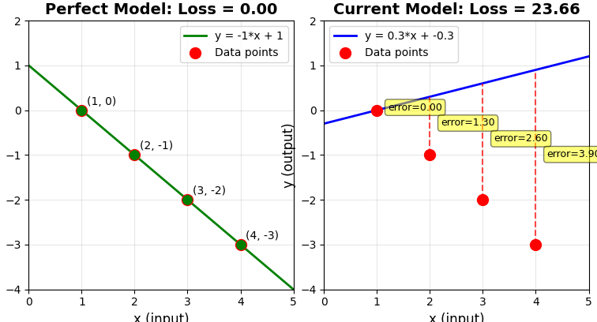

# Tensorflow: Build & Deploy Face Mask Detection

> **Course Reference**: [Tensorflow: Build & Deploy Face Mask Detection](https://www.coursera.org/learn/tensorflow-build-deploy-face-mask-detection/) by EDUCBA on Coursera
>
> **Disclaimer**: These are personal notes and customized code implementations based on the course materials. The code examples have been adapted, extended, and documented for learning purposes. This repository is not affiliated with or endorsed by EDUCBA or Coursera.

---

## Introduction

Tensorflow
- Tensorflow
    - Python library for fast numerical computing created by Google
    - Symbolic math library
    - Programming system where computations are represented as graphs
    - Inputs/Outputs are tensors
    - Written in Python, C++, CUDA
- Libraries are for deep learning
- Used for training and implementing deep neural networks
- Applications: Image recognition, translation, etc.

How it works?
- Uses data flow graphs
- Set of nodes and edges
- Nodes are mathematical operations
- Edges are multi dimensional arrays (tensors)

## Computation with tensorflow

### TensorFlow 1.x: Graph Execution with Sessions

- **Graph-based computation**: TensorFlow 1.x uses a two-phase approach:
  1. **Build phase**: Define computation graph (operations and tensors)
  2. **Execution phase**: Run graph in a session to compute values

- **Sessions**: Required to execute operations in TensorFlow 1.x
  - Sessions allocate resources (CPU/GPU memory) for computation
  - Sessions run the computation graph
  - Must explicitly create and close sessions

- **Basic example (TensorFlow 1.x)**:
    ```python
    import tensorflow as tf
    
    # Build phase: Define computation graph
    a = tf.constant(10)  # Create constant tensor
    b = tf.constant(32)  # Create constant tensor
    c = a + b            # Define operation (not executed yet)
    
    # Execution phase: Run graph in session
    sess = tf.Session()
    result = sess.run(c)  # Execute computation
    print(result)         # Output: 42
    sess.close()         # Clean up resources
    ```

- **Using context manager (recommended)**:
    ```python
    import tensorflow as tf
    
    a = tf.constant(10)
    b = tf.constant(32)
    c = a + b
    
    # Session automatically closed when exiting context
    with tf.Session() as sess:
        result = sess.run(c)
        print(result)  # Output: 42
    ```

### Key Concepts

- **Tensors**: Multi-dimensional arrays that flow through the graph
  - 0-D tensor: Scalar (e.g., `5`)
  - 1-D tensor: Vector (e.g., `[1, 2, 3]`)
  - 2-D tensor: Matrix (e.g., `[[1, 2], [3, 4]]`)
  - Higher dimensions: Arrays with more axes

- **Constants** (`tf.constant`): Immutable tensors with fixed values
  - Defined at graph creation time
  - Cannot be changed after creation
  - Example: `a = tf.constant(10)`

- **Variables** (`tf.Variable`): Mutable tensors that can be updated
  - Used for model parameters (weights, biases)
  - Must be initialized before use
  - Example:
    ```python
    W = tf.Variable(tf.random_normal([784, 10]))
    sess.run(tf.global_variables_initializer())  # Initialize variables
    ```

- **Placeholders** (`tf.placeholder`): Input nodes that receive data at runtime
  - Used for feeding training data
  - Shape and dtype specified, but values provided during `sess.run()`
  - Example:
    ```python
    x = tf.placeholder(tf.float32, shape=[None, 784])
    y = tf.placeholder(tf.float32, shape=[None, 10])
    # Feed data during execution:
    sess.run(loss, feed_dict={x: train_data, y: train_labels})
    ```

- **Operations**: Mathematical computations in the graph
  - Examples: `tf.add()`, `tf.multiply()`, `tf.matmul()`, `tf.reduce_mean()`
  - Operations return tensors
  - Operations are lazy (not executed until `sess.run()`)

- **Graph execution**:
  - `sess.run(tensor)`: Executes graph and returns tensor value
  - `sess.run([tensor1, tensor2])`: Executes multiple tensors
  - Only operations needed to compute requested tensors are executed

### TensorFlow 2.x: Eager Execution (No Sessions)

- **Eager execution**: Operations execute immediately (default in TF 2.x)
  - No need for sessions
  - More Pythonic and intuitive
  - Easier debugging (can print values immediately)

- **Example (TensorFlow 2.x)**:
    ```python
    import tensorflow as tf
    
    # Operations execute immediately
    a = tf.constant(10)
    b = tf.constant(32)
    c = a + b
    print(c)  # Output: tf.Tensor(42, shape=(), dtype=int32)
    print(c.numpy())  # Output: 42 (convert to numpy)
    ```

- **Backward compatibility**: Can still use graph mode in TF 2.x
    ```python
    import tensorflow.compat.v1 as tf
    tf.disable_v2_behavior()  # Use TF 1.x behavior
    ```

### Comparison: TF 1.x vs TF 2.x

| Aspect | TensorFlow 1.x | TensorFlow 2.x |
|--------|----------------|----------------|
| **Execution** | Graph mode (lazy) | Eager execution (immediate) |
| **Sessions** | Required | Not needed |
| **Debugging** | Harder (graph execution) | Easier (immediate execution) |
| **Code style** | More verbose | More Pythonic |
| **Performance** | Optimized graph execution | Slightly slower, but can use `@tf.function` |

### Why Sessions Were Needed (TF 1.x)

- **Resource management**: Sessions allocate and manage computational resources
- **Graph optimization**: Sessions optimize computation graph before execution
- **Device placement**: Sessions handle CPU/GPU device placement
- **Memory management**: Sessions manage memory for large computations
- **Lazy evaluation**: Operations only execute when explicitly requested via `sess.run()`

## Tensor data types

| Data Type | TensorFlow Type | Python Type | Description | Common Use Cases |
|-----------|----------------|-------------|-------------|------------------|
| DT_FLOAT | `tf.float32` | `float` | 32-bit floating point | Most common for neural networks, default for most operations |
| DT_DOUBLE | `tf.float64` | `float` | 64-bit floating point | Higher precision calculations (rarely used, slower) |
| DT_INT8 | `tf.int8` | `int` | 8-bit signed integer | Range: -128 to 127, memory-efficient storage |
| DT_INT16 | `tf.int16` | `int` | 16-bit signed integer | Range: -32,768 to 32,767 |
| DT_INT32 | `tf.int32` | `int` | 32-bit signed integer | Default integer type, indices, counts |
| DT_INT64 | `tf.int64` | `int` | 64-bit signed integer | Large integers, timestamps |
| DT_UINT8 | `tf.uint8` | `int` | 8-bit unsigned integer | Range: 0 to 255, image pixel values |
| DT_UINT16 | `tf.uint16` | `int` | 16-bit unsigned integer | Range: 0 to 65,535 |
| DT_UINT32 | `tf.uint32` | `int` | 32-bit unsigned integer | Range: 0 to 4,294,967,295 |
| DT_UINT64 | `tf.uint64` | `int` | 64-bit unsigned integer | Range: 0 to 18,446,744,073,709,551,615 |
| DT_STRING | `tf.string` | `str` | Variable-length byte arrays | Text data, file paths, labels |
| DT_BOOL | `tf.bool` | `bool` | Boolean values | Logical operations, masks, conditions |
| DT_COMPLEX64 | `tf.complex64` | `complex` | 64-bit complex number (2×float32) | Complex number operations |
| DT_COMPLEX128 | `tf.complex128` | `complex` | 128-bit complex number (2×float64) | High-precision complex numbers |
| DT_QINT8 | `tf.qint8` | `int` | Quantized 8-bit integer | Quantized neural networks |
| DT_QUINT8 | `tf.quint8` | `int` | Quantized unsigned 8-bit integer | Quantized neural networks |
| DT_QINT32 | `tf.qint32` | `int` | Quantized 32-bit integer | Quantized neural networks |

### Notes on Data Types

- **Common use cases**:
  - **tf.float32**: Model weights, activations, gradients (default for neural networks)
  - **tf.int32**: Array indices, batch sizes, loop counters
  - **tf.uint8**: Image pixel values (0-255), compressed data
  - **tf.string**: Text data, file paths, categorical labels
  - **tf.bool**: Masks, conditions, binary classifications

- **Type conversion**:
  ```python
  # Convert tensor to different dtype
  a = tf.constant(10, dtype=tf.int32)
  b = tf.cast(a, tf.float32)  # Convert to float32
  c = tf.cast(a, tf.int64)     # Convert to int64
  ```

- **Checking tensor dtype**:
  ```python
  tensor = tf.constant([1, 2, 3])
  print(tensor.dtype)  # Output: <dtype: 'int32'>
  ``` 

## Simple Linear Model

Evaluate how good a model is.

Define the model
```python
import tensorflow as tf

W = tf.Variable([.3],tf.float32)
b = tf.Variable([.3],tf.float32)
x = tf.placeholder(tf.float32)
linear_model = W * x + b

init = tf.global_variables_initializer()
sess = tf.Session()
sess.run(init)
print(sess.run(linear_model,{x:1,2,3,4}))
```

Compute loss, update variables and repeat the process until loss is smaller.

## Example 1: Sessions

### Description

- This example (`ex1_sessions.py`) shows how **TensorFlow 1.x** executes computations in two phases:
  1. **Build phase**: Define the computation graph (constants and operations)
  2. **Execution phase**: Run the graph inside a **session** to get actual values

- It also illustrates:
  - How to create constants with `tf.constant`
  - How to build simple operations (e.g., `a + b`)
  - How to execute operations with `sess.run(...)`
  - How to properly close sessions (manually and with context manager)

### Code (basic session usage)

```python
import tensorflow as tf

# Build phase: define graph
a = tf.constant(10)
b = tf.constant(32)
sum_op = a + b       # Operation is defined but NOT executed yet

# Execution phase: run graph in a session
        sess = tf.Session()
result = sess.run(sum_op)
print(result)        # Output: 42
sess.close()         # Always close sessions
```

### Code (recommended: context manager)

```python
import tensorflow as tf

        a = tf.constant(10)
        b = tf.constant(32)
sum_op = a + b

# Session is automatically closed when leaving the 'with' block
with tf.Session() as sess:
    result = sess.run(sum_op)
    print(result)    # Output: 42
```

### Inputs and Outputs

- **Inputs**:
  - No external inputs in this example (all values are constants)
  - Graph nodes:
    - `a`: constant tensor with value 10
    - `b`: constant tensor with value 32
    - `sum_op`: operation representing `a + b`

- **Outputs**:
  - `result`: Python scalar `42` returned by `sess.run(sum_op)`

### Relevant Notes

- **Graph vs Execution**:
  - Defining `a`, `b`, and `sum_op` **builds the graph** but does not compute values.
  - `sess.run(sum_op)` **executes** the required part of the graph and returns the result.

- **Sessions**:
  - Required in TensorFlow 1.x to execute any operation.
  - Allocate resources (CPU/GPU, memory) and manage device placement.
  - Must be closed to free resources (`sess.close()` or `with tf.Session() as sess:`).

- **Best practice**:
  - Use the **context manager pattern** (`with tf.Session() as sess:`) to ensure the session is always closed, even if an exception occurs.

## Example 2: Simple Linear Model

### Description

- This example (`ex2_simpleLinearModel.py`) demonstrates building a **simple linear model** using TensorFlow 1.x:
  - **Model formula**: `y = W*x + b` (linear relationship)
  - Uses **Variables** for model parameters (W = weight/slope, b = bias/y-intercept)
  - Uses **Placeholders** for input data (x values)
  - Shows how to initialize variables and feed data to placeholders

- It illustrates:
  - Creating Variables with `tf.Variable()` for trainable parameters
  - Creating Placeholders with `tf.placeholder()` for input data
  - Building a linear model computation graph
  - Variable initialization with `tf.global_variables_initializer()`
  - Feeding data to placeholders using `feed_dict` in `sess.run()`
  - TensorFlow 1.x vs 2.x compatibility

### Code

```python
import tensorflow.compat.v1 as tf
tf.disable_v2_behavior()  # Enable TF 1.x mode in TF 2.x

# Build phase: Define model
W = tf.Variable([.3], tf.float32)  # Weight (slope)
b = tf.Variable([.3], tf.float32)  # Bias (y-intercept)
x = tf.placeholder(tf.float32)     # Input placeholder
linear_model = W * x + b            # Model: y = W*x + b

# Initialize variables
init = tf.global_variables_initializer()

# Execution phase: Run model
sess = tf.Session()
sess.run(init)  # Initialize variables first

# Feed data to placeholder and get predictions
result = sess.run(linear_model, feed_dict={x: [1, 2, 3, 4]})
print("Predictions:", result)  # Output: [0.6 0.9 1.2 1.5]

sess.close()
```

### Code (recommended: context manager)

```python
import tensorflow.compat.v1 as tf
tf.disable_v2_behavior()

W = tf.Variable([.3], tf.float32)
b = tf.Variable([.3], tf.float32)
x = tf.placeholder(tf.float32)
linear_model = W * x + b

init = tf.global_variables_initializer()

with tf.Session() as sess:
    sess.run(init)
    
    # Run model with different inputs
    result1 = sess.run(linear_model, feed_dict={x: [1, 2, 3, 4]})
    result2 = sess.run(linear_model, feed_dict={x: [5, 10, 15]})
    
    print("Predictions for [1,2,3,4]:", result1)
    print("Predictions for [5,10,15]:", result2)
```

### Inputs and Outputs

- **Inputs**:
  - **Variables** (model parameters):
    - `W`: Weight/slope parameter, initial value `[0.3]`
    - `b`: Bias/y-intercept parameter, initial value `[0.3]`
  - **Placeholder** (input data):
    - `x`: Input placeholder, receives values via `feed_dict`
    - Example: `x = [1, 2, 3, 4]` (fed during `sess.run()`)

- **Outputs**:
  - `linear_model`: Tensor representing predictions `y = W*x + b`
  - `result`: Computed predictions as numpy array
  - Example: For `x=[1,2,3,4]` with `W=0.3, b=0.3`:
    - `y = 0.3*1 + 0.3 = 0.6`
    - `y = 0.3*2 + 0.3 = 0.9`
    - `y = 0.3*3 + 0.3 = 1.2`
    - `y = 0.3*4 + 0.3 = 1.5`
    - Output: `[0.6, 0.9, 1.2, 1.5]`

### Relevant Notes

- **Variables vs Constants vs Placeholders**:
  - **Constants** (`tf.constant`): Immutable, fixed values defined at graph creation
  - **Variables** (`tf.Variable`): Mutable, trainable parameters (weights, biases)
  - **Placeholders** (`tf.placeholder`): Input nodes that receive data at runtime
  - Variables must be **initialized** before use (`sess.run(init)`)
  - Placeholders receive values via **feed_dict** during execution

- **Variable Initialization**:
  - Variables start with initial values but aren't "active" until initialized
  - `tf.global_variables_initializer()` creates an operation to initialize all variables
  - Must run `sess.run(init)` before using variables
  - Without initialization, using variables will cause an error

- **feed_dict**:
  - Dictionary that maps placeholders to actual values
  - Format: `{placeholder: value}`
  - Used during `sess.run()` to provide input data
  - Example: `feed_dict={x: [1, 2, 3, 4]}` provides values for placeholder `x`
  - Can feed multiple placeholders: `feed_dict={x: data_x, y: data_y}`

- **Linear Model**:
  - Formula: `y = W*x + b`
  - **W** (weight): Controls slope - how much x affects y
  - **b** (bias): Controls y-intercept - base value when x=0
  - Simplest machine learning model
  - Foundation for more complex models

- **TensorFlow 1.x vs 2.x**:
  - **TF 1.x**: Uses placeholders, sessions, graph mode (this example)
  - **TF 2.x**: Eager execution by default (no placeholders/sessions needed)
  - To use TF 1.x code in TF 2.x: Enable compatibility mode
    ```python
    import tensorflow.compat.v1 as tf
    tf.disable_v2_behavior()
    ```

- **Model Execution Flow**:
  1. Define Variables (W, b) and Placeholder (x)
  2. Build model computation graph (linear_model = W*x + b)
  3. Create initialization operation
  4. Create session
  5. Initialize variables (`sess.run(init)`)
  6. Run model with data (`sess.run(linear_model, feed_dict={x: values})`)
  7. Close session

## Example 3: Calculating Loss for a Linear Model

### Description

- This example (`ex3_lossing.py`) demonstrates how to **calculate loss** (error) for a linear model by comparing predictions with actual target values. It shows the fundamental concept of evaluating model performance.

- It illustrates:
  - Building a linear model with Variables and Placeholders (from Example 2)
  - Calculating prediction errors (difference between predicted and actual values)
  - Using squared error to measure model performance
  - Computing Sum of Squared Errors (SSE) or Mean Squared Error (MSE)
  - Interpreting loss values (lower is better, 0 = perfect)
  - Understanding how model parameters affect loss

- **Visualization** (`ex3_visualize_loss.py`): Creates visual comparison between perfect model and current model, showing how loss measures the distance between model predictions and actual data points.

### Code

```python
import tensorflow.compat.v1 as tf
tf.disable_v2_behavior()

# Model parameters
W = tf.Variable([.3], tf.float32)   # Weight (slope)
b = tf.Variable([-.3], tf.float32)  # Bias (y-intercept)

# Model definition
x = tf.placeholder(tf.float32)      # Input placeholder
linear_model = W * x + b             # Model: y = W*x + b
y = tf.placeholder(tf.float32)      # Target placeholder

# Loss calculation
squared_deltas = tf.square(linear_model - y)  # Squared errors
loss = tf.reduce_sum(squared_deltas)         # Sum of Squared Errors (SSE)
# Alternative: loss = tf.reduce_mean(squared_deltas)  # Mean Squared Error (MSE)

# Initialize and run
init = tf.global_variables_initializer()
session = tf.Session()
session.run(init)

# Calculate loss with actual data
# True relationship: y = -1*x + 1
# For x=[1,2,3,4], targets are y=[0,-1,-2,-3]
loss_value = session.run(loss, feed_dict={x: [1, 2, 3, 4], y: [0, -1, -2, -3]})
print("Loss value:", loss_value)  # Output: ~23.66 (high loss = poor performance)

session.close()
```

### Inputs and Outputs

- **Inputs**:
  - **Model parameters**:
    - `W`: Weight variable, initial value `[0.3]` (should be -1.0 for perfect fit)
    - `b`: Bias variable, initial value `[-0.3]` (should be 1.0 for perfect fit)
  - **Input data** (via feed_dict):
    - `x`: Input features `[1, 2, 3, 4]`
    - `y`: Target values `[0, -1, -2, -3]` (true relationship: y = -1*x + 1)

- **Outputs**:
  - `loss`: Scalar value representing total prediction error
  - Example calculation with current parameters (W=0.3, b=-0.3):
    - x=1: y_pred = 0.3*1 - 0.3 = 0.0,  y_actual=0,  error² = 0.0² = 0.0
    - x=2: y_pred = 0.3*2 - 0.3 = 0.3,  y_actual=-1, error² = (0.3-(-1))² = 1.69
    - x=3: y_pred = 0.3*3 - 0.3 = 0.6,  y_actual=-2, error² = (0.6-(-2))² = 6.76
    - x=4: y_pred = 0.3*4 - 0.3 = 0.9,  y_actual=-3, error² = (0.9-(-3))² = 15.21
    - **Total loss (SSE)**: 0.0 + 1.69 + 6.76 + 15.21 = **23.66**
  - **Perfect model** (W=-1, b=1): Loss = 0.0 (all predictions match targets exactly)

### Relevant Notes

- **Loss Function Purpose**:
  - Measures how wrong the model's predictions are
  - Compares predicted values vs actual target values
  - Lower loss = better model performance
  - Loss = 0 means perfect predictions (model matches all targets exactly)

- **Squared Error**:
  - **Error**: `predicted - actual` (can be positive or negative)
  - **Squared error**: `(predicted - actual)²` (always positive)
  - **Why square**:
    - Makes all errors positive (no cancellation of positive and negative errors)
    - Penalizes large errors more heavily (error of 2 → squared = 4, error of 4 → squared = 16)
    - Smooth function (easier to optimize with gradient descent)

- **Sum of Squared Errors (SSE)**:
  - Formula: `loss = Σ(predicted - actual)²`
  - Sums squared errors across all data points
  - Used in this example: `tf.reduce_sum(squared_deltas)`
  - Not normalized by dataset size

- **Mean Squared Error (MSE)**:
  - Formula: `MSE = (1/n) * Σ(predicted - actual)²`
  - Average of squared errors (normalized by number of samples)
  - More common than SSE (better for comparing models with different dataset sizes)
  - Use: `tf.reduce_mean(squared_deltas)` instead of `tf.reduce_sum()`

- **Loss Interpretation**:
  - **Loss = 0**: Perfect predictions (model matches all targets exactly)
  - **Low loss**: Good model (predictions close to targets)
  - **High loss**: Poor model (predictions far from targets)
  - Current example: Loss = 23.66 (relatively high, indicates poor fit)

- **Model Parameters vs Loss**:
  - Different parameter values give different loss values
  - Current model (W=0.3, b=-0.3): Loss = 23.66
  - Perfect model (W=-1, b=1): Loss = 0.0
  - Goal: Find parameters that minimize loss (this is what optimization/training does)

- **feed_dict with Multiple Placeholders**:
  - Can provide values for multiple placeholders in one feed_dict
  - Format: `{placeholder1: value1, placeholder2: value2}`
  - Example: `feed_dict={x: [1,2,3,4], y: [0,-1,-2,-3]}`
  - Both input (x) and target (y) are provided simultaneously

- **True Relationship**:
  - Data follows: `y = -1*x + 1`
  - For x=[1,2,3,4]: y=[0,-1,-2,-3]
  - Model should learn W=-1 and b=1 to achieve loss=0
  - Current parameters (W=0.3, b=-0.3) don't match, resulting in high loss

### Visualization (ex3_visualize_loss.py)



- **Purpose**: Visual comparison between perfect model and current model
- **What it shows**:
  - **Left plot**: Perfect model (W=-1, b=1) with loss=0 - line passes through all data points
  - **Right plot**: Current model (W=0.3, b=-0.3) with loss=23.66 - line doesn't fit data
  - Error lines (red dashed) show distance from data points to model line
  - Annotations show error values for each point

- **Key insights from visualization**:
  - Perfect model: All points lie exactly on the line (loss=0)
  - Current model: Points are far from the line (high loss)
  - Loss visually represents the sum of squared distances from points to line
  - Larger errors contribute more to loss (squared effect)

- **How to use**:
  ```python
  python ex3_visualize_loss.py
  # Saves visualization as 'loss_visualization.png'
  # Shows side-by-side comparison of perfect vs current model
  ```

### Loss Calculation Functions

- **`tf.square(x)`**:
  - **Description**: Computes element-wise square of tensor
  - **Input**: Tensor (can be scalar, vector, matrix, etc.)
  - **Output**: Tensor with same shape, each element squared
  - **Example**: `tf.square([2, 3])` → `[4, 9]`
  - **Use case**: Squaring prediction errors

- **`tf.reduce_sum(input_tensor)`**:
  - **Description**: Computes sum of all elements across dimensions
  - **Input**: Tensor
  - **Output**: Scalar (or reduced tensor if axis specified)
  - **Example**: `tf.reduce_sum([1, 2, 3])` → `6`
  - **Use case**: Sum of Squared Errors (SSE)

- **`tf.reduce_mean(input_tensor)`**:
  - **Description**: Computes mean (average) of all elements
  - **Input**: Tensor
  - **Output**: Scalar (or reduced tensor if axis specified)
  - **Example**: `tf.reduce_mean([1, 2, 3])` → `2.0`
  - **Use case**: Mean Squared Error (MSE) - more common than SSE

## Example 4: Optimizing a Linear Model with Gradient Descent

### Description

- This example (`ex4_optimization.py`) demonstrates how to **optimize/train a linear model** using gradient descent to minimize the loss function. It builds on Example 3 by adding an optimizer that automatically adjusts model parameters (W and b) to reduce loss.

- It illustrates:
  - Understanding why optimization is needed (high loss with wrong parameters)
  - Creating a gradient descent optimizer
  - Building a training operation that updates parameters
  - Running a training loop to iteratively improve the model
  - Observing loss decrease and parameters converge to optimal values
  - Understanding how gradient descent finds optimal parameters

- **Key concept**: This is what "training" a model means - automatically adjusting parameters to minimize loss.

### Code

```python
import tensorflow.compat.v1 as tf
tf.disable_v2_behavior()

# Model setup (same as Example 3)
W = tf.Variable([.3], tf.float32)
b = tf.Variable([-.3], tf.float32)
x = tf.placeholder(tf.float32)
linear_model = W * x + b
y = tf.placeholder(tf.float32)
loss = tf.reduce_sum(tf.square(linear_model - y))

# Initialize variables
init = tf.global_variables_initializer()
session = tf.Session()
session.run(init)

# Calculate initial loss
loss_value = session.run(loss, feed_dict={x: [1, 2, 3, 4], y: [0, -1, -2, -3]})
print("Initial loss:", loss_value)  # ~23.66

# ======================== OPTIMIZATION ========================
# Create gradient descent optimizer
optimizer = tf.train.GradientDescentOptimizer(learning_rate=0.01)

# Create training operation
train = optimizer.minimize(loss)

# Training loop: Iteratively improve model
for i in range(1000):
    session.run(train, feed_dict={x: [1, 2, 3, 4], y: [0, -1, -2, -3]})

# Check optimized parameters
optimized_params = session.run([W, b])
print("Optimized W:", optimized_params[0][0])  # Should be ≈ -1.0
print("Optimized b:", optimized_params[1][0])  # Should be ≈ 1.0

# Check final loss
final_loss = session.run(loss, feed_dict={x: [1, 2, 3, 4], y: [0, -1, -2, -3]})
print("Final loss:", final_loss)  # Should be ≈ 0.0

session.close()
```

### Inputs and Outputs

- **Inputs**:
  - **Model parameters** (initial):
    - `W`: Weight variable, initial value `[0.3]` (will be optimized to ≈ -1.0)
    - `b`: Bias variable, initial value `[-0.3]` (will be optimized to ≈ 1.0)
  - **Training data** (via feed_dict):
    - `x`: Input features `[1, 2, 3, 4]`
    - `y`: Target values `[0, -1, -2, -3]` (true relationship: y = -1*x + 1)
  - **Optimizer parameters**:
    - `learning_rate=0.01`: Step size for parameter updates

- **Outputs**:
  - **Optimized parameters** (after training):
    - `W`: Optimized weight ≈ -1.0 (matches true relationship)
    - `b`: Optimized bias ≈ 1.0 (matches true relationship)
  - **Final loss**: ≈ 0.0 (perfect fit)
  - **Training process**:
    - Initial: W=0.3, b=-0.3, loss=23.66
    - After 1000 iterations: W≈-1.0, b≈1.0, loss≈0.0

### Relevant Notes

- **Why Optimization is Needed**:
  - Initial parameters (W=0.3, b=-0.3) give high loss (~23.66)
  - Model doesn't match true relationship (y = -1*x + 1)
  - Need to find optimal W and b that minimize loss
  - Optimization automatically discovers the correct parameters

- **Gradient Descent Algorithm**:
  - **What it does**: Finds optimal parameters by following the gradient (slope) of the loss function
  - **How it works**:
    1. Calculates gradients: `∂loss/∂W` and `∂loss/∂b` (how loss changes with each parameter)
    2. Updates parameters: `W_new = W_old - learning_rate * ∂loss/∂W`
    3. Moves parameters in direction that reduces loss (gradient descent)
  - **Formula**: `param_new = param_old - learning_rate * gradient`
  - **Intuition**: Like walking downhill - follow the steepest slope to reach the bottom (minimum loss)

- **Learning Rate**:
  - **What**: Controls step size for parameter updates
  - **Too high** (e.g., 0.1): May overshoot optimal values, unstable training, may diverge
  - **Too low** (e.g., 0.001): Very slow convergence, needs many iterations
  - **Good value** (e.g., 0.01): Balance between speed and stability
  - **Finding optimal**: Often requires experimentation and tuning

- **Training Operation (`optimizer.minimize(loss)`)**:
  - **What**: Creates operation that performs one optimization step
  - **Input**: Loss tensor (already defined)
  - **Output**: Operation that updates W and b when executed
  - **What happens when run**:
    1. Computes predictions: `y_pred = W*x + b` (using current W and b)
    2. Calculates loss: `loss = Σ(y_pred - y)²`
    3. Computes gradients: How loss changes with W and b
    4. Updates parameters: W and b adjusted to reduce loss
  - **Note**: Operation is defined but not executed until `sess.run(train)`

- **Training Loop**:
  - **Why needed**: One optimization step improves parameters slightly, but not enough
  - **Process**: Repeat many times to reach optimal values
  - **Each iteration**:
    - Calculate predictions with current parameters
    - Calculate loss (how wrong predictions are)
    - Calculate gradients (how to adjust parameters)
    - Update parameters (move toward better values)
  - **Result**: Each iteration reduces loss and improves model accuracy

- **Convergence**:
  - **What**: Model converges when loss stops decreasing significantly
  - **When**: Parameters reach values that minimize loss
  - **For this problem**: W→-1, b→1, loss→0
  - **Signs of convergence**: Loss plateaus, parameters stabilize

- **Training Progress**:
  - **Initial state**: W=0.3, b=-0.3, loss=23.66 (poor model)
  - **During training**: Loss decreases, parameters move toward optimal values
  - **Final state**: W≈-1.0, b≈1.0, loss≈0.0 (perfect model)
  - **Model learned**: y = -1*x + 1 (matches true relationship)

- **Gradient Descent vs Other Optimizers**:
  - **GradientDescentOptimizer**: Basic optimizer (this example)
  - **Other optimizers**: Adam, RMSprop, Adagrad (often better performance)
  - **All work by**: Minimizing loss function, but use different update strategies
  - **Gradient descent**: Simple, works well for this problem

- **feed_dict in Training Loop**:
  - Same data fed every iteration: `{x: [1,2,3,4], y: [0,-1,-2,-3]}`
  - Model sees same data multiple times (1000 iterations)
  - Each iteration: Model learns a bit more, parameters improve slightly
  - For larger datasets: Use batches, feed different data each iteration

### Optimization Functions

- **`tf.train.GradientDescentOptimizer(learning_rate)`**:
  - **Description**: Creates gradient descent optimizer
  - **Input**: `learning_rate` (float) - step size for updates
  - **Output**: Optimizer object
  - **What it does**: Implements gradient descent algorithm
  - **Use case**: Basic optimization for simple problems

- **`optimizer.minimize(loss)`**:
  - **Description**: Creates training operation that minimizes loss
  - **Input**: `loss` tensor (loss function to minimize)
  - **Output**: Training operation
  - **What it does**: When executed, calculates gradients and updates trainable variables
  - **Use case**: Standard way to create training step

### Training Process Summary

1. **Initialization**: Start with initial parameters (W=0.3, b=-0.3)
2. **Calculate loss**: Measure how wrong predictions are (loss=23.66)
3. **Calculate gradients**: Determine how to adjust parameters
4. **Update parameters**: Move W and b in direction that reduces loss
5. **Repeat**: Steps 2-4 for many iterations (1000 times)
6. **Convergence**: Parameters reach optimal values (W≈-1, b≈1, loss≈0)
7. **Result**: Model learned the true relationship (y = -1*x + 1)

## Example 5: Tensor Evaluation Methods

### Description

- This example (`ex5_evaluation.py`) demonstrates **different ways to evaluate tensors** in TensorFlow 1.x, showing alternative methods beyond the standard `sess.run()`.

- It illustrates:
  - Using `tensor.eval()` method for evaluation
  - Using `session.as_default()` context manager
  - Using `feed_dict` to replace intermediate tensor values (not just placeholders)
  - Understanding that `feed_dict` can override any tensor value, not just placeholders

- **Key insight**: `feed_dict` is more powerful than just feeding placeholders - it can replace any tensor value in the computation graph.

### Code

**Example 1: Using session.as_default() with eval()**

```python
import tensorflow.compat.v1 as tf
tf.disable_v2_behavior()

a = tf.constant(3)
session = tf.Session()

# Set session as default, then use eval() without session parameter
with session.as_default():
    print(a.eval())  # Output: 3

session.close()
```

**Example 2: Replacing tensor values with feed_dict**

```python
import tensorflow.compat.v1 as tf
tf.disable_v2_behavior()

# Build computation graph
a2 = tf.add(2, 3)      # a2 = 5
b2 = tf.multiply(a2, 4)  # b2 = a2 * 4 = 20 (normally)

session = tf.Session()

# Replace a2's value with 15 using feed_dict
replace_dict = {a2: 15}

# Compute b2 with replaced a2 value
result = session.run(b2, feed_dict=replace_dict)
print(result)  # Output: 60 (15 * 4, not 20)

session.close()
```

### Inputs and Outputs

**Example 1**:
- **Inputs**:
  - `a`: Constant tensor with value 3
  - `session`: Active TensorFlow session
- **Outputs**:
  - `a.eval()`: Computed value `3` (Python scalar or numpy array)

**Example 2**:
- **Inputs**:
  - **Computation graph**:
    - `a2`: Tensor representing `2 + 3 = 5`
    - `b2`: Tensor representing `a2 * 4`
  - **feed_dict**: `{a2: 15}` (replaces a2's computed value)
- **Outputs**:
  - **Normal execution** (without feed_dict): `b2 = 5 * 4 = 20`
  - **With feed_dict**: `b2 = 15 * 4 = 60` (a2 replaced with 15)

### Relevant Notes

- **Tensor Evaluation Methods**:
  - **`sess.run(tensor)`**: Standard method (most common, recommended)
    - Explicit: Always specify session
    - Can evaluate single tensor or list of tensors
  - **`tensor.eval(session=sess)`**: Alternative method
    - Requires explicit session parameter
    - Convenient for single tensor evaluation
    - Equivalent to `sess.run(tensor)`
  - **`tensor.eval()` with `session.as_default()`**: Convenient for multiple evaluations
    - Sets session as default context
    - Don't need to pass session to each `eval()` call
    - Use context manager: `with session.as_default():`

- **session.as_default()**:
  - **What**: Context manager that sets the session as default
  - **Why**: Allows using `tensor.eval()` without passing session parameter
  - **When to use**: When evaluating multiple tensors (cleaner code)
  - **Example**:
    ```python
    with session.as_default():
        val1 = tensor1.eval()  # No session parameter needed
        val2 = tensor2.eval()  # No session parameter needed
    ```

- **feed_dict with Non-Placeholders**:
  - **Key insight**: `feed_dict` can replace **ANY tensor value**, not just placeholders
  - **What it does**: Overrides tensor's computed value during execution
  - **Use cases**:
    - **Debugging**: Override computed values to test behavior
    - **Testing**: Replace intermediate values to see effects
    - **Overriding**: Force specific values in computation graph
  - **Format**: `{tensor: replacement_value}`
  - **Example**: `{a2: 15}` replaces a2's value (normally 5) with 15

- **How feed_dict Works with Non-Placeholders**:
  - **Normal execution**: Computes all tensors in order (a2 = 5, then b2 = 5*4 = 20)
  - **With feed_dict**: Replaces specified tensor values before computation
  - **Process**:
    1. Graph defines: a2 = 2+3 = 5, b2 = a2*4
    2. feed_dict replaces: a2 = 15 (overrides computed value)
    3. Execution: b2 = 15*4 = 60 (uses replaced value)
  - **Important**: feed_dict overrides the tensor's value, not the operation

- **When to Use Each Evaluation Method**:
  - **`sess.run()`**: 
    - Most common and recommended
    - Explicit and clear
    - Works for single or multiple tensors
  - **`tensor.eval()`**:
    - Convenient for single tensor
    - Requires session (explicit or default)
    - Slightly more Pythonic syntax
  - **`session.as_default() + eval()`**:
    - Clean when evaluating many tensors
    - Reduces repetition of session parameter
    - Good for interactive debugging

- **feed_dict Limitations and Best Practices**:
  - **Can replace**: Any tensor value (constants, variables, computed tensors)
  - **Cannot replace**: Operations themselves (only their output values)
  - **Best practice**: Use placeholders for inputs that change, use feed_dict for debugging/testing
  - **Performance**: Replacing many tensors can be slower than using placeholders

### Evaluation Functions

- **`tensor.eval(session=None)`**:
  - **Description**: Evaluates tensor in a session
  - **Input**: `session` (Session object, or None if using default)
  - **Output**: Computed value (numpy array or Python scalar)
  - **Notes**: Equivalent to `sess.run(tensor)`, requires active session

- **`session.as_default()`**:
  - **Description**: Context manager that sets session as default
  - **Input**: Session object
  - **Output**: Context manager
  - **Notes**: Allows `tensor.eval()` without session parameter inside context

- **`sess.run(fetches, feed_dict=None)`**:
  - **Description**: Executes computation graph
  - **Input**: 
    - `fetches`: Tensor or list of tensors to compute
    - `feed_dict`: Dictionary mapping tensors to replacement values
  - **Output**: Computed value(s)
  - **Notes**: `feed_dict` can map any tensor (not just placeholders) to replacement values

---

## Example 6: TensorFlow Constructors and Operations

### Description

This example demonstrates various TensorFlow constructors and operations, including:
- **Variables**: Creating and initializing trainable variables
- **Basic Operations**: Element-wise addition and multiplication
- **Reduction Operations**: Computing product and sum across tensor dimensions
- **Placeholders**: Creating input nodes for feeding data at runtime
- **Evaluation Methods**: Using `tensor.eval()` and `sess.run()` to compute values

The example is divided into two parts:
1. **Part 1**: Variables and basic arithmetic operations
2. **Part 2**: Placeholders with reduction operations and feed_dict

### Code

**Part 1: Variables and Basic Operations**

```python
import tensorflow.compat.v1 as tf
import numpy as np

tf.disable_v2_behavior()

# Create a trainable variable
my_variable = tf.Variable(4, name="my_variable")

# Element-wise addition: 5 + my_variable
add = tf.add(5, my_variable)

# Element-wise multiplication: 8 * my_variable
multiply = tf.multiply(8, my_variable)

# Create session and initialize variable
session = tf.Session()
session.run(my_variable.initializer)

# Evaluate tensors
print("Variable value:", my_variable.eval(session=session))  # Output: 4
print("Add result:", add.eval(session=session))              # Output: 9
print("Multiply result:", multiply.eval(session=session))    # Output: 32

session.close()
```

**Part 2: Placeholders and Reduction Operations**

```python
# Create placeholder for input data
a = tf.placeholder(tf.int32, shape=[2], name="input")

# Reduction operations
b = tf.reduce_prod(a, name="prod_b")  # Product: 1 * 2 = 2
c = tf.reduce_sum(a, name="sum_c")    # Sum: 1 + 2 = 3

# Combine results
d = tf.add(b, c, name="add_d")  # 2 + 3 = 5

# Create session
session = tf.Session()

# Feed data to placeholder
input_dictionary = {a: np.array([1, 2], dtype=np.int32)}

# Execute computation
result = session.run(d, feed_dict=input_dictionary)
print("Final result:", result)  # Output: 5

session.close()
```

### Inputs and Outputs

**Part 1**:
- **Inputs**:
  - `my_variable`: Variable tensor with initial value 4
  - Constants: 5 (for addition), 8 (for multiplication)
- **Outputs**:
  - `my_variable.eval()`: `4`
  - `add.eval()`: `9` (5 + 4)
  - `multiply.eval()`: `32` (8 * 4)

**Part 2**:
- **Inputs**:
  - **Placeholder `a`**: Shape `[2]`, dtype `int32`
  - **feed_dict**: `{a: [1, 2]}` (actual values for placeholder)
- **Outputs**:
  - **Computation flow**:
    - `b = reduce_prod([1, 2]) = 1 * 2 = 2`
    - `c = reduce_sum([1, 2]) = 1 + 2 = 3`
    - `d = b + c = 2 + 3 = 5`
  - **Final result**: `5`

### Relevant Notes

- **tf.Variable()**:
  - **What**: Creates a mutable tensor that can be updated during training
  - **Purpose**: Store model parameters (weights, biases) that change during optimization
  - **Key characteristics**:
    - **Mutable**: Values can be updated (unlike constants)
    - **Trainable**: Can be optimized by optimizers (SGD, Adam, etc.)
    - **Must initialize**: Variables must be initialized before use
    - **Initialization methods**:
      - `variable.initializer`: Initialize single variable
      - `tf.global_variables_initializer()`: Initialize all variables at once
  - **When to use**: Model parameters, trainable weights, biases
  - **Example**: `my_variable = tf.Variable(4)` creates variable with initial value 4

- **tf.add() and tf.multiply()**:
  - **tf.add(x, y)**: Element-wise addition
    - **Input**: Two tensors (must be broadcastable)
    - **Output**: Tensor with sum of elements
    - **Example**: `tf.add(5, 4) = 9`
    - **Broadcasting**: Automatically handles different shapes (scalar + tensor, etc.)
  - **tf.multiply(x, y)**: Element-wise multiplication
    - **Input**: Two tensors (must be broadcastable)
    - **Output**: Tensor with product of elements
    - **Example**: `tf.multiply(8, 4) = 32`
    - **Note**: Element-wise (not matrix multiplication - use `tf.matmul()` for matrices)
  - **Lazy evaluation**: Operations are not executed until `sess.run()` or `tensor.eval()`
  - **Immutability**: Operations return new tensors (don't modify inputs)

- **Reduction Operations**:
  - **tf.reduce_prod()**: Computes product of all elements
    - **Input**: Tensor, optional `axis` parameter
    - **Output**: Scalar (or reduced tensor if axis specified)
    - **Example**: `reduce_prod([1, 2, 3]) = 1 * 2 * 3 = 6`
    - **Use case**: Computing product across dimensions
  - **tf.reduce_sum()**: Computes sum of all elements
    - **Input**: Tensor, optional `axis` parameter
    - **Output**: Scalar (or reduced tensor if axis specified)
    - **Example**: `reduce_sum([1, 2, 3]) = 1 + 2 + 3 = 6`
    - **Use case**: Computing sum across dimensions (common in loss functions)
  - **Axis parameter**:
    - **None (default)**: Reduces all dimensions to scalar
    - **Integer**: Reduces along specific dimension
    - **List**: Reduces along multiple dimensions
  - **Other reduction operations**: `tf.reduce_mean()`, `tf.reduce_max()`, `tf.reduce_min()`

- **tf.placeholder()**:
  - **What**: Creates an input node that receives data at runtime
  - **Purpose**: Feed data into computation graph during execution
  - **Key characteristics**:
    - **No values until execution**: Placeholder has no value until provided via `feed_dict`
    - **Shape specification**: Can specify exact shape or `None` (accepts any shape)
    - **Dtype required**: Must specify data type (`tf.int32`, `tf.float32`, etc.)
  - **When to use**:
    - Training data that changes each iteration
    - Inputs that vary between runs
    - Data that comes from external sources
  - **Example**: `a = tf.placeholder(tf.int32, shape=[2])` creates placeholder for 2-element integer array

- **feed_dict with Placeholders**:
  - **What**: Dictionary that maps placeholders to actual values
  - **Purpose**: Provide data to placeholders during `sess.run()`
  - **Format**: `{placeholder: value}`
  - **Requirements**:
    - Values must match placeholder's `dtype`
    - Values must match placeholder's `shape` (or be broadcastable)
  - **Multiple placeholders**: Can provide values for multiple placeholders in one dictionary
  - **Example**: `{a: np.array([1, 2])}` feeds `[1, 2]` to placeholder `a`

- **Variable Initialization**:
  - **Why needed**: Variables start uninitialized (unlike constants)
  - **Methods**:
    - **Single variable**: `session.run(variable.initializer)`
    - **All variables**: `session.run(tf.global_variables_initializer())`
  - **When to initialize**: Before first use of variable
  - **Best practice**: Initialize all variables at once using `tf.global_variables_initializer()`

- **Tensor Types Comparison**:
  - **tf.constant()**: Immutable, value defined at graph creation
    - Use for: Fixed values, hyperparameters, constants
  - **tf.Variable()**: Mutable, value can be updated
    - Use for: Model parameters, trainable weights
  - **tf.placeholder()**: No value until execution, receives data via feed_dict
    - Use for: Training data, inputs that change each run

- **Evaluation Methods**:
  - **`tensor.eval(session=sess)`**: Evaluate single tensor
    - Convenient for single tensor
    - Requires explicit session parameter
  - **`sess.run(tensor)`**: Standard method
    - Can evaluate single tensor or list of tensors
    - More explicit and recommended
  - **Both are equivalent**: `tensor.eval(session=sess)` = `sess.run(tensor)`

### Constructor and Operation Functions Reference

- **`tf.Variable(initial_value, name=None)`**:
  - **Description**: Creates trainable variable
  - **Input**: `initial_value` (scalar, array, or tensor), `name` (optional)
  - **Output**: Variable tensor
  - **Notes**: Must be initialized before use, mutable and trainable

- **`tf.add(x, y, name=None)`**:
  - **Description**: Element-wise addition
  - **Input**: Two tensors (must be broadcastable)
  - **Output**: Tensor with sum of elements
  - **Notes**: Broadcasting supported, returns new tensor

- **`tf.multiply(x, y, name=None)`**:
  - **Description**: Element-wise multiplication
  - **Input**: Two tensors (must be broadcastable)
  - **Output**: Tensor with product of elements
  - **Notes**: Element-wise (not matrix multiplication), use `tf.matmul()` for matrices

- **`tf.placeholder(dtype, shape=None, name=None)`**:
  - **Description**: Creates input node for data
  - **Input**: `dtype` (data type), `shape` (optional), `name` (optional)
  - **Output**: Placeholder tensor
  - **Notes**: Values provided via `feed_dict` during `sess.run()`

- **`tf.reduce_prod(input_tensor, axis=None, name=None)`**:
  - **Description**: Product of all elements
  - **Input**: Tensor, `axis` (optional - which dimensions to reduce)
  - **Output**: Scalar or reduced tensor
  - **Notes**: Default reduces all dimensions to scalar

- **`tf.reduce_sum(input_tensor, axis=None, name=None)`**:
  - **Description**: Sum of all elements
  - **Input**: Tensor, `axis` (optional - which dimensions to reduce)
  - **Output**: Scalar or reduced tensor
  - **Notes**: Common in loss functions, default reduces all dimensions to scalar

- **`variable.initializer`**:
  - **Description**: Initialization operation for a variable
  - **Input**: None (uses variable's initial_value)
  - **Output**: Initialization operation
  - **Notes**: Must run in session before using variable

- **`tf.global_variables_initializer()`**:
  - **Description**: Creates operation to initialize all variables
  - **Input**: None
  - **Output**: Initialization operation
  - **Notes**: Recommended for initializing all variables at once

---

## Example 7: Simple Addition and Linear Regression

### Description

This example demonstrates two key concepts:
1. **Simple Addition**: Basic arithmetic operations with TensorFlow constants
2. **Complete Linear Regression**: A full machine learning workflow from data generation to model training

The linear regression example shows:
- **Synthetic Data Generation**: Creating artificial data with a known relationship
- **Model Definition**: Building a linear model (y = W*x + b)
- **Loss Function**: Using Mean Squared Error (MSE) to measure prediction error
- **Optimization**: Training the model using Gradient Descent to learn optimal parameters
- **Training Loop**: Iteratively improving the model until it learns the true relationship

This is a complete end-to-end example that demonstrates how TensorFlow learns from data.

### Code

**Part 1: Simple Addition**

```python
import tensorflow.compat.v1 as tf

tf.disable_v2_behavior()

session = tf.Session()

# Create constants
a = tf.constant(10)
b = tf.constant(22)

# Add and execute
print("Simple addition result:", session.run(a + b))  # Output: 32

session.close()
```

**Part 2: Linear Regression**

```python
import tensorflow.compat.v1 as tf
import numpy as np

tf.disable_v2_behavior()

# Generate synthetic training data
x_data = np.random.rand(100).astype(np.float32)
y_data = x_data * 0.1 + 0.3  # True relationship: y = 0.1*x + 0.3

# Model parameters (to be learned)
W = tf.Variable(tf.random_uniform([1], -1.0, 1.0))  # Weight (slope)
b = tf.Variable(tf.zeros([1]))                      # Bias (y-intercept)

# Model definition: y = W*x + b
y = W * x_data + b

# Loss function: Mean Squared Error
loss = tf.reduce_mean(tf.square(y - y_data))

# Optimizer: Gradient Descent
optimizer = tf.train.GradientDescentOptimizer(0.5)
train = optimizer.minimize(loss)

# Initialize variables
init = tf.initialize_all_variables()

session = tf.Session()
session.run(init)

# Training loop
for step in range(201):
    session.run(train)
    
    if step % 20 == 0:
        current_W = session.run(W)
        current_b = session.run(b)
        current_loss = session.run(loss)
        print(f"Step {step}: W = {current_W[0]:.4f}, b = {current_b[0]:.4f}, Loss = {current_loss:.6f}")

session.close()
```

### Inputs and Outputs

**Part 1**:
- **Inputs**:
  - `a`: Constant tensor with value 10
  - `b`: Constant tensor with value 22
- **Outputs**:
  - `a + b`: `32` (10 + 22)

**Part 2**:
- **Inputs**:
  - **Training Data**:
    - `x_data`: 100 random float32 values in [0, 1)
    - `y_data`: 100 target values computed as `0.1 * x_data + 0.3`
  - **Model Parameters** (initialized randomly):
    - `W`: Random value in [-1.0, 1.0) (should learn to be 0.1)
    - `b`: Initialized to 0.0 (should learn to be 0.3)
  - **Hyperparameters**:
    - Learning rate: 0.5
    - Training steps: 201
- **Outputs**:
  - **After Training**:
    - `W`: Approximately `0.1` (learned slope)
    - `b`: Approximately `0.3` (learned y-intercept)
    - `loss`: Very small value (close to 0, indicating good fit)
  - **Training Progress** (printed every 20 steps):
    - Shows W, b, and loss values at each checkpoint
    - Demonstrates convergence: W→0.1, b→0.3, loss→0

### Relevant Notes

- **Synthetic Data Generation**:
  - **What**: Creating artificial data with a known relationship
  - **Why**: Allows verification that the model learns correctly
  - **How**: 
    - Generate random x values: `np.random.rand(100)`
    - Compute y using true relationship: `y = 0.1*x + 0.3`
  - **True Relationship**: `y = 0.1*x + 0.3`
    - Slope (W): 0.1
    - Y-intercept (b): 0.3
  - **Advantages**:
    - Know the "correct" answer (can verify model learns it)
    - Controlled environment for learning
    - No need for real-world data collection
  - **Data Type**: `.astype(np.float32)` ensures compatibility with TensorFlow

- **Model Parameters**:
  - **W (Weight/Slope)**:
    - **Purpose**: Controls the slope of the line
    - **Initialization**: Random value in [-1.0, 1.0) using `tf.random_uniform()`
    - **Target**: Should learn to be 0.1 (true slope)
    - **Why random**: Starting from random values demonstrates learning
  - **b (Bias/Y-intercept)**:
    - **Purpose**: Controls where the line crosses the y-axis
    - **Initialization**: Zero using `tf.zeros()`
    - **Target**: Should learn to be 0.3 (true y-intercept)
    - **Why zero**: Common default for bias initialization
  - **Both are Variables**: Mutable and trainable (updated by optimizer)

- **Linear Model Definition**:
  - **Formula**: `y = W * x_data + b`
  - **What it does**: Computes predictions for all data points
  - **Element-wise operations**:
    - `W * x_data`: Element-wise multiplication (broadcasting)
    - `+ b`: Element-wise addition (broadcasting)
  - **Output**: Tensor with 100 predictions (one per data point)
  - **Initially wrong**: Random W and b=0 produce poor predictions
  - **Improves**: Gets better as W and b are optimized

- **Mean Squared Error (MSE) Loss**:
  - **Formula**: `MSE = (1/n) * Σ(predicted - actual)²`
  - **Components**:
    - `y - y_data`: Prediction errors (residuals)
    - `tf.square(y - y_data)`: Squared errors (makes all positive, penalizes large errors more)
    - `tf.reduce_mean(...)`: Average across all data points
  - **Why MSE**:
    - **Smooth**: Differentiable everywhere (good for gradient descent)
    - **Penalizes large errors**: Squaring amplifies large mistakes
    - **Common**: Standard loss for regression problems
    - **Interpretable**: Average squared prediction error
  - **Lower is better**: 0 = perfect predictions, higher = worse predictions
  - **vs Sum of Squared Errors (SSE)**: MSE is normalized by dataset size (more comparable across datasets)

- **Gradient Descent Optimizer**:
  - **What**: Algorithm that minimizes loss by updating parameters
  - **How it works**:
    1. Calculate gradients (derivatives) of loss with respect to W and b
    2. Update parameters: `W = W - learning_rate * gradient_W`
    3. Repeat until loss is minimized
  - **Learning Rate (0.5)**:
    - **What**: Step size for parameter updates
    - **Why 0.5**: Relatively high, good for this simple problem
    - **Too high**: May overshoot optimal values, diverge
    - **Too low**: Converges slowly, may get stuck in local minima
    - **For this problem**: 0.5 works well (converges quickly)
  - **optimizer.minimize(loss)**:
    - Creates training operation
    - Automatically computes gradients and updates W and b
    - Each execution performs one optimization step

- **Training Loop**:
  - **Purpose**: Iteratively improve model by minimizing loss
  - **Process** (each iteration):
    1. Execute `train` operation
    2. Optimizer calculates gradients
    3. Updates W and b to reduce loss
    4. Model predictions improve
  - **Convergence**:
    - **Initially**: W is random, b=0, high loss
    - **Gradually**: W→0.1, b→0.3, loss→0
    - **After training**: Model learned true relationship
  - **Monitoring**: Print progress every 20 steps to observe convergence
  - **Number of steps**: 201 iterations (enough for this simple problem)

- **Variable Initialization**:
  - **Why needed**: Variables start uninitialized (unlike constants)
  - **Method**: `tf.initialize_all_variables()` (deprecated but works)
    - **Note**: In newer TensorFlow, use `tf.global_variables_initializer()`
  - **When**: Must run before first use of variables
  - **What it does**: Sets W and b to their initial values (random W, b=0)

- **No Placeholders in This Example**:
  - **Why**: `x_data` and `y_data` are numpy arrays embedded in the graph
  - **Simpler**: No need for `feed_dict` (data is part of graph)
  - **When to use placeholders**:
    - Large datasets (don't want to embed in graph)
    - Data that changes between runs
    - Batch training (different batches each iteration)
  - **For this example**: Embedding data is fine (small dataset, fixed data)

- **Key Learning Outcomes**:
  - **Model learns from data**: Started with random parameters, learned true relationship
  - **Gradient descent works**: Automatically found optimal W and b
  - **Loss decreases**: Model improves with each training step
  - **Convergence**: Parameters approach true values (W→0.1, b→0.3)
  - **Complete workflow**: Data → Model → Loss → Optimizer → Training → Evaluation

- **Real-World Applications**:
  - **Linear regression**: Predicting continuous values (price, temperature, etc.)
  - **Foundation**: Understanding this example helps with more complex models
  - **Extension**: Same concepts apply to neural networks (just more parameters)
  - **Pattern**: This workflow (data → model → loss → optimizer → train) is universal

### Linear Regression Functions Reference

- **`tf.constant(value, dtype=None)`**:
  - **Description**: Creates immutable tensor with fixed value
  - **Input**: `value` (scalar, array, or tensor), `dtype` (optional)
  - **Output**: Constant tensor
  - **Notes**: Immutable, no initialization needed, value known at graph construction

- **`tf.random_uniform(shape, minval=0, maxval=1, dtype=tf.float32)`**:
  - **Description**: Creates tensor with random values from uniform distribution
  - **Input**: `shape` (output shape), `minval` (minimum), `maxval` (maximum), `dtype` (optional)
  - **Output**: Tensor with random values in [minval, maxval)
  - **Notes**: Common for random weight initialization

- **`tf.zeros(shape, dtype=tf.float32)`**:
  - **Description**: Creates tensor filled with zeros
  - **Input**: `shape` (output shape), `dtype` (optional)
  - **Output**: Tensor with all elements set to zero
  - **Notes**: Common initialization for bias terms

- **`tf.square(x, name=None)`**:
  - **Description**: Computes square of each element
  - **Input**: Tensor
  - **Output**: Tensor with squared elements
  - **Notes**: Used in loss functions to make errors positive and penalize large errors

- **`tf.reduce_mean(input_tensor, axis=None, name=None)`**:
  - **Description**: Computes mean (average) of tensor elements
  - **Input**: Tensor, `axis` (optional - which dimensions to reduce)
  - **Output**: Scalar or reduced tensor
  - **Notes**: Common in loss functions (MSE = mean of squared errors)

- **`tf.train.GradientDescentOptimizer(learning_rate)`**:
  - **Description**: Optimizer that minimizes loss using gradient descent
  - **Input**: `learning_rate` (step size for parameter updates)
  - **Output**: Optimizer object
  - **Notes**: Basic optimizer, learning rate is crucial hyperparameter

- **`optimizer.minimize(loss, var_list=None)`**:
  - **Description**: Creates operation that performs one optimization step
  - **Input**: `loss` (tensor to minimize), `var_list` (optional - which variables to optimize)
  - **Output**: Training operation
  - **Notes**: When executed, computes gradients and updates trainable variables

- **`tf.initialize_all_variables()`** (deprecated):
  - **Description**: Creates operation to initialize all variables
  - **Input**: None
  - **Output**: Initialization operation
  - **Notes**: Deprecated, use `tf.global_variables_initializer()` in newer TensorFlow


---

# PROJECT

## Goal

- Use of TensorFlow framework using Keras model
- Data analysis and pattern detection
- Implementing TensorFlow framework in Python
- Face mask detection in real-time scenario

## Project Overview

This project implements a **face mask detection system** using **transfer learning** with MobileNetV2. The project consists of two main scripts:

1. **`1_pretrain_model.py`**: Builds, trains, and saves a face mask detection model
2. **`2_predict.py`**: Loads the trained model and makes predictions on new images

The model classifies images into two categories:
- **with_mask**: Person is wearing a face mask
- **without_mask**: Person is not wearing a face mask

### Why Transfer Learning?

- **Pre-trained models** (like MobileNetV2 trained on ImageNet) have learned general image features (edges, textures, shapes)
- **Transfer learning** allows us to reuse these features for our specific task (face mask detection)
- **Benefits**:
  - Requires less training data
  - Faster training (only train the classification head, not the entire network)
  - Better performance on small datasets
  - Reduces overfitting risk

### Technology Stack

- **TensorFlow/Keras**: Deep learning framework
- **MobileNetV2**: Pre-trained convolutional neural network (lightweight, efficient)
- **ImageDataGenerator**: Data loading and augmentation
- **OpenCV (cv2)**: Image processing and visualization
- **NumPy**: Numerical operations
- **Matplotlib**: Image display

---

## Script 1: Pre-training the Model (`1_pretrain_model.py`)

### Purpose

This script builds a complete face mask detection model using transfer learning:
- Loads pre-trained MobileNetV2 as a feature extractor
- Adds a custom classification head for 2 classes
- Trains the model on face mask dataset
- Saves the trained model to disk

### Workflow

#### Step 1: Dataset Preparation

**What**: Set up data generators to load images from directories

**Why**: 
- Images are stored in folders organized by class
- Need to load images in batches during training (memory efficient)
- Need to apply preprocessing (resize, normalize) consistently

**How**:
```python
train_data = 'dataset/train'  # Path to training images
test_data = 'dataset/test'    # Path to test images
```

**Directory Structure**:
```
dataset/
  train/
    with_mask/      # Training images of people with masks
    without_mask/   # Training images of people without masks
  test/
    with_mask/      # Test images of people with masks
    without_mask/   # Test images of people without masks
```

**Key Points**:
- Each class has its own subfolder
- Keras `flow_from_directory` automatically infers classes from folder names
- Images are loaded on-the-fly (not all loaded into memory at once)

#### Step 2: Data Preprocessing and Augmentation

**What**: Create `ImageDataGenerator` objects for training and testing

**Why**:
- **Normalization**: Convert pixel values from [0, 255] to [0, 1] (required for neural networks)
- **Data Augmentation**: Increase dataset size and improve generalization
- **Consistent preprocessing**: Ensure all images are processed the same way

**How**:
```python
# Training generator: includes augmentation
train_gen = ImageDataGenerator(
    rescale=1./255,           # Normalize to [0, 1]
    shear_range=0.2,          # Random shear transformation
    horizontal_flip=True      # Random horizontal flip
)

# Test generator: only normalization (no augmentation)
test_gen = ImageDataGenerator(rescale=1./255)
```

**Parameters Explained**:
- **`rescale=1./255`**: Divides pixel values by 255 to normalize to [0, 1]
  - **Why**: Neural networks work better with normalized inputs
  - **Where**: Applied to every image before training/prediction
- **`shear_range=0.2`**: Randomly applies shear transformation (up to 20%)
  - **Why**: Increases dataset diversity, helps model generalize
  - **What**: Distorts images slightly (simulates different viewing angles)
- **`horizontal_flip=True`**: Randomly flips images horizontally
  - **Why**: Masks are symmetric, flipping doesn't change the class
  - **What**: Doubles effective dataset size

**Important**: 
- **Training set**: Uses augmentation (helps model learn robust features)
- **Test set**: No augmentation (evaluates on realistic, unmodified images)

#### Step 3: Create Data Generators

**What**: Create generators that yield batches of (image, label) pairs

**Why**:
- Training requires batches of data (not single images)
- Generators load data on-demand (memory efficient)
- Handles image resizing and label encoding automatically

**How**:
```python
final_train = train_gen.flow_from_directory(
    train_data,
    target_size=(224, 224),              # Resize all images to 224x224
    batch_size=32,                        # 32 images per batch
    class_mode='categorical',             # One-hot encoded labels
    classes=['with_mask', 'without_mask'], # Explicit class order
    shuffle=True                          # Shuffle images each epoch
)
```

**Parameters Explained**:
- **`target_size=(224, 224)`**: Resizes all images to 224x224 pixels
  - **Why**: MobileNetV2 expects 224x224 input images
  - **What**: All images are resized to this size (aspect ratio may change)
- **`batch_size=32`**: Number of images per batch
  - **Why**: Process multiple images at once (faster training, better gradient estimates)
  - **Trade-off**: Larger batches use more memory but train faster
- **`class_mode='categorical'`**: Returns one-hot encoded labels
  - **Why**: Required for `categorical_crossentropy` loss function
  - **What**: Labels are [1, 0] for "with_mask" and [0, 1] for "without_mask"
- **`classes=['with_mask', 'without_mask']`**: Explicit class order
  - **Why**: Ensures consistent label mapping (with_mask = index 0, without_mask = index 1)
  - **Important**: This order must match in prediction script
- **`shuffle=True`**: Randomizes image order each epoch
  - **Why**: Prevents model from learning order-dependent patterns
  - **What**: Images are shuffled before each epoch

**Output**:
- `final_train`: Generator yielding batches of (32 images, 32 labels)
- `final_test`: Similar generator for test/validation data

#### Step 4: Load Pre-trained MobileNetV2 Base

**What**: Load MobileNetV2 model pre-trained on ImageNet, without its classification head

**Why**:
- **MobileNetV2**: Lightweight, efficient architecture (good for mobile/edge devices)
- **Pre-trained on ImageNet**: Learned general image features (edges, textures, objects)
- **Transfer learning**: Reuse these features for our specific task

**How**:
```python
pretrained_model = MobileNetV2(
    alpha=1.0,                    # Width multiplier (1.0 = standard size)
    input_shape=(224, 224, 3),    # Input image dimensions
    include_top=False,            # Exclude original classification head
    weights='imagenet'            # Load pre-trained weights
)
```

**Parameters Explained**:
- **`alpha=1.0`**: Width multiplier (controls model size)
  - **1.0**: Standard MobileNetV2 (good balance of accuracy and speed)
  - **< 1.0**: Smaller, faster model (lower accuracy)
  - **> 1.0**: Larger, slower model (higher accuracy)
- **`input_shape=(224, 224, 3)`**: Expected input image size
  - **224x224**: Standard ImageNet input size
  - **3**: RGB channels (color images)
  - **Must match**: `target_size` in data generators
- **`include_top=False`**: Exclude the original classification head
  - **Why**: We want to add our own classification head for 2 classes
  - **What**: Returns feature maps instead of class predictions
- **`weights='imagenet'`**: Load weights pre-trained on ImageNet
  - **Why**: Reuse learned features instead of training from scratch
  - **What**: Downloads weights automatically on first run

**Output**:
- `pretrained_model`: Keras model that outputs feature maps (not class predictions)

#### How MobileNetV2 Was Originally Trained

**What is ImageNet?**
- **ImageNet**: Large-scale image dataset with over 14 million images
- **Classes**: 1,000 different object categories (dogs, cats, cars, planes, etc.)
- **Purpose**: General image classification (not specific patterns)
- **Diversity**: Contains images of many different objects, scenes, and patterns
- **Scale**: One of the largest and most diverse image datasets available

**Training Process**:
1. **Dataset Preparation**:
   - Collected millions of images from the internet
   - Manually labeled each image into 1,000 categories
   - Organized into training, validation, and test sets
   - Images resized to 224x224 pixels (standard input size)

2. **Model Architecture**:
   - MobileNetV2 architecture was designed (by Google researchers)
   - Optimized for mobile/edge devices (lightweight, efficient)
   - Uses depthwise separable convolutions (reduces parameters)

3. **Training**:
   - **Initialization**: Started with random weights
   - **Loss Function**: Categorical crossentropy (for 1,000 classes)
   - **Optimizer**: Typically SGD or Adam with learning rate scheduling
   - **Training Time**: Trained for many epochs (often 100+ epochs)
   - **Hardware**: Trained on powerful GPUs/TPUs (takes days/weeks)
   - **Data Augmentation**: Applied during training (rotation, flipping, cropping, etc.)
   - **Goal**: Learn to classify images into 1,000 ImageNet categories

4. **What the Model Learned**:
   - **Low-level features**: Edges, lines, textures, colors
   - **Mid-level features**: Shapes, patterns, parts of objects
   - **High-level features**: Complete objects, scenes, complex patterns
   - **General features**: Not specific to any single task, but useful for many tasks

5. **Saving the Model**:
   - **Format**: Trained weights saved in HDF5 format (`.h5` or `.hdf5`)
   - **What's saved**: Only the weights (parameter values), not the full model
   - **Size**: Typically 10-20 MB (compressed weights)
   - **Distribution**: Made available by TensorFlow/Keras team
   - **Storage**: Hosted online, downloaded automatically when you use `weights='imagenet'`

**How We Use It**:
```python
# When we call this:
pretrained_model = MobileNetV2(weights='imagenet', ...)

# What happens behind the scenes:
# 1. TensorFlow checks if weights are already downloaded
# 2. If not, downloads from TensorFlow/Keras servers
# 3. Loads weights into the MobileNetV2 architecture
# 4. Model is ready to use (but trained for ImageNet, not our task)
```

**Key Differences from Our Training**:

| Aspect | ImageNet Training | Our Face Mask Training |
|--------|------------------|------------------------|
| **Dataset Size** | ~14 million images | Hundreds/thousands of images |
| **Number of Classes** | 1,000 classes | 2 classes (with_mask, without_mask) |
| **Training Time** | Days/weeks on GPUs | Minutes/hours on CPU/GPU |
| **Purpose** | General image classification | Specific task (face mask detection) |
| **What We Train** | Entire model from scratch | Only classification head |
| **Patterns Learned** | General features (edges, shapes, objects) | Task-specific features (mask vs no mask) |

**Why This Works (Transfer Learning)**:
1. **General Features**: MobileNetV2 learned general image features useful for many tasks
   - Edges, textures, shapes are common across image tasks
   - These features are "reusable" for different problems

2. **Feature Hierarchy**:
   - **Early layers**: Learn simple features (edges, colors) - very general
   - **Middle layers**: Learn complex features (shapes, patterns) - somewhat general
   - **Late layers**: Learn task-specific features (ImageNet objects) - more specific

3. **Our Approach**:
   - Use early/middle layers (general features) - these are frozen
   - Replace late layers (task-specific) with our own head
   - Train only our head to learn face mask-specific patterns

**The Pre-trained Weights File**:
- **Location**: Stored in `~/.keras/models/` (on first download)
- **Filename**: Something like `mobilenet_v2_weights_tf_dim_ordering_tf_kernels_1.0_224.h5`
- **Format**: HDF5 file containing all layer weights
- **Size**: ~14-20 MB (compressed)
- **Structure**: Organized by layer name, contains weight matrices and biases

**How It's Different from Our Model Save**:
```python
# ImageNet training (done by Google/TensorFlow team):
# - Trained entire MobileNetV2 model
# - Saved only weights (not full model)
# - Distributed as pre-trained weights

# Our training:
model.save('mask_detection_model.h5')
# - Saves complete model (architecture + weights + optimizer state)
# - Includes our custom head + MobileNetV2 base
# - Can be loaded and used directly for predictions
```

**Summary**:
- MobileNetV2 was trained on **ImageNet** (14M+ images, 1,000 classes)
- Trained for **general image classification** (not specific patterns)
- Learned **general image features** useful for many tasks
- Saved as **weights file** (HDF5 format, ~14-20 MB)
- We download and reuse these weights, then add our own classification head
- This is much faster and more effective than training from scratch

#### Step 5: Freeze Base Model

**What**: Set `pretrained_model.trainable = False`

**Why**:
- **Preserve pre-trained features**: Don't overwrite ImageNet-learned features
- **Faster training**: Only train the new classification head (fewer parameters)
- **Prevent overfitting**: Especially important for small datasets
- **Later fine-tuning**: Can unfreeze some layers later if needed

**What happens**:
- All layers in `pretrained_model` become non-trainable
- Their weights will NOT be updated during training
- Only the new layers we add will be trained

**When to unfreeze**:
- After initial training, you might unfreeze the top layers of MobileNetV2
- This is called "fine-tuning" and can improve performance
- Requires lower learning rate to avoid destroying pre-trained features

#### Step 6: Build Custom Classification Head

**What**: Stack new layers on top of MobileNetV2 for our 2-class classification task

**Why**:
- MobileNetV2 outputs feature maps (not class predictions)
- Need to convert features to class probabilities
- Custom head learns task-specific features

**Architecture**:
```python
model = Sequential()
model.add(pretrained_model)                    # MobileNetV2 base (frozen)
model.add(GlobalAveragePooling2D())            # Reduce spatial dimensions
model.add(Dense(128, activation='relu'))       # Learn task-specific features
model.add(Dropout(0.5))                        # Prevent overfitting
model.add(Dense(2, activation='softmax'))     # Final classification layer
```

**Layer-by-Layer Explanation**:

1. **`pretrained_model`** (MobileNetV2 base):
   - **Input**: (224, 224, 3) image
   - **Output**: Feature maps (e.g., (7, 7, 1280))
   - **What it does**: Extracts high-level features from image
   - **Why frozen**: Preserve pre-trained features

2. **`GlobalAveragePooling2D()`**:
   - **Input**: Feature maps (e.g., (7, 7, 1280))
   - **Output**: 1D vector (1280 elements)
   - **What it does**: Averages each feature map to a single value
   - **Why**: Reduces parameters, prevents overfitting, common in modern architectures
   - **Alternative**: `Flatten()` (more parameters, higher overfitting risk)

3. **`Dense(128, activation='relu')`**:
   - **Input**: 1280-dimensional vector
   - **Output**: 128-dimensional vector
   - **What it does**: Learns task-specific features for mask detection
   - **Why 128 units**: Balance between capacity and overfitting risk
   - **ReLU activation**: Introduces non-linearity (enables learning complex patterns)

4. **`Dropout(0.5)`**:
   - **Input**: 128-dimensional vector
   - **Output**: Same shape, but 50% of values randomly set to 0 during training
   - **What it does**: Regularization technique to prevent overfitting
   - **Why 0.5**: Common default, randomly drops 50% of connections
   - **When**: Only active during training (not during inference)

5. **`Dense(2, activation='softmax')`**:
   - **Input**: 128-dimensional vector
   - **Output**: 2 probabilities (sum to 1.0)
   - **What it does**: Final classification layer
   - **Why 2 units**: One for each class (with_mask, without_mask)
   - **Softmax activation**: Converts raw scores to probabilities

**Output Shape Flow**:
- Image: (224, 224, 3)
- After MobileNetV2: (7, 7, 1280) feature maps
- After GlobalAveragePooling2D: (1280,) vector
- After Dense(128): (128,) vector
- After Dropout: (128,) vector (50% dropped during training)
- After Dense(2): (2,) probabilities [P(with_mask), P(without_mask)]

#### Step 7: Compile Model

**What**: Configure the learning process (optimizer, loss function, metrics)

**Why**: 
- Model needs to know how to optimize (optimizer)
- How to measure error (loss function)
- What to track during training (metrics)

**How**:
```python
model.compile(
    optimizer='adam',
    loss='categorical_crossentropy',
    metrics=['accuracy']
)
```

**Parameters Explained**:
- **`optimizer='adam'`**: Adam optimizer (adaptive learning rate)
  - **Why**: Works well for most problems, adaptive learning rate
  - **What**: Automatically adjusts learning rate per parameter
  - **Alternative**: SGD, RMSprop (Adam is often better)
- **`loss='categorical_crossentropy'`**: Loss function for multi-class classification
  - **Why**: Standard for classification with one-hot encoded labels
  - **What**: Measures difference between predicted and true probability distributions
  - **Formula**: `-Σ(y_true * log(y_pred))`
  - **Why categorical**: We have 2 classes with one-hot encoding
- **`metrics=['accuracy']`**: Track accuracy during training
  - **Why**: Human-interpretable metric (% of correct predictions)
  - **What**: Percentage of correctly classified images
  - **Note**: Doesn't affect training (only for monitoring)

#### Step 8: Train the Model

**What**: Fit the model on training data for multiple epochs

**Why**:
- Model needs to learn the mapping from images to classes
- Multiple epochs allow model to see data multiple times
- Validation data monitors generalization

**How**:
```python
epochs = 5
model.fit(
    final_train,                    # Training data generator
    epochs=epochs,                   # Number of epochs
    validation_data=final_test     # Validation data generator
)
```

**Parameters Explained**:
- **`final_train`**: Training data generator
  - **What**: Yields batches of (images, labels) during training
  - **Why**: Memory efficient, handles data loading automatically
- **`epochs=5`**: Number of complete passes over training data
  - **Why 5**: Good starting point for transfer learning (head trains quickly)
  - **Trade-off**: More epochs = better performance but risk of overfitting
  - **Monitoring**: Watch validation loss to decide when to stop
- **`validation_data=final_test`**: Test/validation data
  - **Why**: Monitor model performance on unseen data
  - **What**: Evaluated at end of each epoch (doesn't affect training)
  - **Important**: Helps detect overfitting (training loss decreases but validation loss increases)

**Training Process**:
1. For each epoch:
   - Shuffle training data
   - For each batch:
     - Forward pass: Compute predictions
     - Calculate loss: Compare predictions to true labels
     - Backward pass: Compute gradients
     - Update weights: Adjust only trainable layers (classification head)
   - Evaluate on validation data
   - Print training and validation metrics

**What Gets Trained**:
- **Trainable**: Only the new classification head (Dense layers)
- **Frozen**: MobileNetV2 base (weights unchanged)
- **Why**: Faster training, less overfitting, preserves pre-trained features

**Expected Output**:
- Training loss decreases over epochs
- Training accuracy increases
- Validation metrics show generalization performance
- Model learns to distinguish masks from no masks

#### Step 9: Save the Model

**What**: Serialize the trained model to disk

**Why**:
- Reuse model without retraining
- Deploy model to production
- Share model with others

**How**:
```python
model.save('mask_detection_model.h5')
```

**What Gets Saved**:
- Model architecture (layer structure)
- Trained weights (learned parameters)
- Optimizer state (for resuming training)
- Loss and metrics configuration

**File Format**:
- **`.h5`**: HDF5 format (Hierarchical Data Format)
- **Why**: Efficient storage, supported by Keras
- **Size**: Typically 10-50 MB (depends on model size)

**Loading Later**:
```python
from tensorflow.keras.models import load_model
model = load_model('mask_detection_model.h5')
```

---

## Script 2: Making Predictions (`2_predict.py`)

### Purpose

This script loads the trained model and makes predictions on new images:
- Loads the saved model from disk
- Preprocesses input images (same as training)
- Runs inference to get class probabilities
- Displays predictions and confidence scores

### Workflow

#### Step 1: Load Trained Model

**What**: Load the saved model from disk

**Why**: 
- Model was trained and saved in `1_pretrain_model.py`
- Need to load it to make predictions on new images

**How**:
```python
MODEL_PATH = "mask_detection_model.h5"

# Check if model exists
if not os.path.exists(MODEL_PATH):
    raise FileNotFoundError("Model file not found. Train model first.")

# Load the model
model = load_model(MODEL_PATH)
```

**What Gets Loaded**:
- Complete model architecture
- Trained weights (learned parameters)
- Can immediately use for predictions

**Error Handling**:
- Checks if model file exists before loading
- Provides clear error message if model not found
- Prevents runtime errors later

#### Step 2: Image Preprocessing

**What**: Load and preprocess image to match training format

**Why**:
- Model expects images in specific format (224x224, normalized to [0, 1])
- Must match exactly how training images were processed
- Inconsistent preprocessing leads to poor predictions

**How**:
```python
# Load image with Keras (handles resizing)
keras_img = load_img(image_path, target_size=(224, 224))

# Convert PIL image to NumPy array
img_array = img_to_array(keras_img)  # Shape: (224, 224, 3), values [0, 255]

# Normalize to [0, 1] (same as training: rescale=1./255)
img_array = img_array / 255.0  # Shape: (224, 224, 3), values [0, 1]

# Add batch dimension: (224, 224, 3) -> (1, 224, 224, 3)
img_batch = np.expand_dims(img_array, axis=0)
```

**Step-by-Step Explanation**:

1. **`load_img(image_path, target_size=(224, 224))`**:
   - **What**: Loads image from disk and resizes to 224x224
   - **Why**: Model expects 224x224 input (same as training)
   - **Output**: PIL Image object

2. **`img_to_array(keras_img)`**:
   - **What**: Converts PIL image to NumPy array
   - **Output**: Array of shape (224, 224, 3) with values [0, 255]
   - **Why**: Model needs NumPy array, not PIL image

3. **`img_array / 255.0`**:
   - **What**: Normalizes pixel values from [0, 255] to [0, 1]
   - **Why**: Training used `rescale=1./255`, must match exactly
   - **Critical**: Wrong normalization = wrong predictions

4. **`np.expand_dims(img_array, axis=0)`**:
   - **What**: Adds batch dimension
   - **Input**: (224, 224, 3)
   - **Output**: (1, 224, 224, 3)
   - **Why**: Model expects batch of images (even if batch size is 1)

**Important**: Preprocessing must match training exactly:
- Same image size (224x224)
- Same normalization (divide by 255)
- Same color format (RGB)
- Batch dimension required

#### Step 3: Run Prediction

**What**: Pass preprocessed image through model to get predictions

**Why**: 
- Model outputs probabilities for each class
- Need to interpret these probabilities

**How**:
```python
# Get probabilities for each class
probs = model.predict(img_batch)[0]  # Shape: (2,)

# Get predicted class (index with highest probability)
pred_class = int(np.argmax(probs))   # 0 or 1
```

**What Happens**:
1. **`model.predict(img_batch)`**:
   - **Input**: Batch of images (1, 224, 224, 3)
   - **Output**: Probabilities for batch (1, 2)
   - **What**: Forward pass through entire model
   - **Output format**: `[[P(with_mask), P(without_mask)]]`

2. **`[0]`** (index first element):
   - **Why**: Batch has size 1, extract single prediction
   - **Output**: `[P(with_mask), P(without_mask)]`

3. **`np.argmax(probs)`**:
   - **What**: Returns index of highest probability
   - **Output**: 0 (with_mask) or 1 (without_mask)
   - **Why**: Class with highest probability is the prediction

**Model Output Interpretation**:
- **`probs[0]`**: Probability of "with_mask" class
- **`probs[1]`**: Probability of "without_mask" class
- **Sum**: Always equals 1.0 (softmax ensures this)
- **Confidence**: Higher probability = more confident prediction

#### Step 4: Display Results

**What**: Print prediction and confidence, optionally display image

**Why**:
- User needs to see the prediction
- Confidence score indicates how certain the model is
- Visual confirmation helps verify prediction

**How**:
```python
print("Raw probabilities [with_mask, without_mask]:", probs)

if pred_class == 0:
    print(f"Prediction: with_mask (confidence = {probs[0] * 100:.2f}%)")
else:
    print(f"Prediction: without_mask (confidence = {probs[1] * 100:.2f}%)")
```

**Output Example**:
```
Raw probabilities [with_mask, without_mask]: [0.95, 0.05]
Prediction: with_mask (confidence = 95.00%)
```

**Interpretation**:
- **High confidence (> 90%)**: Model is very certain
- **Medium confidence (50-90%)**: Model is somewhat certain
- **Low confidence (< 50%)**: Model is uncertain (may indicate poor image quality or ambiguous case)

**Image Display** (optional):
- Uses Matplotlib to show the input image
- Helps verify that prediction matches visual inspection
- Useful for debugging and demonstration

---

## Complete Workflow Summary

### Training Phase (`1_pretrain_model.py`)

1. **Prepare Data**:
   - Organize images into `train/` and `test/` folders
   - Each class in its own subfolder

2. **Create Data Generators**:
   - `ImageDataGenerator` for preprocessing and augmentation
   - `flow_from_directory` to create batch generators

3. **Load Pre-trained Model**:
   - MobileNetV2 with ImageNet weights
   - Freeze base model (preserve pre-trained features)

4. **Build Custom Head**:
   - GlobalAveragePooling2D → Dense(128) → Dropout → Dense(2)
   - Only this head will be trained

5. **Compile Model**:
   - Optimizer: Adam
   - Loss: categorical_crossentropy
   - Metrics: accuracy

6. **Train Model**:
   - Fit on training data for 5 epochs
   - Validate on test data

7. **Save Model**:
   - Save to `mask_detection_model.h5`

### Inference Phase (`2_predict.py`)

1. **Load Model**:
   - Load `mask_detection_model.h5` from disk

2. **Preprocess Image**:
   - Load and resize to 224x224
   - Normalize to [0, 1]
   - Add batch dimension

3. **Predict**:
   - Run `model.predict()` to get probabilities
   - Get predicted class (argmax)

4. **Display Results**:
   - Print prediction and confidence
   - Optionally display image

---

## Key Concepts and Technologies

### Transfer Learning

**What**: Reusing a pre-trained model for a new task

**Why**:
- Pre-trained models learned general features from large datasets (ImageNet)
- These features are useful for many tasks
- Faster training, better performance on small datasets

**How**:
1. Load pre-trained model (MobileNetV2)
2. Freeze base layers (preserve features)
3. Add custom head (task-specific layers)
4. Train only the new head

### MobileNetV2

**What**: Lightweight convolutional neural network architecture

**Why**:
- Efficient (fast inference, low memory)
- Good accuracy despite being lightweight
- Suitable for mobile/edge devices

**Key Features**:
- Depthwise separable convolutions (reduces parameters)
- Inverted residuals (improves feature representation)
- Width multiplier (alpha) controls model size

### Data Augmentation

**What**: Artificially increase dataset size by applying transformations

**Why**:
- More training data = better generalization
- Helps model learn robust features
- Reduces overfitting

**Common Techniques**:
- Horizontal flip
- Rotation
- Shear
- Zoom
- Brightness adjustment

**Important**: Only apply to training data, not test data

### GlobalAveragePooling2D

**What**: Reduces spatial dimensions by averaging each feature map

**Why**:
- Reduces parameters (prevents overfitting)
- Common in modern architectures
- More efficient than Flatten

**How it works**:
- Input: (H, W, C) feature maps
- Output: (C,) vector (average of each channel)

### Dropout

**What**: Randomly sets some neurons to zero during training

**Why**:
- Prevents overfitting
- Forces model to learn robust features
- Acts as regularization

**How**:
- During training: Randomly drop 50% of connections
- During inference: Use all connections (no dropout)

### Softmax Activation

**What**: Converts raw scores to probabilities

**Why**:
- Outputs probability distribution (sums to 1.0)
- Interpretable (confidence scores)
- Standard for multi-class classification

**Formula**: `softmax(x_i) = exp(x_i) / Σexp(x_j)`

### Categorical Crossentropy Loss

**What**: Measures difference between predicted and true probability distributions

**Why**:
- Standard loss for multi-class classification
- Works well with softmax output
- Penalizes confident wrong predictions

**Formula**: `loss = -Σ(y_true * log(y_pred))`

---

## Common Issues and Solutions

### Issue: Model file not found

**Error**: `FileNotFoundError: Could not find model file`

**Solution**: 
- Run `1_pretrain_model.py` first to train and save the model
- Check that `mask_detection_model.h5` exists in the same directory

### Issue: Image file not found

**Error**: `OpenCV could not read image`

**Solution**:
- Check image path is correct (relative to script location)
- Verify image file exists
- Check file format is supported (jpg, png, etc.)

### Issue: Poor predictions

**Possible Causes**:
- Image preprocessing doesn't match training (wrong size, normalization)
- Image quality is poor (blurry, too dark, etc.)
- Model not trained enough (need more epochs)
- Overfitting (validation accuracy much lower than training accuracy)

**Solutions**:
- Ensure preprocessing matches training exactly
- Use high-quality images
- Train for more epochs
- Add more training data or data augmentation

### Issue: Out of memory

**Error**: `ResourceExhaustedError: OOM`

**Solution**:
- Reduce `batch_size` (e.g., from 32 to 16 or 8)
- Use smaller images (but must match model input size)
- Close other applications using GPU/memory

---

## Extending the Project

### Fine-tuning

After initial training, you can unfreeze some MobileNetV2 layers for fine-tuning:

```python
# Unfreeze top layers of MobileNetV2
pretrained_model.trainable = True
for layer in pretrained_model.layers[:-10]:  # Freeze all but last 10 layers
    layer.trainable = False

# Use lower learning rate for fine-tuning
model.compile(
    optimizer=Adam(learning_rate=1e-5),  # Lower than initial training
    loss='categorical_crossentropy',
    metrics=['accuracy']
)
```

### Real-time Detection

To use with webcam or video:

1. Use OpenCV to capture frames from camera
2. Preprocess each frame (resize, normalize)
3. Run prediction on frame
4. Display result with bounding box/label
5. Repeat for each frame

### Deployment

Options for deploying the model:

- **TensorFlow Lite**: For mobile devices
- **TensorFlow Serving**: For server deployment
- **TensorFlow.js**: For web browsers
- **ONNX**: For cross-platform deployment

---

## Dataset Information

**Source**: https://github.com/prajnasb/observations.git

**Structure**:
- Training images: `dataset/train/`
- Test images: `dataset/test/`
- Classes: `with_mask`, `without_mask`

**Note**: Ensure you have the dataset downloaded and organized correctly before running the scripts.
